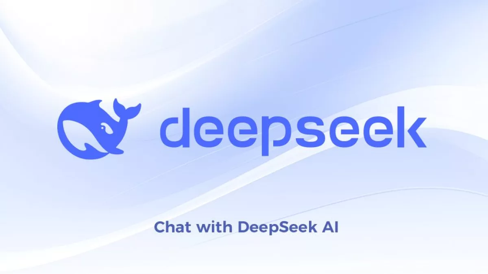
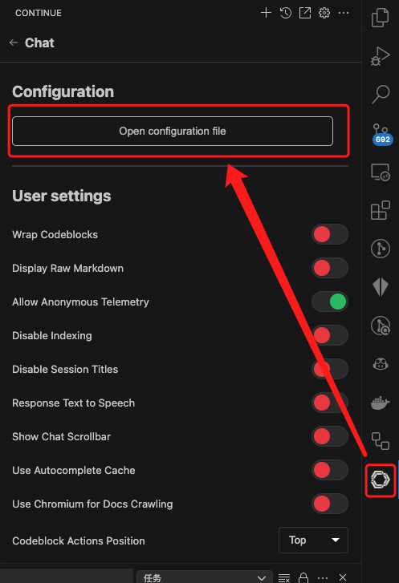
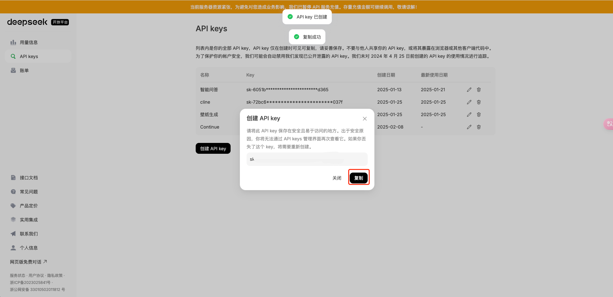
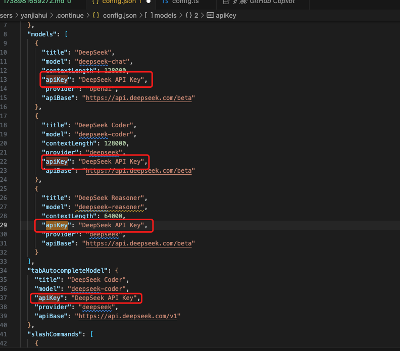

## 前言

在 AI 浪潮的推动下，技术的迭代速度前所未有地加快。如果你不紧跟时代的步伐，很快就会被淘汰。我从 2023 年初就开始使用 GPT 来提高编码效率，经历了从 OpenAI、初代 Cursor、Copilot 到如今百花齐放的国产大模型，如通义千文、文心一言、豆包、Kimi 等。而如今，DeepSeek 的出现标志着 AI 工具进入了一个新的时代。

正如术哥所说：“AI 时代，一个月相当于一年，速度快得让你忘记今夕是何年。” 在这篇文章中，我将分享如何利用 DeepSeek 和 Continue 插件这一划时代的工具组合，大幅提升你的编码效率。

## 什么是 DeepSeek？



DeepSeek 是由杭州深度求索人工智能基础技术研究有限公司开发的一系列先进的人工智能模型和技术。其中最著名的模型之一是 **DeepSeek-V2**，这是一个拥有 2360 亿参数的专家混合（MoE）语言模型。它在训练效率和推理性能上都有显著的优势。

此外，DeepSeek 还推出了 **deepseek-reasoner（R1）** 推理模型，该模型能够在输出最终答案前提供一段思维链内容，从而增强答案的准确性和逻辑性。

DeepSeek 之所以备受关注，主要因为它提供了高性能、低成本的大规模语言模型，并且这些模型是完全开源的，支持商业应用。这意味着开发者可以自由地使用这些强大的工具来构建自己的应用程序，而无需承担高昂的研发成本。同时，DeepSeek 的技术创新，如高效的训练方法和优秀的推理能力，使得其模型在各种基准测试中表现优异，进一步推动了 AI 技术的发展和普及。

## 什么是 Continue 插件？


Continue 是一款基于 AI 的 VSCode 插件，专注于代码补全、代码生成和代码优化。它支持多种 AI 模型（如 OpenAI、DeepSeek 等），能够根据上下文智能地生成代码、修复错误，并提供开发建议。Continue 的核心优势在于其开源性、灵活性和对开发者工作流的深度集成。

## 如何在 VSCode 中集成 DeepSeek 和 Continue 插件

### 1. 安装 Continue 插件

首先，打开 VSCode 的扩展商店，搜索 **Continue**，然后点击安装。安装完成后，你可以在 VSCode 的侧边栏中找到该扩展。

### 2. 配置 Continue 插件

安装完成后，你需要配置 `config.json` 文件以启用 DeepSeek 模型。以下是一个示例配置：



```json
{
  "completionOptions": {
    "BaseCompletionOptions": {
      "temperature": 0,
      "maxTokens": 256
    }
  },
  "models": [
    {
      "title": "DeepSeek",
      "model": "deepseek-chat",
      "contextLength": 128000,
      "apiKey": "DeepSeek API Key",
      "provider": "openai",
      "apiBase": "https://api.deepseek.com/beta"
    },
    {
      "title": "DeepSeek Coder",
      "model": "deepseek-coder",
      "contextLength": 128000,
      "provider": "deepseek",
      "apiKey": "DeepSeek API Key",
      "apiBase": "https://api.deepseek.com/beta"
    },
    {
      "title": "DeepSeek Reasoner",
      "model": "deepseek-reasoner",
      "contextLength": 64000,
      "apiKey": "DeepSeek API Key",
      "provider": "deepseek",
      "apiBase": "https://api.deepseek.com/beta"
    }
  ],
  "tabAutocompleteModel": {
    "title": "DeepSeek Coder",
    "model": "deepseek-coder",
    "apiKey": "DeepSeek API Key",
    "provider": "deepseek",
    "apiBase": "https://api.deepseek.com/v1"
  },
  "slashCommands": [
    {
      "name": "edit",
      "description": "Edit highlighted code"
    },
    {
      "name": "comment",
      "description": "Write comments for the highlighted code"
    },
    {
      "name": "share",
      "description": "Export the current chat session to markdown"
    },
    {
      "name": "cmd",
      "description": "Generate a shell command"
    }
  ],
  "customCommands": [],
  "contextProviders": [
    {
      "name": "diff",
      "params": {}
    },
    {
      "name": "open",
      "params": {}
    },
    {
      "name": "terminal",
      "params": {}
    }
  ]
}
```

### 3. 获取 DeepSeek API 密钥

接下来，你需要获取 DeepSeek 的 API 密钥。访问 [DeepSeek 开放平台](https://platform.deepseek.com/api_keys)，创建一个新的 API Key。请务必妥善保存这个密钥，因为一旦丢失，你将需要重新生成一个新的密钥。



### 4. 配置 API 密钥

在 config.json 文件中，将 apiKey 字段替换为你刚刚生成的 DeepSeek API Key。保存设置后，你就可以在 VSCode 中使用 DeepSeek 的强大功能了。



### 5. 使用 DeepSeek 提升编码效率

配置完成后，DeepSeek 的强大功能将无缝集成到你的 VSCode 工作流中。以下是几种常见的操作方式，帮助你更高效地利用 DeepSeek 进行编码：

#### 5.1 代码补全
DeepSeek 的代码补全功能基于上下文智能生成代码片段。当你在编写代码时，DeepSeek 会自动分析当前代码的上下文，并为你提供相关的代码建议。你可以通过以下方式触发代码补全：
- **自动触发**：在输入代码时，DeepSeek 会自动弹出补全建议，按下 `Tab` 键即可接受建议。
- **手动触发**：按下 `Ctrl + Space`（Windows/Linux）或 `Cmd + Space`（Mac）手动触发代码补全。

#### 5.2 错误修复
DeepSeek 能够识别代码中的潜在错误，并提供修复建议。当你遇到编译错误或逻辑问题时，可以通过以下方式调用 DeepSeek 的错误修复功能：
- **右键菜单**：选中出错的代码片段，右键点击并选择 **Fix with DeepSeek**，DeepSeek 将分析错误并提供修复方案。
- **快捷键**：选中代码后，按下 `Ctrl + .`（Windows/Linux）或 `Cmd + .`（Mac）快速调用错误修复功能。

#### 5.3 复杂逻辑推理
对于复杂的逻辑问题，DeepSeek 的 **deepseek-reasoner** 模型能够提供详细的推理过程。你可以通过以下方式调用推理功能：
- **命令行调用**：在 VSCode 的终端中输入 `/reason`，然后输入你的问题或代码片段，DeepSeek 将生成详细的推理过程。
- **快捷键**：选中代码后，按下 `Ctrl + Shift + R`（Windows/Linux）或 `Cmd + Shift + R`（Mac）快速调用推理功能。

#### 5.4 快捷操作
DeepSeek 还支持多种快捷操作，帮助你快速完成常见任务：
- **代码注释生成**：选中代码后，按下 `Ctrl + /`（Windows/Linux）或 `Cmd + /`（Mac），DeepSeek 将自动生成代码注释。
- **代码格式化**：选中代码后，按下 `Ctrl + Shift + F`（Windows/Linux）或 `Cmd + Shift + F`（Mac），DeepSeek 将自动格式化代码。
- **代码分享**：按下 `Ctrl + Shift + S`（Windows/Linux）或 `Cmd + Shift + S`（Mac），将当前代码片段导出为 Markdown 文件，方便分享。

#### 5.5 自定义快捷键
如果你希望自定义快捷键，可以在 VSCode 的快捷键设置中搜索 **DeepSeek**，并根据个人习惯绑定快捷键。例如，你可以将代码补全功能绑定到 `Ctrl + Alt + Space`，以便更快速地调用。

通过以上操作，你可以充分利用 DeepSeek 的强大功能，显著提升编码效率。无论是日常开发中的代码补全，还是复杂问题的推理分析，DeepSeek 都能为你提供可靠的支持。

## 最后

随着人工智能技术的发展，DeepSeek 以其卓越的表现和广泛的适用性，正在成为众多开发者的新宠。作为一个开源且支持商业应用的人工智能模型，DeepSeek 不仅降低了开发者的使用门槛，还通过其强大的性能和灵活性推动了整个行业的进步。

从高性能的语言模型 DeepSeek-V2 到具备强大推理能力的 deepseek-reasoner（R1），DeepSeek 系列产品展示了在自然语言处理、代码生成及优化等多方面的巨大潜力。这些工具不仅能够帮助开发者提高编码效率，还能解决复杂逻辑问题，提供更加准确和逻辑严密的答案。

在未来，我们可以预见 DeepSeek 将继续引领 AI 技术的发展潮流，带来更多创新的应用场景。无论是作为独立的 API 调用，还是与其他开发工具如 VSCode 的 Continue 插件结合使用，DeepSeek 都展现出了它不可替代的价值。