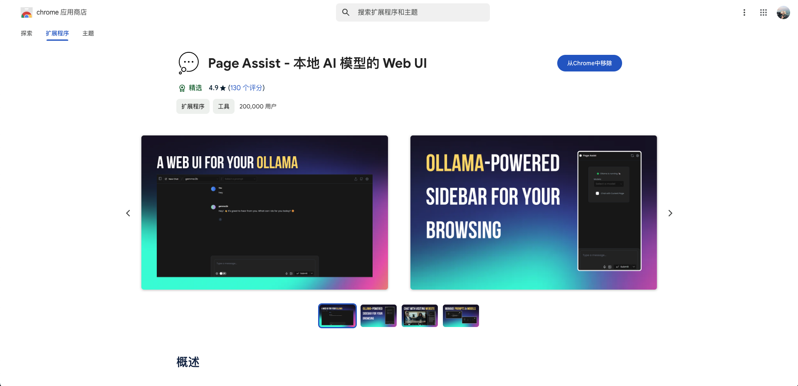
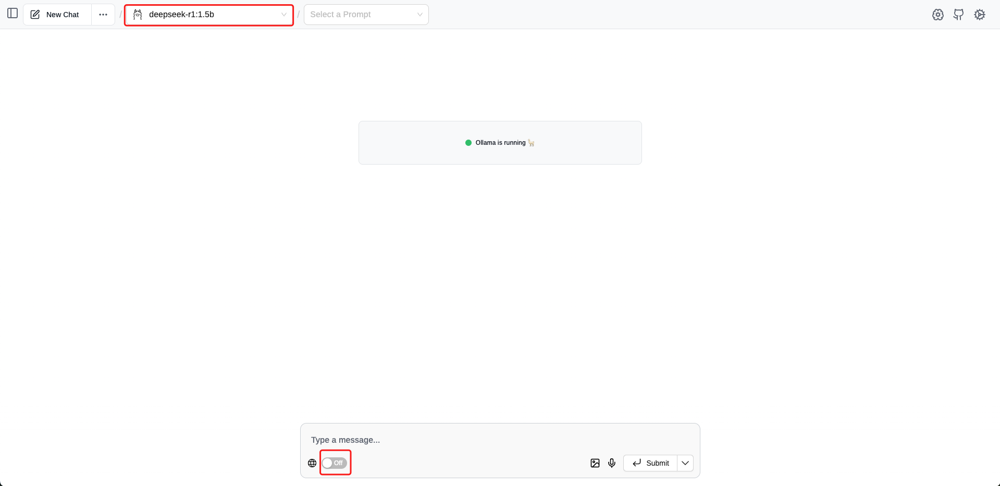
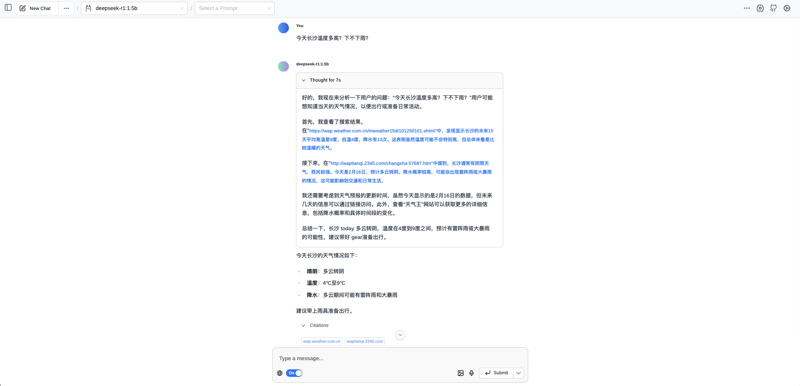
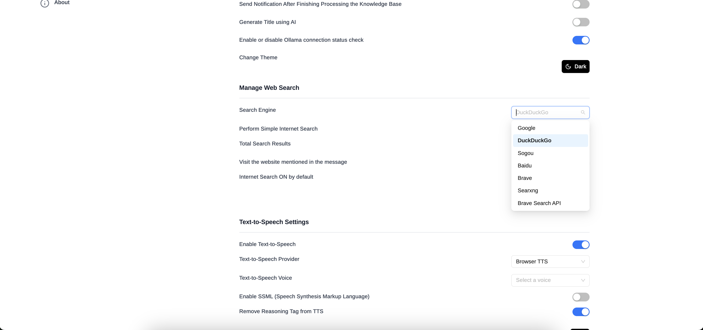
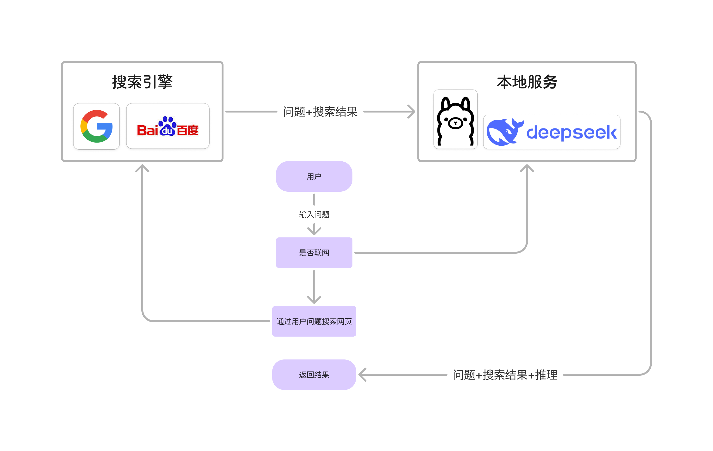
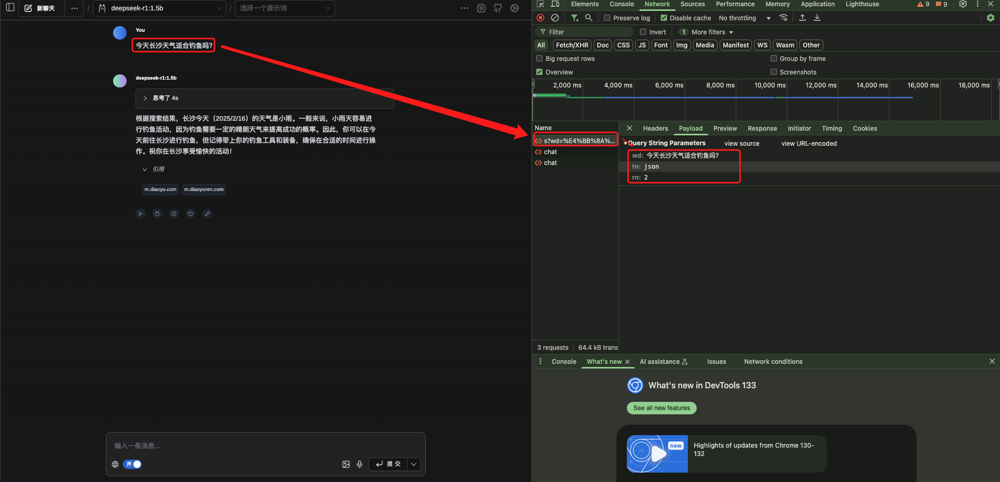
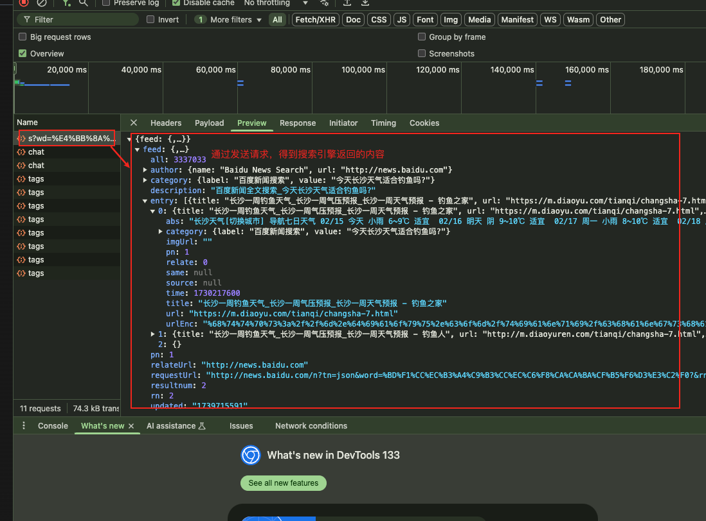
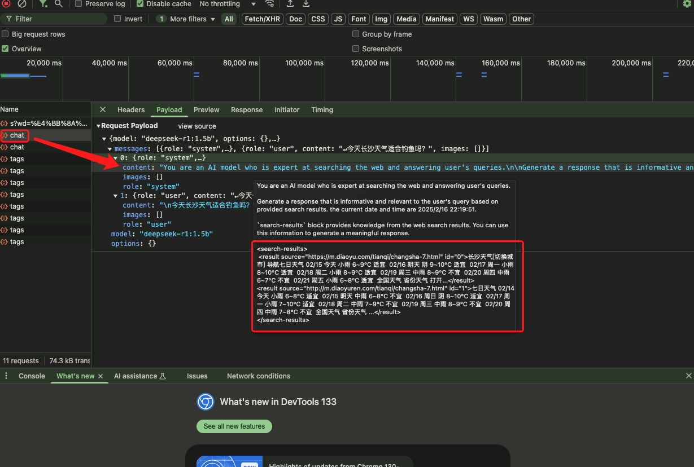
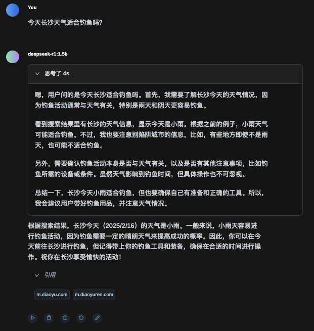

## 前言

为什么要联网？本地的模型现在只能通过现有的训练参数+知识库内容，进行回答，如果你需要一些时效性的问题，它就无能为力了（甚至会胡言乱语，自己加戏）。想要本地的 DeepSeek 开启联网也很简单，只需要安装一个浏览器插件，这里我推荐的是 Page Assist。当然还有一些其他的方式比如 AnythingLLM 等我也尝试过，这个貌似更容易上手。

### 安装 Page Assist 插件

目前 Page Assist 支持 Chrome、Edge、Firefox 等主流浏览器。

https://github.com/n4ze3m/page-assist



## 选择模型

在浏览器中 chrome-extension://jfgfiigpkhlkbnfnbobbkinehhfdhndo/options.html

选择本地的模型，然后开启联网。前提是你本地启动了 Ollama。在页面中间位置能过看到这个 Ollama is running 🦙。



## 提出时效性问题

```
User: 今天长沙温度多高？下不下雨？

DeepSeekR1:1.5b
今天长沙的天气情况如下：

晴朗：多云转阴
温度：4℃至9℃
降水：多云期间可能有雷阵雨和大暴雨
建议带上雨具准备出行。
```



## 修改搜索引擎

点击右上角的齿轮，你就可以看到这个设置界面在 Manage Web Search 中，修改 Search Engine，也就是搜索引擎，你这里可以选 Google、百度等一系列搜索引擎。点击Save，即可生效。这里还可以选择搜索结果总数，你可以根据自身网络情况来定，因为这需要更多的时间。



## 简单讲解原理

我打开 F12 ，查看了这个插件的请求，发起联网后的一些操作。如下是大致流程，可供参考。



1. 将问题发送请求到搜索引擎，拿到返回结果。





2. 发起请求到本地 Llama + DeepSeek，参数是问题 + 搜索结果。

可以看到内容请求参数 message 中第一个内容，将这个搜索结果作为一个 Prompt 的部分内容，可以理解为上下文。

```
You are an AI model who is expert at searching the web and answering user's queries.

Generate a response that is informative and relevant to the user's query based on provided search results. the current date and time are 2025/2/16 22:59:21.

`search-results` block provides knowledge from the web search results. You can use this information to generate a meaningful response.

<search-results>
  <result source="https://m.diaoyu.com/tianqi/changsha-7.html" id="0">长沙天气[切换城市] 导航七日天气 02/15 今天 小雨 6~9℃ 适宜  02/16 明天 阴 9~10℃ 适宜  02/17 周一 小雨 8~10℃ 适宜  02/18 周二 小雨 8~9℃ 适宜  02/19 周三 中雨 8~9℃ 不宜  02/20 周四 中雨 6~7℃ 不宜  02/21 周五 小雨 6~8℃ 适宜  全国天气 省份天气 打开...</result>
  <result source="http://m.diaoyuren.com/tianqi/changsha-7.html" id="1">七日天气 02/14 今天 小雨 6~8℃ 适宜  02/15 明天 中雨 6~8℃ 不宜  02/16 周日 阴 8~10℃ 适宜  02/17 周一 小雨 7~10℃ 适宜  02/18 周二 中雨 7~9℃ 不宜  02/19 周三 中雨 8~9℃ 不宜  02/20 周四 中雨 7~8℃ 不宜  全国天气 省份天气 ...</result>
</search-results>

```



3. 返回推理过程 + 搜索结果引用 + 结果，到此便结束了。




## 最后

所以这样看来，联网功能并不复杂，甚至我们可以自己进行优化提示词，将问题拆得更细，做一个 Agent ，比如：

```
1. 用户输入问题
2. 通过模型拆分问题。
3. 在对应多个问题，可以在不同的网站搜索专业答案（例如股票去东方财富、同花顺之类）
4. 对搜索结果 + 用户问题进行再次组合提问推理模型。
5. 输出结果。
```