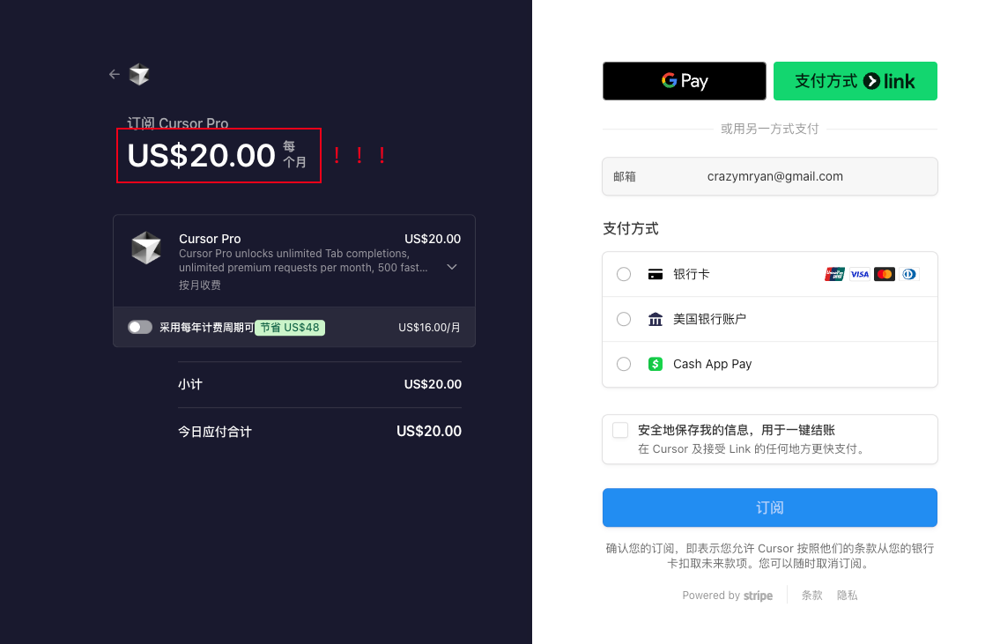
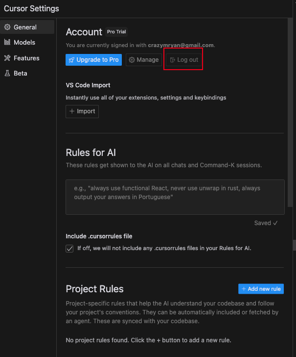
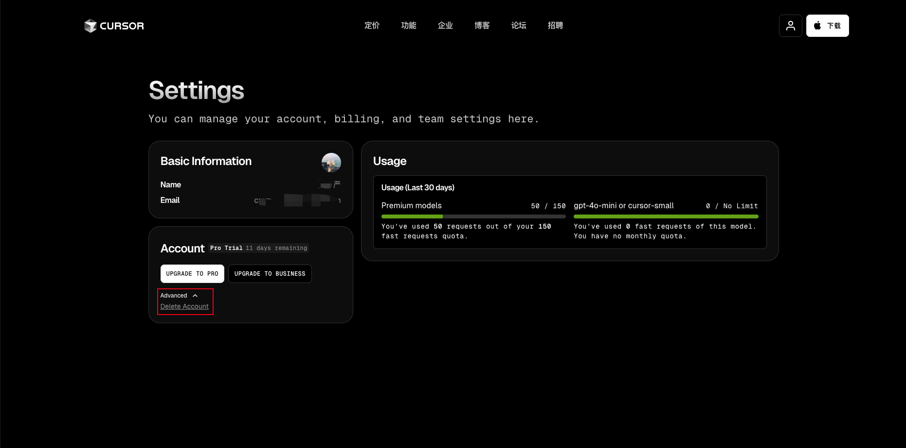
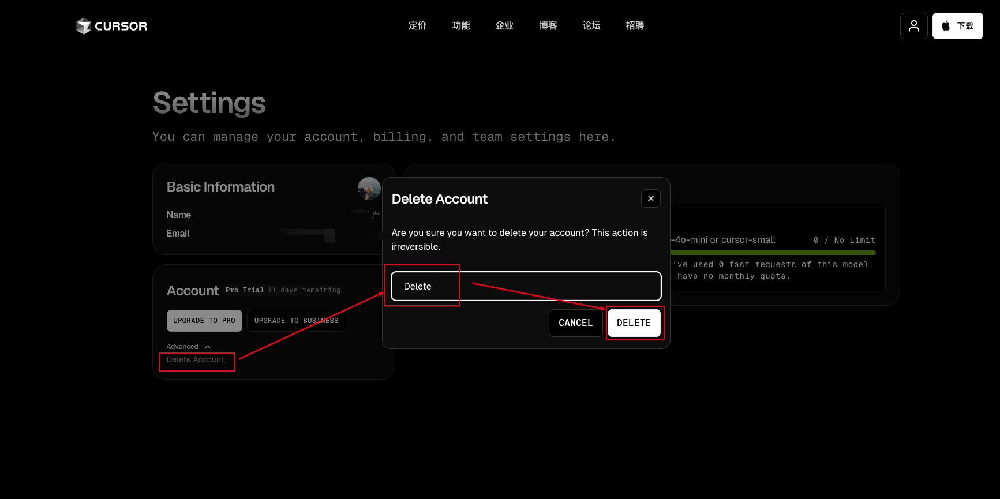
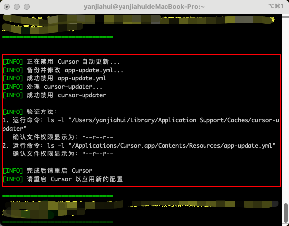
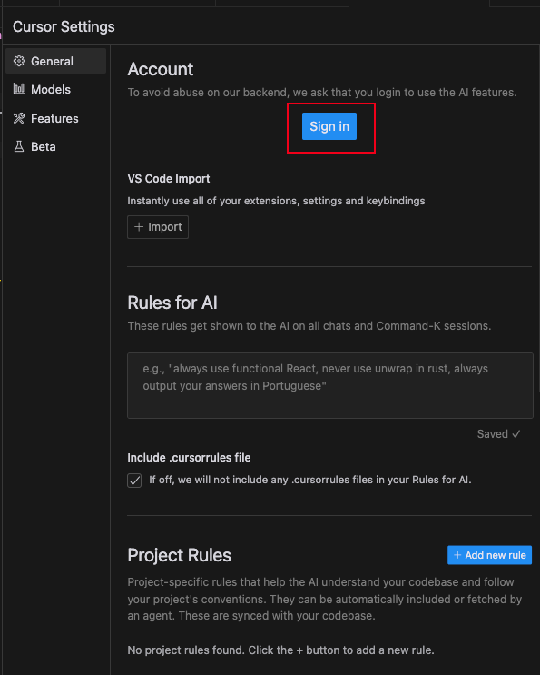
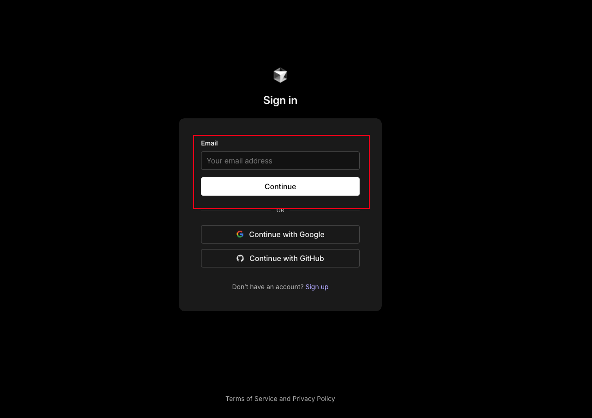
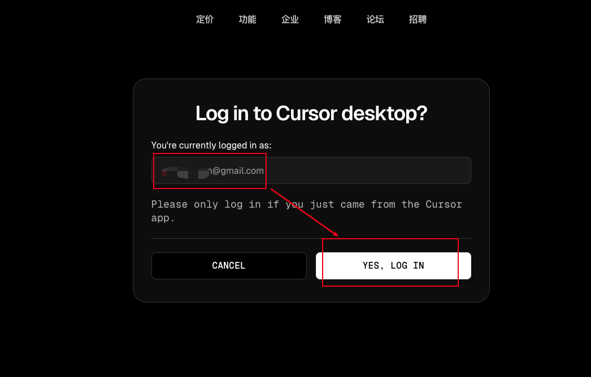
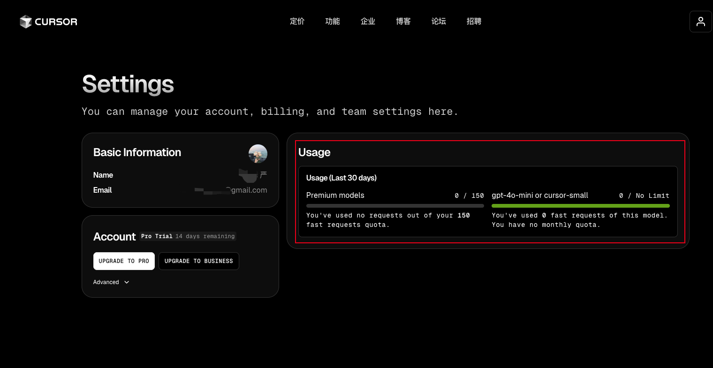

# 

## 前言

想必各位开发者、产品经理或一些有想法的非程序员人士，已经使用了 Cursor 来协助完成一些开发任务，但是由于额度和有效期的问题，每次刚学会几招 Cursor 的使用方式，就用不了了。

本文主要给大家讲解下如何薅 Cursor 的羊毛。如图 $20 一个月还是有些许心疼的。



## Cursor 是什么？

Cursor 是一款专为开发人员设计的代码编辑器，具有以下特点：

1. **AI 辅助编程**：内置 AI 功能，支持代码生成、补全、错误检测和优化建议。

2. **多语言支持**：适用于 Python、JavaScript、Java、C++ 等多种编程语言。

3. **智能代码补全**：通过上下文分析提供准确的代码补全建议。

4. **错误检测与修复**：实时检测代码错误并提供修复建议。

5. **代码优化**：提供性能优化建议，帮助提升代码效率。

6. **集成开发环境**：支持调试、版本控制等开发工具。

7. **插件扩展**：可通过插件扩展功能，适应不同开发需求。

8. **跨平台支持**：兼容 Windows、macOS 和 Linux。

## 开始

利用开源大神们的解决方案 https://github.com/yuaotian/go-cursor-help 

不用下载软件，按照我下面的步骤，关键在最后那一行命令。

### 1. 退出 Cursor 账号

打开 Cursor ，在右上角找到 setting 图标。



### 2. 注销账号

退出账号后，他会让你选择登录账号，就用你之前的账号就行。

注意这里有个 Delete Account （删除账户）按钮



点击 Delete Account ，有个弹窗提示，输入 Delete 之后即可点击 DELETE 按钮，将账号删除。



### 3. 重置设备码（关键）

打开终端，windows 打开 CMD 都可以，运行下面对应的 sh、ps1脚本。

**macOS**

```shell
curl -fsSL https://aizaozao.com/accelerate.php/https://raw.githubusercontent.com/yuaotian/go-cursor-help/refs/heads/master/scripts/run/cursor_mac_id_modifier.sh | sudo bash
```

**Linux**

```shell
curl -fsSL https://aizaozao.com/accelerate.php/https://raw.githubusercontent.com/yuaotian/go-cursor-help/refs/heads/master/scripts/run/cursor_linux_id_modifier.sh | sudo bash
```

**Windows**

```powershell
irm https://aizaozao.com/accelerate.php/https://raw.githubusercontent.com/yuaotian/go-cursor-help/refs/heads/master/scripts/run/cursor_win_id_modifier.ps1 | iex
```

回车执行命令后，会让你输入密码，后面将你本地的 Cursor 关闭。这都是正常的，直到，看到下面的提示，即代表已经执行完毕了。



### 4. 重新注册登录

继续打开 Cursor 编辑器，找到 Setting 图标，点击 Sign in，进行登录。



继续用之前的账号，我这里使用的是谷歌邮箱。继续点击 YES，LOG IN 即可注册完成。





登录完成回到 Cursor 编辑器，可以看到，可以继续正常使用了，而且之前的会话也都留存。

## 验证

去 Cursor 设置页面，查看是否恢复额度。

https://www.cursor.com/cn/settings

可以看到有效天数已经重置为 30 天，已请求次数都清零了。



## 最后

主打一个能薅羊毛的绝不花钱，坚决做大冤种。当然如果你是重度用户，还是可以买的。

我现在是在 Cursor、Trae 、Windsurf 中间来回切，虽然 Trae 没那么强大，但是免费，并且也支持 Claude-3.5-sonnet 和 Claude-3.7-sonnet。大家也可以去试用一下，毕竟现在完全免费，没额度限制。