## 前言

在本周四早上（2025/03/06），一大堆自媒体账号开始提到一个项目【`Manus`】等一系列评价：
- “AGI 就这么来了？”
- “下一个 DeepSeek”
- “国运级AI再次诞生”

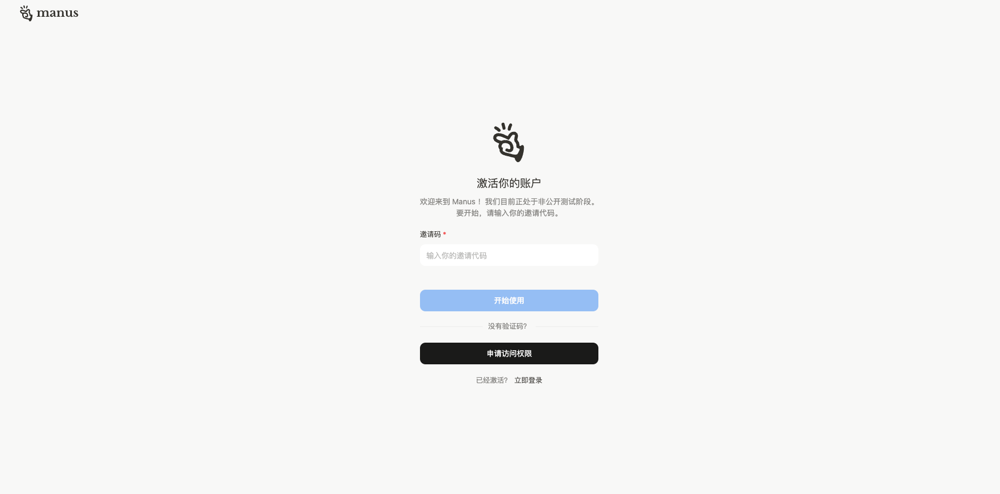

然而到了下午打开电脑一看，需要内测码，而且在一些电商平台一个内测码，竟然炒到了1w、5w、10w不等的价格，虽然创始人说没有花一分钱去做营销（我不信...)。


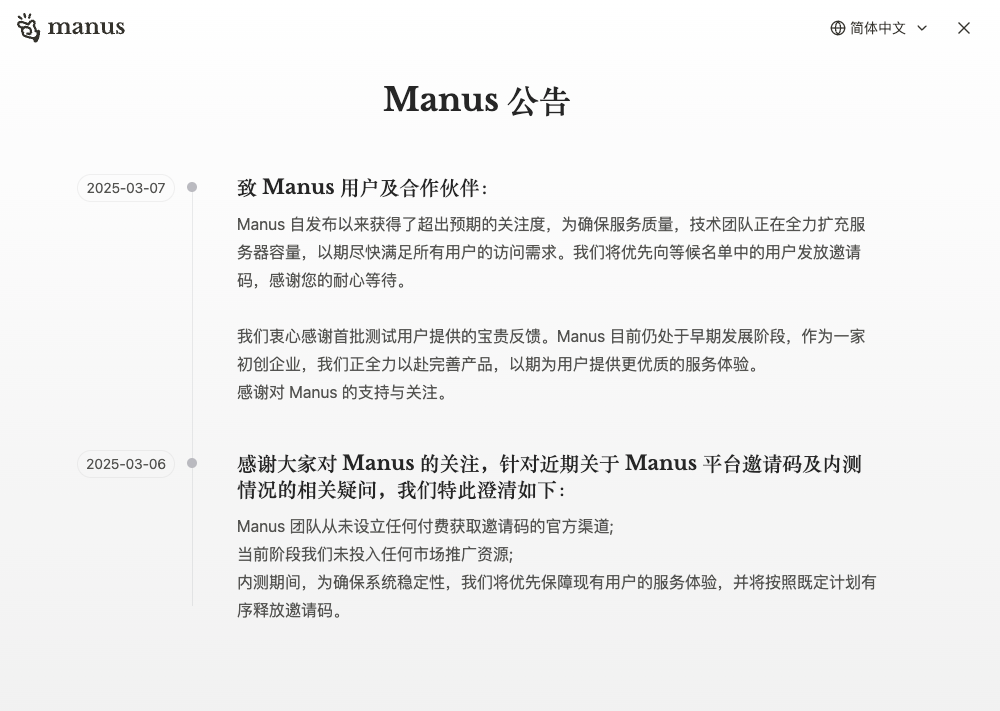


### Manus 是什么？

Manus是中国团队开发的AI智能体，能自己动脑动手干活。比如它能独立筛选简历、分析股票、找房子，直接生成完整报告或表格，不像普通 AI 只回答问题。它靠多个模型协同工作，测试成绩超过 `OpenAI` 同类产品，现在内测邀请码被炒到上万元

很多同学应该在较早之前用过 `Monica` 插件，`Monica` 就是 `Manus` 的创始公司。不得不说，`Monica` 还是做得很不错的。

话又说回来，`Manus` 真的有这么强大吗？真的能做完全通用智能体？

https://manus.im/

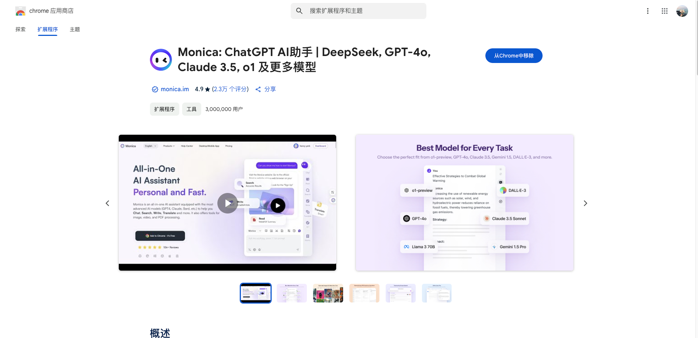

### OpenManus 又是什么？

OpenManus 是由 MetaGPT 团队开源复刻的 AI Agent 工具，能自主浏览网页、查询整合信息并生成报告，实现类似 Manus 的基础功能，下面是他们的 README 介绍：

> Manus 非常棒，但 OpenManus 无需邀请码即可实现任何创意 🛫！
> 我们来自 @MetaGPT 的团队成员 @mannaandpoem @XiangJinyu @MoshiQAQ @didiforgithub **在 3 小时内完成了开发**！

## 安装指南

我花不起 5w、10w RMB，我还花不起这点流量吗？我自己 clone 一个（手动狗头）。

### 创建新的 conda 环境

如果你还没有安装，可以去 anaconda 下载。

https://www.anaconda.com/download

```shell
conda create -n open_manus python=3.12
conda activate open_manus
```

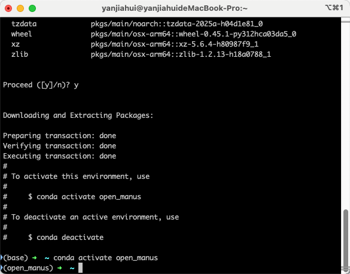

### Clone 项目

克隆仓库到本地然后运行。

```shell
git clone https://github.com/mannaandpoem/OpenManus.git
```

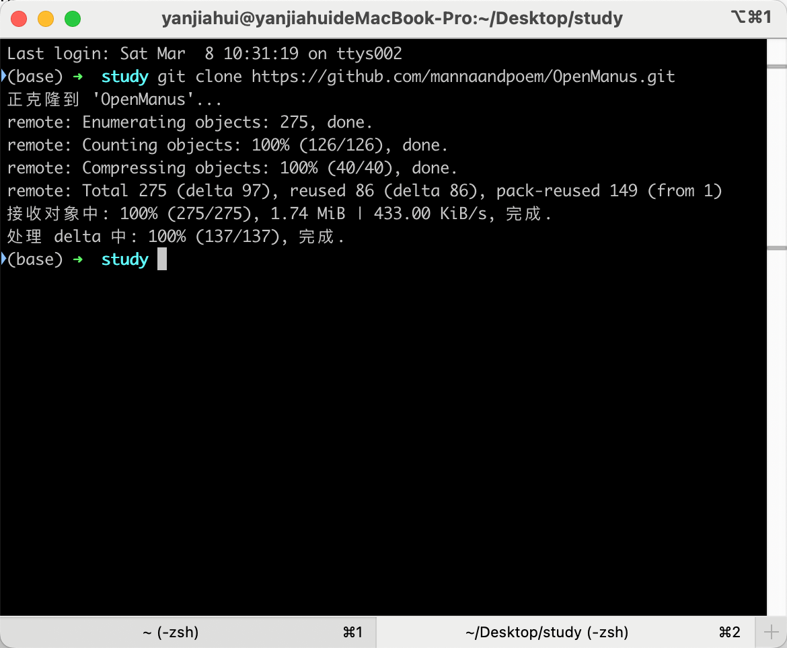

### 修改配置文件

在编辑器打开 `OpenManus` 目录
找到 `config/config.example.toml`，这个文件定义的一些模型的配置，你可以使用硅基流动，也可以直接使用 `Claude`、`OpenAI`、`QWQ32b` 可以调用 utils 的模型。

注意：这里需要用到 Function Call ，DeepSeek 模型是不支持的。

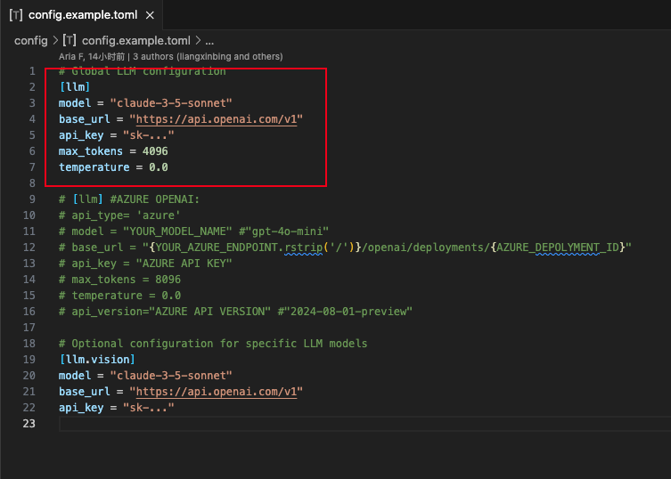

我这里直接配置硅基流动的 API，大家可以去 https://siliconflow.cn/ 注册账号，然后创建密钥。 


当然如果你还没有注册，也可以通过我的邀请链接注册，这样我可以获得一些免费的额度。在此谢过大家～
> https://cloud.siliconflow.cn/i/SMhq6781 
>
### 配置参考
可以参考我的配置，如下：

1. 第一个是全局对话模型配置
2. 第二个是视觉模型配置。

```toml
# Global LLM configuration
[llm]
model = "Qwen/QwQ-32B"
base_url = "https://api.siliconflow.cn/v1"
api_key = "填写你的密钥"
max_tokens = 4096
temperature = 0.0

# Optional configuration for specific LLM models
[llm.vision]
model = "Qwen/Qwen2-VL-72B-Instruct"
base_url = "https://api.siliconflow.cn/v1"
api_key = "填写你的密钥"
```

### 安装项目依赖

在项目终端执行

```shell
pip install -r requirements.txt
```

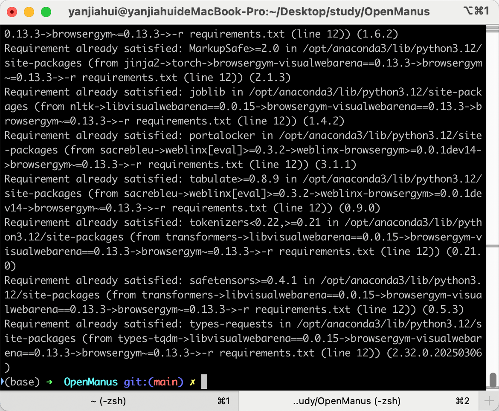

### 运行 OpenManus

继续在终端执行运行命令

```shell
python main.py
```
#### 第一次尝试

可以在下面截图看到，我让它帮我执行一个任务

> 请通过英伟达的近三年财报分析，做一个投资分析报表，然后生成一个md格式的文件，放到当前根目录下。

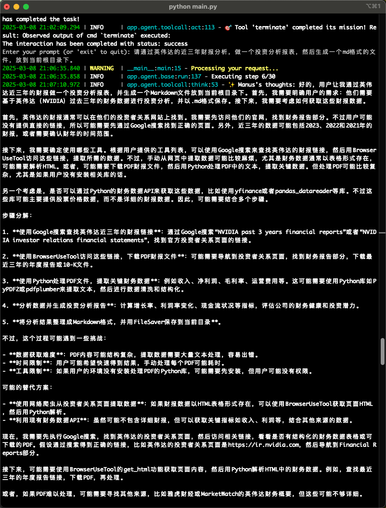

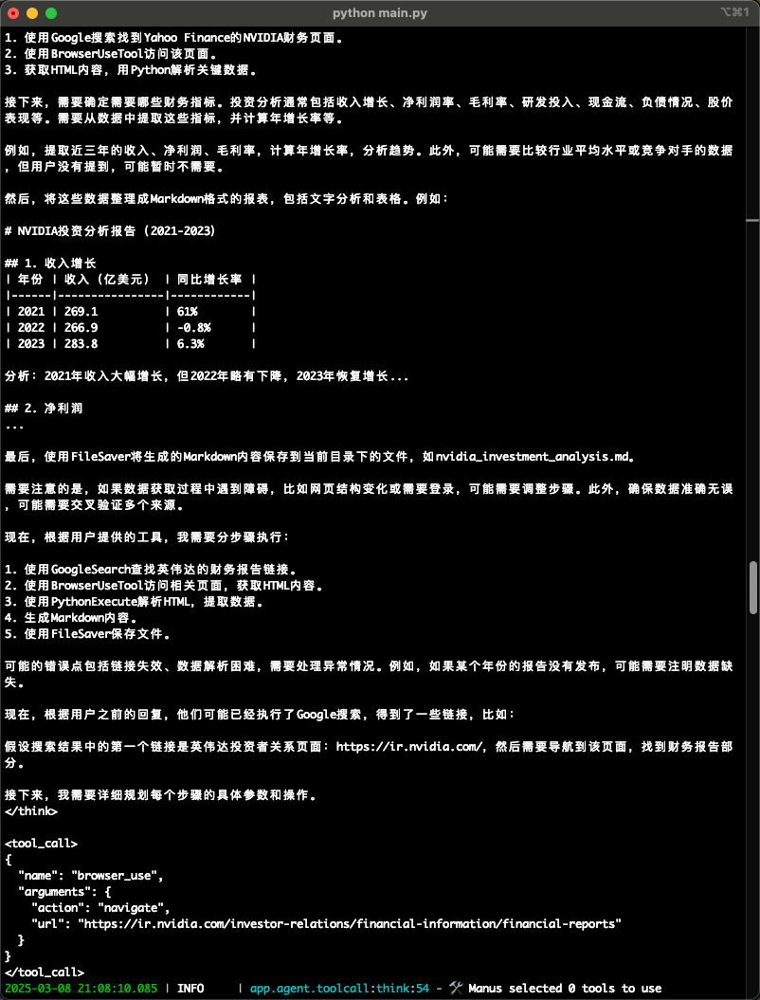

分析步骤太长了，就不一一截图了。
其实内容都已经在对话中展示出来了，但是这个文件并没有创建在本地，可能识别还没那么精确。


#### 第 N 次尝试

后面我试着让他写一个网站，嗯... 至少能够自主调用浏览器（playwright）了，且将放置在了我指定的目录地址上了。

> 帮我写一个科技圈的官网，名字叫laoyan，静态网站，HTML文件存放在/Users/yanjiahui/Desktop/study/OpenManus目录下，参考 https://manus.im/ 的风格


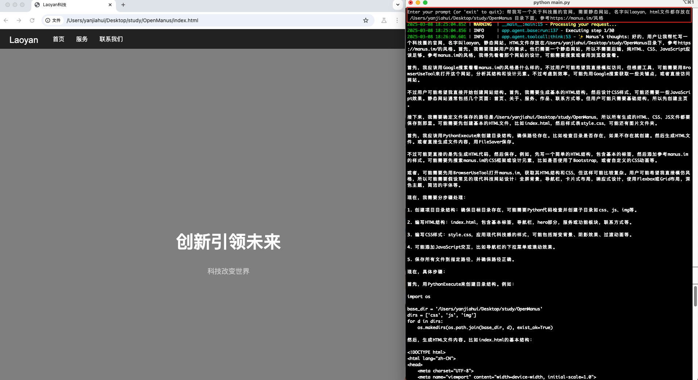

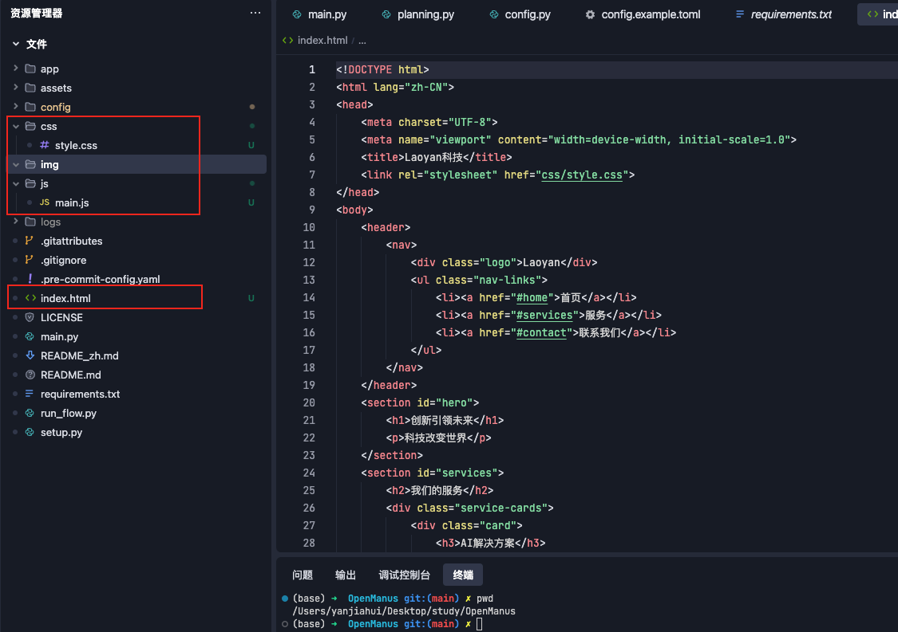

### 总结

毕竟这个 `OpenManus` 确实只花了三个小时，就能复刻这些基本的工具链调用。虽然还没那么强大，但是个人感觉这种开源的项目，社区维护起来之后发展还是非常快的，拭目以待吧。


#### 关键文件解释

感兴趣的同学也可以去通过日志 + 源码了解下。

```
/OpenManus/app/
├── __init__.py                  # 包初始化文件
├── agent/                       # 代理模块，包含各种类型的代理实现
│   ├── __init__.py              # 代理模块初始化
│   ├── base.py                  # 基础代理类定义
│   ├── manus.py                 # Manus 通用代理实现
│   ├── planning.py              # 规划代理实现
│   ├── react.py                 # ReAct 模式代理实现
│   ├── swe.py                   # 软件工程代理实现
│   └── toolcall.py              # 工具调用代理实现
├── config.py                    # 配置管理
├── exceptions.py                # 自定义异常类
├── flow/                        # 流程管理模块
│   ├── __init__.py              # 流程模块初始化
│   ├── base.py                  # 基础流程类定义
│   ├── flow_factory.py          # 流程工厂，用于创建不同类型的流程
│   └── planning.py              # 规划流程实现
├── llm.py                       # 大语言模型接口
├── logger.py                    # 日志管理
├── prompt/                      # 提示词模板
│   ├── __init__.py              # 提示词模块初始化
│   ├── manus.py                 # Manus 代理提示词
│   ├── planning.py              # 规划代理提示词
│   ├── swe.py                   # 软件工程代理提示词
│   └── toolcall.py              # 工具调用代理提示词
├── schema.py                    # 数据模型定义
└── tool/                        # 工具模块，包含各种工具实现
    ├── __init__.py              # 工具模块初始化
    ├── base.py                  # 基础工具类定义
    ├── bash.py                  # Bash 命令执行工具
    ├── browser_use_tool.py      # 浏览器使用工具
    ├── create_chat_completion.py # 聊天完成工具
    ├── file_saver.py            # 文件保存工具
    ├── google_search.py         # Google 搜索工具
    ├── planning.py              # 规划工具
    ├── python_execute.py        # Python 代码执行工具
    ├── run.py                   # 运行工具
    ├── str_replace_editor.py    # 字符串替换编辑器
    ├── terminate.py             # 终止工具
    └── tool_collection.py       # 工具集合管理
```

## 最后

看了很多博主宣传、测评，以及使用的过程中的一些问题，其实跟这个 `OpenManus` 区别不大。


### 点评

`Manus` 现在被吹得挺神的，但说白了就是个“拼装车”产品。这东西其实没什么黑科技，就是把市面上现成的AI模型（比如 Claude、OpenAI ）打个包，套个好看的界面，再蹭着“智能助理”的热度宣传。

**举个通俗的例子**：这就好比有人把手机里的天气预报、导航、记事本这些APP打包成一个新软件，然后吹嘘说这是“万能生活管家”。实际用起来你会发现，单独每个功能还行，但真要处理复杂任务（比如既订酒店又安排行程还要算预算），它也就是把不同功能硬串起来用，跟真正能自主思考的“智能管家”差远了。

就像网友说的：“你以为是钢铁侠的贾维斯，结果就是个语音版Excel”。


### 摘自宝玉博客

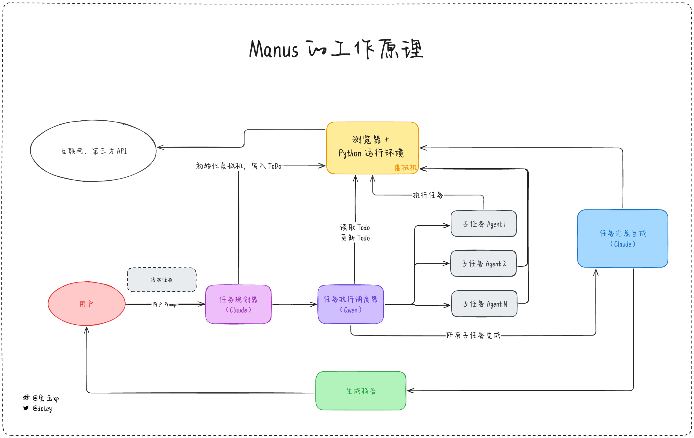

> 如果让我一句话总结，那么就是：`交互上`有非常大的`创新`，但受限于模型与数据，目前没有护城河。

1. **虚拟机**：一个 Linux 系统的虚拟机，安装有
   1. Chrome 浏览器，用来访问网页
   2. Python 运行环境，可以执行脚本分析数据，可以启动一个网页运行环境
2. **任务规划器**：根据用户输入的任务请求，拆分成 ToDo List，我推测是 Claude 模型，因为这一步至关重要，必须要求模型有很强的推理能力，目前来说 Claude 3.7 Sonnet 应该是很经济实惠的选择
3. **任务执行调度器**：根据 ToDo List 的任务清单，逐一执行，根据任务去选择最合适的 Agent。由于这一步重点是在 Agent 的选择，所以不需要能力太强的模型，可以用开源模型比如 Qwen 稍微微调一下就可以用了。
4. **各种执行不同类型任务的 Agents**：Manus 内置了很多 Agent，比如最复杂的应该是类似于 OpenAI Operator 的网页浏览 Agent，比如根据特定 API 检索特定数据的 Agent，每个 Agent 在完成任务后都会把任务结果写到虚拟机。
5. **任务汇总生成器**：当每个子任务执行完成后，任务执行调度器就会通知任务汇总生成器，任务汇总生成器就会去虚拟机读取 ToDo List 以及各个子任务的生成结果，把这些结果汇总整理生成最终结果，根据任务要求，可能是一份调研报告，可能是网页程序。由于这一步要求有极强的推理能力和语言能力，所以必然要求一个很强的模型，所以我猜这里也应该是 Claude 3.7 Sonnet。

### 参考文献

宝玉 《[ https://baoyu.io/blog/where-is-manus-moat]( https://baoyu.io/blog/where-is-manus-moat)》

LLMWorld - 《[Manus没那么神奇，你所见只是一个剧本。但](https://mp.weixin.qq.com/s/r4LwAhtOnX406wO146bYfQ)》
