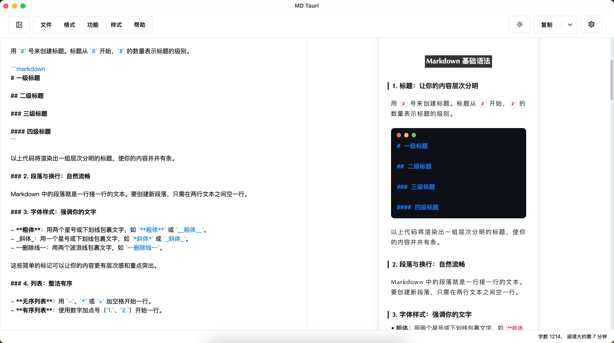
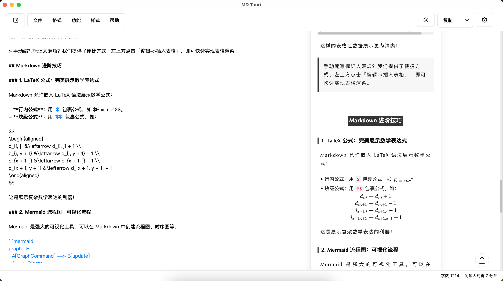
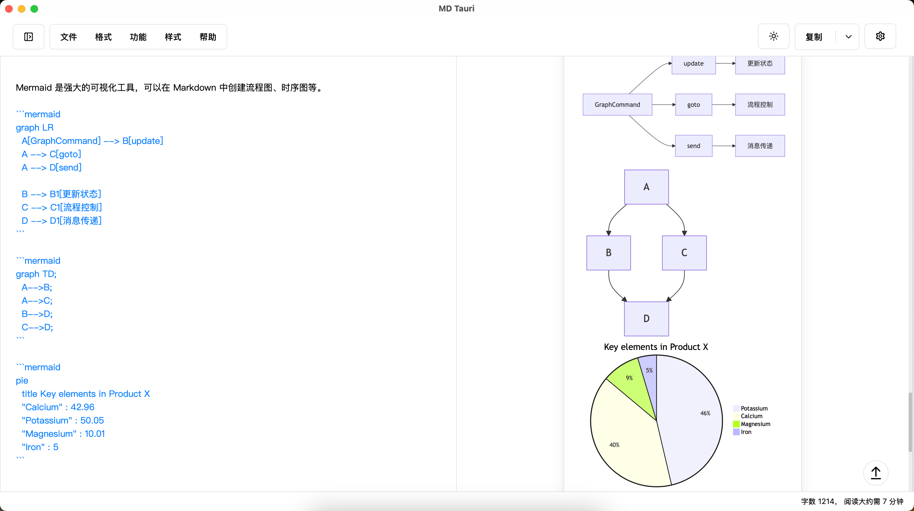
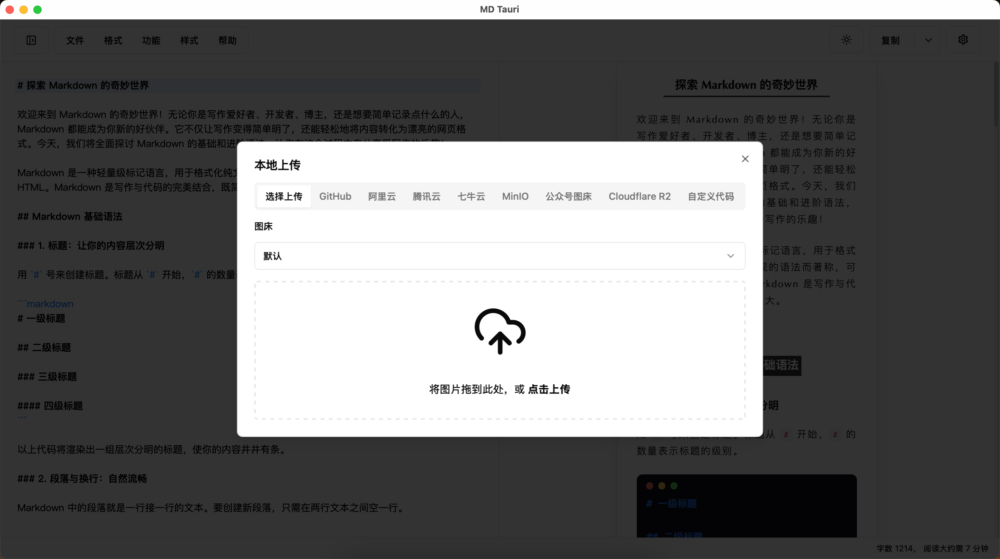
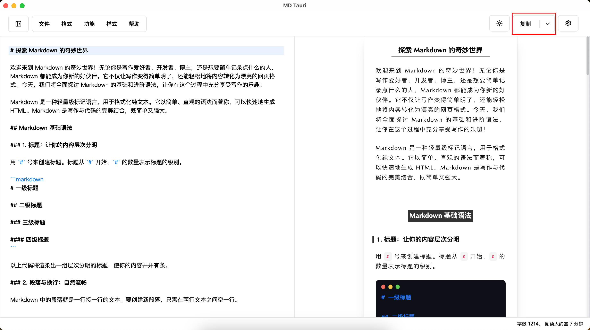
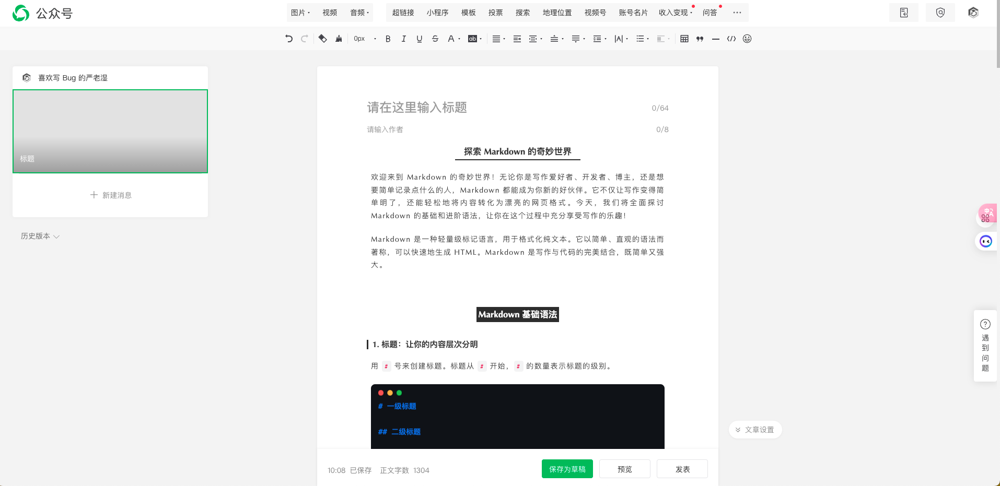
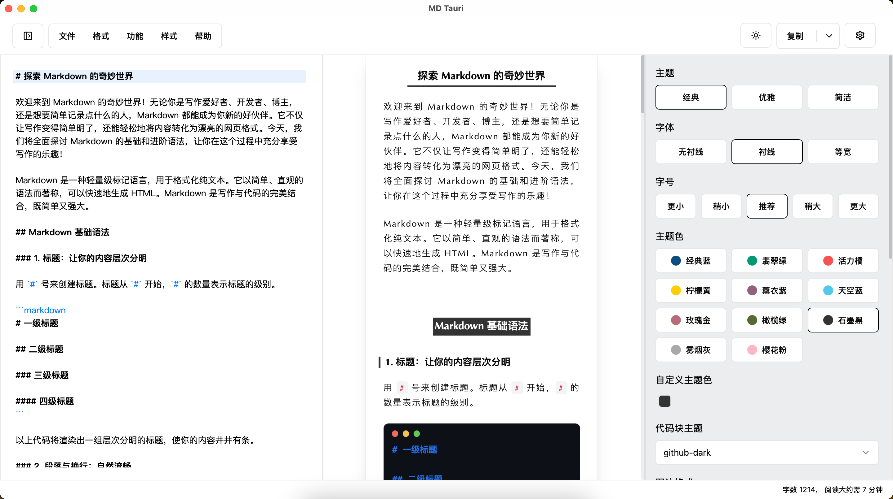
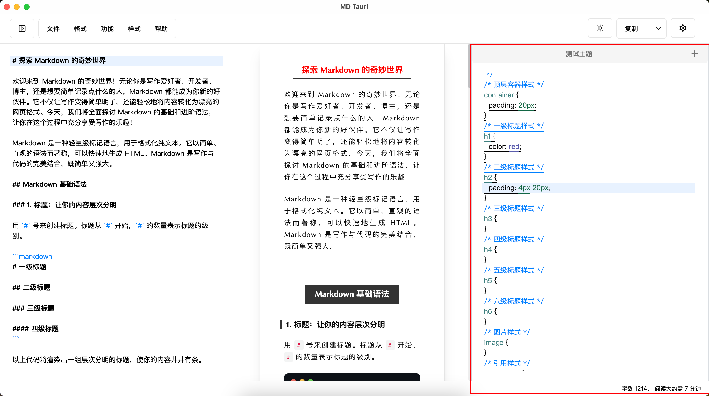
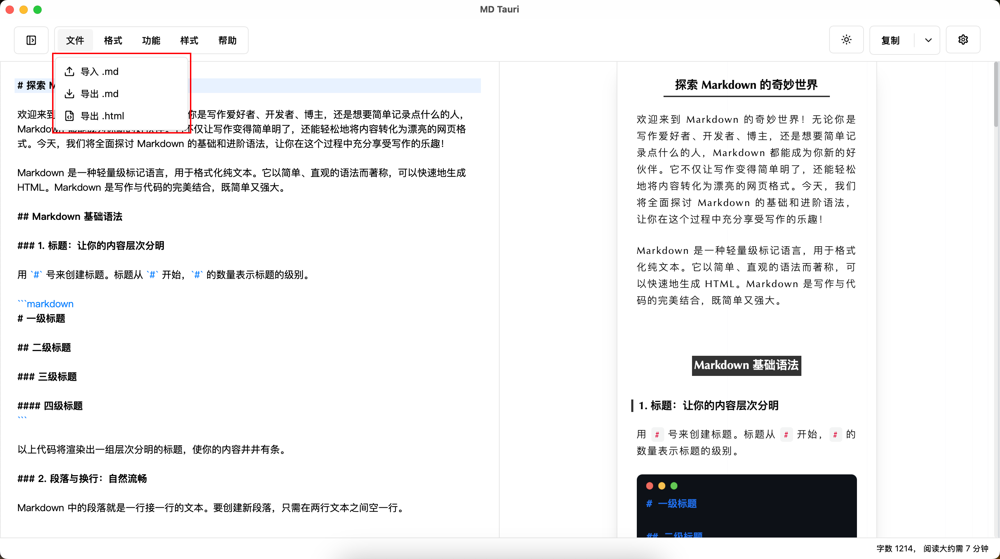

## 前言

从19年开始写公众号，到25年，6-7年时间里换了不知道多少个编辑器，用时最长的还是 `mdnice` 因为可以直接通过 md 转换出很多适配公众号的主题，不用担心兼容样式问题。

但每次都需要打开网页，进行编辑，而且信息都存储在远端觉得有点麻烦，所以找了一个开源仓库`doocs/md`用它来作为模板进行开发，实现了一个桌面端`markdown`编辑器`md-tauri`，也是开源的。 可以直接下载安装使用。

## md-tauri 是什么？
一个使用 Tauri 和 Vue 3 构建的现代化 Markdown 编辑器，为 Markdown 编辑和预览提供流畅的桌面体验。

### 技术栈

- Tauri
- Vue 3
- TypeScript
- Vite
- TailwindCSS
- CodeMirror
- Marked
- Mermaid

### 功能
- 🚀 使用 Tauri + Vue 3 构建，实现最佳桌面性能
- 📝 实时 Markdown 预览
- 🎨 代码语法高亮支持
- 📊 Mermaid 图表支持
- 🧮 数学公式渲染
- 🖼️ 多种图片上传选项
- 💾 草稿自动保存
- 🎯 自定义主题和 CSS 样式
- 📤 导入/导出功能

## 功能介绍

### 语法支持

#### Markdown 基础语法
支持 Markdown 所有基础语法例如：

1～6级标题、表格、高亮内容、加粗、斜体、代码块、删除线、超链接、图片、有序列表、无序列表、引用等语法



#### 数学公式



#### Mermaid 图表渲染


### 图床

默认上传使用 `jsdelivr`，这里支持多种配置图床，例如 `GitHub`、`腾讯云`、`阿里云`、`七牛云`、`MinIo`、`公众号`、`Cloudflare`、以及自定义代码。




### 一键复制
这里的一键复制，可以直接去公众号编辑器粘贴即可。







### 主题
目前支持三种主题和多种主题色，以及代码块风格。




如果内置主题中没有比较喜欢样式，可以自定义 `CSS Theme`。

如果你希望更多的人使用你的主题，可以在主题征集`Issue`下方贴上你的主题文件内容和截图，下面是主题征集地址：

https://github.com/CrazyMrYan/md-tauri/issues/1




### 导入导出

目前支持导入导出`md`、和导出`html`功能



### 快捷键


## 安装包
目前仅构建了 MacOS 的 dmg 包，大家也可以自行 clone 下来进行编译适合自己系统的包。

https://github.com/CrazyMrYan/md-tauri/releases/download/v1.0.0-beta.1/md-tauri_1.0.0_aarch64.dmg

## 运行源码

### 仓库地址
https://github.com/CrazyMrYan/md-tauri

### 环境要求

Nodejs >=21.1.0

### 克隆
```shell
git clone git@github.com:CrazyMrYan/md-tauri.git
```

### 安装依赖

```shell
cd md-tauri
yarn install
```
### 本地运行

```shell
yarn tauri:dev
```

### 本地构建

```shell
yarn tauri:build
```

## 后续需求规划

1. 实现本地Markdown项目文件的直接解析与加载能力
2. 提供全局全文检索引擎（支持标题/内容联合检索）
3. 集成Slash(/)指令系统实现快捷内容模板插入
4. 构建可视化目录树形结构并支持元数据标注
5. 实现文件系统对象的拖拽排序（Drag-and-Drop Reordering）
6. 建立文档间双向引用机制（@符号索引）
7. 批量导出处理器（含资源本地化与ZIP打包）
8. 动态布局系统（支持窗格宽度实时调整）
9. 本地化HTTP媒体资源上传代理服务
10. 基于NLG的智能文档生成系统
11. 上下文感知的代码自动补全引擎
12. 实现UI控件国际化（中文）适配层
13. 智能文件名推导算法（标题→文件名映射）
14. 双模式渲染引擎（编辑/预览态无缝切换）

## 特别鸣谢

本项目的开发基于 [doocs/md](https://github.com/doocs/md) 优秀的基础架构，特别感谢原项目团队在以下方面的卓越工作：
- 提供高性能的 Markdown 渲染内核  
- 构建可扩展的插件体系  
- 实现稳定的编辑体验


## 最后

如果大家喜欢这个项目，并且感兴趣可以在仓库提 ISSUE、PR，欢迎共建！