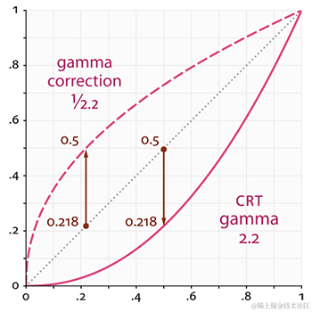
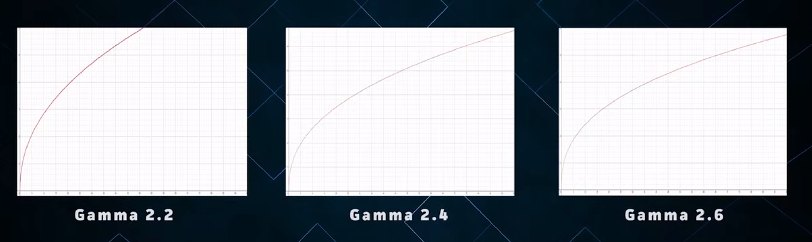
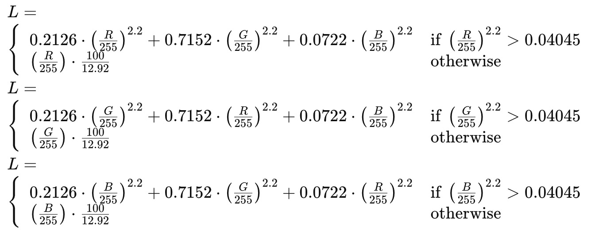
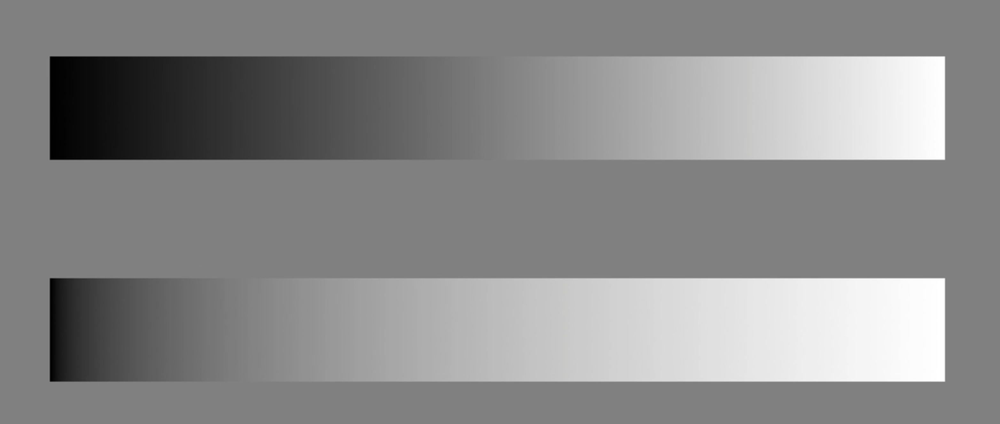
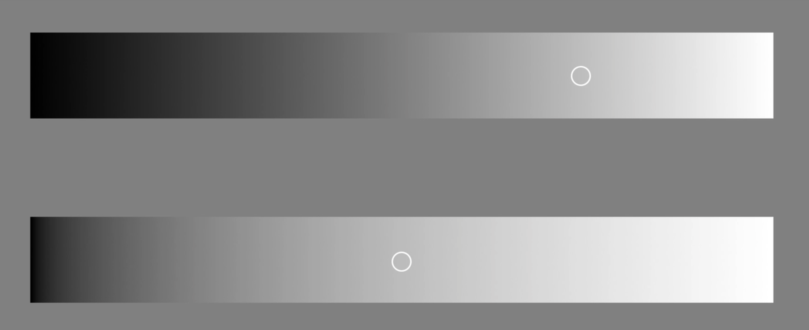
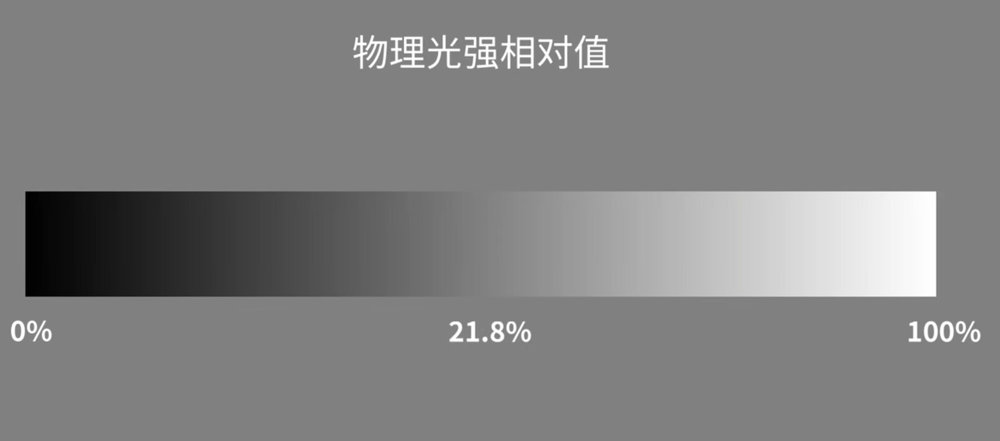
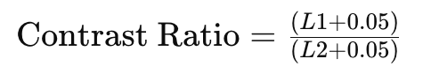

> 最近在使用 `XMind ` 的时候，思考了一个问题。为什么在背景色不同的时候，字体颜色也会自动跟着变化。
> 
> 比如：背景为黑色，字体就是白色；背景是红色，字体就是黑色；


这是使用了 `Gamma 校正`算法。



## What is gamma correction


最常见的 Gamma 校正，目前有三种 2.2/2.4/2.6，而在上图便是 Gamma 2.2 ，在各大视频平台上面的也采用 Gamma 2.2






> 在这两个色阶图中，使用人眼来观察会认为第一条色阶比较均匀，由黑至白。而实际上呢？

其实使用数码设备来观测的话，第二条其实更加均匀。



白色像素的50%，分别在图中的区域。这个时候



而在第一条色阶中，中间区域，只占白像素的21.8%。



## 对比度计算公式

其中，***<u>L1</u>*** 和 ***<u>L2</u>*** 分别是前景色（字体颜色）和背景色的相对亮度。如果对比度比值大于 **4.5**，则符合 *WCAG **AA*** 级别标准；如果大于7，则符合 *WCAG **AAA*** 级别标准。



## 亮度计算公式


上述公式用于计算相对亮度（L），其中，R、G 和 B 分别表示背景色的红、绿和蓝通道的值。在每个分支中，如果相对亮度大于0.04045，则使用非线性 gamma 校正计算，否则使用线性亮度计算。

这个相对亮度计算的公式中，主要采用了伽马校正（gamma correction）和线性亮度计算的组合。这种组合通常用于将 `RGB` 颜色值转换为相对亮度值，其中伽马校正用于模拟人眼对光线亮度的非线性感知。

具体来说，这个计算过程包含了伽马校正、线性亮度计算以及一个条件判断，用于在不同的颜色范围内选择不同的计算方法。

这种相对亮度计算在计算机图形学、颜色科学和Web设计等领域经常被使用，特别是在涉及颜色对比度和可访问性方面，以确保文本在不同背景下的可读性。

## JS 方法实现

### 核心代码

```JS
// 计算相对亮度
function calculateRelativeLuminance(color) {
    const gammaCorrect = (value) => {
        value = value / 255;
        return value <= 0.04045 ? value / 12.92 : Math.pow((value + 0.055) / 1.055, 2.4);
    };

    const r = gammaCorrect(color[0]);
    const g = gammaCorrect(color[1]);
    const b = gammaCorrect(color[2]);

    return 0.2126 * r + 0.7152 * g + 0.0722 * b;
}

// 计算对比度
function calculateContrastRatio(color1, color2) {
    const l1 = calculateRelativeLuminance(color1);
    const l2 = calculateRelativeLuminance(color2);

    const contrastRatio = (Math.max(l1, l2) + 0.05) / (Math.min(l1, l2) + 0.05);

    return contrastRatio;
}

// 获取字体颜色
function getContrastTextColor(backgroundColor) {
    const defaultTextColor = [255, 255, 255]; // 默认字体颜色（白色）

    // 计算默认字体颜色与背景色的对比度
    const defaultContrastRatio = calculateContrastRatio(defaultTextColor, backgroundColor);

    // 如果对比度满足要求，返回默认字体颜色；否则返回另一种颜色（黑色）
    return defaultContrastRatio >= 4.5 ? defaultTextColor : [0, 0, 0];
}

// 示例
const backgroundColor = [255, 0, 0]; // 背景色的RGB值，这里是红色
const textColor = getContrastTextColor(backgroundColor);

console.log("背景色:", backgroundColor);
console.log("字体颜色:", textColor);
```

### 优化代码，使其支持RGB或者十六进制色值。

```js
// 计算相对亮度
function calculateRelativeLuminance(color) {
    const gammaCorrect = (value) => {
        value = value / 255;
        return value <= 0.04045 ? value / 12.92 : Math.pow((value + 0.055) / 1.055, 2.4);
    };

    const r = gammaCorrect(color[0]);
    const g = gammaCorrect(color[1]);
    const b = gammaCorrect(color[2]);

    return 0.2126 * r + 0.7152 * g + 0.0722 * b;
}

// 计算对比度
function calculateContrastRatio(color1, color2) {
    const l1 = calculateRelativeLuminance(color1);
    const l2 = calculateRelativeLuminance(color2);

    const contrastRatio = (Math.max(l1, l2) + 0.05) / (Math.min(l1, l2) + 0.05);

    return contrastRatio;
}


// 将RGB数组转换为十六进制颜色值
function rgbToHex(rgb) {
  return (
    "#" +
    rgb.map((component) => component.toString(16).padStart(2, "0")).join("")
  );
}

// 将十六进制颜色值转换为RGB数组
function hexToRgb(hex) {
  hex = hex.replace(/^#/, "");
  const bigint = parseInt(hex, 16);
  const r = (bigint >> 16) & 255;
  const g = (bigint >> 8) & 255;
  const b = bigint & 255;
  return [r, g, b];
}

// 获取字体颜色
function getContrastTextColor(backgroundColor) {
  // 判断输入的颜色格式
  const isHex =
    typeof backgroundColor === "string" && backgroundColor.startsWith("#");
  const backgroundColorValue = isHex
    ? hexToRgb(backgroundColor)
    : backgroundColor;

  const defaultTextColor = [255, 255, 255]; // 默认字体颜色（白色）

  // 计算默认字体颜色与背景色的对比度
  const defaultContrastRatio = calculateContrastRatio(
    defaultTextColor,
    backgroundColorValue
  );

  if (isHex) {
    // 如果对比度满足要求，返回默认字体颜色；否则返回另一种颜色（黑色）
    return defaultContrastRatio >= 4.5
      ? rgbToHex(defaultTextColor)
      : rgbToHex([0, 0, 0]);
  } else {
    return defaultContrastRatio >= 4.5 ? defaultTextColor : [0, 0, 0];
  }
}
```

参考文献

* [Gamma校正](https://learnopengl-cn.github.io/05%20Advanced%20Lighting/02%20Gamma%20Correction/) - JoeyDeVries
* [所拍非所见？你须要理解伽玛校正](https://www.bilibili.com/video/BV1tF411w7tq/?spm_id_from=333.337.search-card.all.click&vd_source=7d3776f4050763ba2da1015f5da7ccef) - Gaiamount
