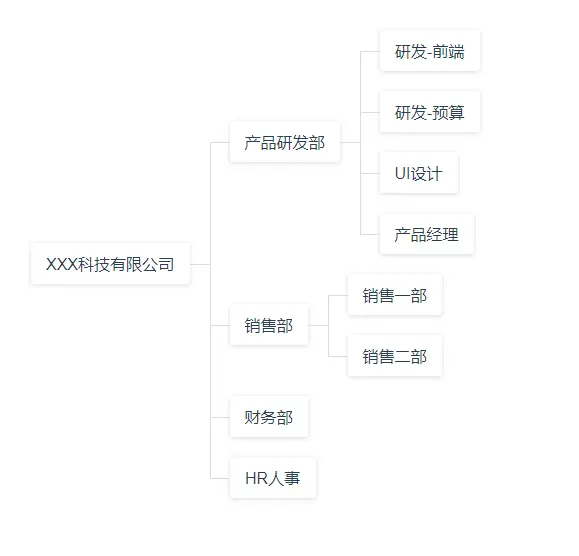
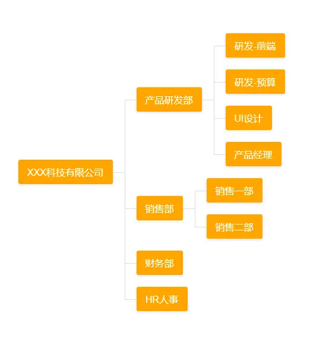
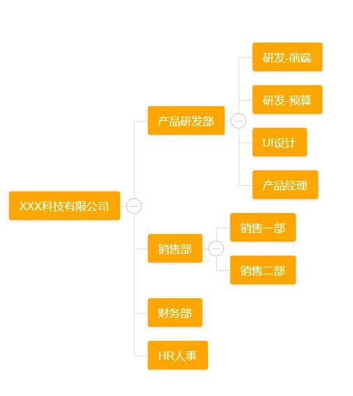

前言
--

> ​ 最近公司项目（`Vue` + `Element` ）需求有用到 `tree` ，所以呢我去网上找了很多插件，都不是很符合我的要求。最后在GitHub上面找到了一款插件是 `iview` 的组织结构树 `vue-org-tree` ,但是由于文档不是特别易懂，自己踩了很多坑。不过定制性特别高，基本上会用到的方法都有了。所以今天来给大家讲解下。


安装
--

### NPM

```
# use npm
npm i vue2-org-tree

# use yarn
yarn add vue2-org-tree
```

### 安装 loader

温馨提示：不安装less-loader基本上都会报错

```
npm install --save-dev less less-loader
```

### Import Plugins

```
import Vue from 'vue'
import Vue2OrgTree from 'vue2-org-tree'

Vue.use(Vue2OrgTree)
```

### CDN

```
# css
<link href="https://unpkg.com/vue2-org-tree@1.1.0/dist/style.css">

# js
<script src="https://unpkg.com/vue@2.5.17/dist/vue.js"></script>
<script src="https://unpkg.com/vue2-org-tree@1.1.0/dist/index.js"></script>
```

简单起步
----

​ 严老湿这边呢，就直接使用`Vue-cli`起步了，`vue-org-tree` 安装成功之后，我们就直接使用了，在`Vue`页面或者组件中使用`vue2-org-tree` 标签，动态绑定data

### 基本创建

```
<vue2-org-tree :data="data"/>
```

data数据放入页面中

id 每个元素不同的ID ，label为name， children为自己的子集数据

```
data: {
        id: 0,
        label: "XXX科技有限公司",
        children: [
          {
            id: 2,
            label: "产品研发部",
            children: [
              {
                id: 5,
                label: "研发-前端"
              },
              {
                id: 6,
                label: "研发-后端"
              },
              {
                id: 9,
                label: "UI设计"
              },
              {
                id: 10,
                label: "产品经理"
              }
            ]
          },
          {
            id: 3,
            label: "销售部",
            children: [
              {
                id: 7,
                label: "销售一部"
              },
              {
                id: 8,
                label: "销售二部"
              }
            ]
          },
          {
            id: 4,
            label: "财务部"
          },
          {
            id: 9,
            label: "HR人事"
          }
        ]
      }
```

效果图：


### 排列方式

刚刚我们看到的是默认排列方式 ，其实还有一种排列方式，我们一起来看看

#### 水平排列

`horizontal` 是水平排列方式，我们来实践一下吧，它的参数是`true`、`false`

```
<vue2-org-tree
	:data="data"
    :horizontal="true"
/>
```

看看效果如何：



### 修改背景色

​ 使用 `label-class-name` 我们还可以动态绑定自定义`class`

```
<vue2-org-tree 
	:data="data" 
    :horizontal="true"      
    :label-class-name="labelClassName"           
/>
```

我们一起来尝试一下吧！

js:

```
 data() {
    return {
		labelClassName:"bg-color-orange"
    }
 }
```

css：

```
.bg-color-orange{
    color: #fff;
    background-color: orange;
}
```

**警告⚠ ：`style`标签里不能加 `scoped` 不然自定义样式无效**

看看效果图



### 折叠展示

折叠展示效果

```
<vue2-org-tree 
	:data="data" 
    :horizontal="true"      
    :label-class-name="labelClassName"    
    collapsable
/>
```


折叠效果是有了，那么怎么展开呢？

```
<vue2-org-tree 
	:data="data" 
    :horizontal="true"      
    :label-class-name="labelClassName"    
    collapsable
	@on-expand="onExpand"
/>
```

js:

```
collapse(list) {
   	var _this = this;
    list.forEach(function(child) {
        if (child.expand) {
          child.expand = false;
        }
        child.children && _this.collapse(child.children);
	});
},
onExpand(e,data) {
    if ("expand" in data) {
       data.expand = !data.expand;
    	if (!data.expand && data.children) {
       		this.collapse(data.children);
    	}
    } else {
        this.$set(data, "expand", true);
    }
},
```

请看效果图：


问题又来了，默认展开如何实现？

请看大屏幕

```
toggleExpand(data, val) {
	var _this = this;
    if (Array.isArray(data)) {
        data.forEach(function(item) {
          _this.$set(item, "expand", val);
          if (item.children) {
            _this.toggleExpand(item.children, val);
          }
      	});
    } else {
        this.$set(data, "expand", val);
        if (data.children) {
          _this.toggleExpand(data.children, val);
        }
    }
}
```

在请求完数据之后直接调用,或者生命周期调用，可以自由发挥

第一个参数是你的资源data，第二个参数是全部展开或否

```
this.toggleExpand(this.data,true)
```

上效果图：



深入观察
----

`vue2-org-tree` 向我们抛出了几个事件，我们先看看有哪些事件

### 点击事件

`on-node-click` 就是被抛出的点击事件

```
<vue2-org-tree 
	:data="data" 
	@on-node-click="NodeClick"
/>
```

我们在方法里面写一个NodeClick用来接受点击触发的值

```
NodeClick(e,data){
	console.log(e)
    // e 为 event
	console.log(data)
    // 当前项的所有详情 如：id label children
}
```

打印结果：

```
// e 的打印
{
    isTrusted: true
    screenX: 720
    screenY: 308
    clientX: 720
    clientY: 205
    ctrlKey: false
    shiftKey: false
    altKey: false
    metaKey: false
    button: 0
    buttons: 0
    relatedTarget: null
    pageX: 720
    ......
}
// data的打印
{
    id: 2
	label: "产品研发部"
	children: Array(4)
}
```

### 移入移出

它还向我们抛出了移入移出事件，返回值与点击事件大致相同

```
<vue2-org-tree 
	:data="data" 
    :horizontal="true"      
    :label-class-name="labelClassName"    
    collapsable
	@on-expand="onExpand"
	@on-node-mouseover="onMouseover"
    @on-node-mouseout="onMouseout"
/>
```

### 拓展移入移出

​ 来了老弟？我们做移入移出，肯定是要有功能的对不对？

每当我们的鼠标移入到小盒子里就出现一个模态框用来展示data内容

```
<vue2-org-tree 
	:data="data" 
    :horizontal="true"  
	name="test"    
    :label-class-name="labelClassName"
	collapsable
	@on-expand="onExpand"
	@on-node-mouseover="onMouseover"
    @on-node-mouseout="onMouseout"
/>
<!-- 创建浮窗盒子 -->
<div v-show="BasicSwich" class="floating">
    <p>ID:{{BasicInfo.id}}</p>
    <p>Name:{{BasicInfo.label}}</p>
</div>
```

js:

```
// 声明变量
data() {
    return {
		BasicSwich:false,
		BasicInfo:{id:null,label:null}
    }
}
// 方法
onMouseout(e, data) {
    this.BasicSwich = false
},
onMouseover(e, data) {
    this.BasicInfo = data;
    this.BasicSwich = true;
    var floating =  document.getElementsByClassName('floating')[0];
    floating.style.left = e.clientX +'px';
    floating.style.top = e.clientY+'px';
},
```

css:

```
/* 盒子css */
.floating{
    background: rgba(0, 0, 0, 0.7);
    width: 160px;
    height: 100px;
    position: absolute;
    color: #fff;
    padding-top: 15px;
    border-radius: 15px;
    padding-left: 15px;
    box-sizing: border-box;
    left:0;
    top: 0;
    transition: all 0.3s;
	z-index: 999;
	text-align: left;
	font-size: 12px;
}
```

上效果图：


API
---

### props

prop

descripton

type

default

data

`Object`

props

configure props

`Object`

`{label: 'label', children: 'children', expand: 'expand'}`

labelWidth

node label width

`String` | `Number`

`auto`

collapsable

children node is collapsable

`Boolean`

`true`

renderContent

how to render node label

`Function`

\-

labelClassName

node label class

`Function` | `String`

\-

selectedKey

The key of the selected node

`String`

\-

selectedClassName

The className of the selected node

`Function` | `String`

\-

### events

event name

descripton

type

click

Click event

`Function`

mouseover

onMouseOver event

`Function`

mouseout

onMouseOut event

`Function`

*   ### Call events
    

#### on-expand

鼠标点击时调用它。

*   params `e` `Event`
*   params `data` `Current node data`

#### on-node-click

well be called when the node-label clicked

*   params `e` `Event`
*   params `data` `Current node data`

#### on-node-mouseover

当鼠标悬停时调用它。

*   params `e` `Event`
*   params `data` `Current node data`

#### on-node-mouseout

当鼠标离开时调用它。

*   params `e` `Event`
*   params `data` `Current node data`

总结
--

最后附上Git地址：[github.com/CrazyMrYan/…](https://github.com/CrazyMrYan/vue2-org-tree "https://github.com/CrazyMrYan/vue2-org-tree")

预览地址：[crazy.lovemysoul.vip/gitdemo/vue…](http://crazy.lovemysoul.vip/gitdemo/vue2-org-tree "http://crazy.lovemysoul.vip/gitdemo/vue2-org-tree")

关注“悲伤日记”查看更多精彩文章


