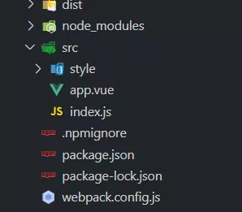
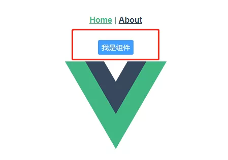

1.初始化
-----

```
npm init
```

命名、描述、版本、作者、储存库等等不想写的可以直接 加上`-y` 一切默认

可以看看我的 `package.json`

因为是`vue`组件所以我们需要部分依赖，如`less`，`es6` ......

```
{
  "name": "vue-org-crazyyan",
  "version": "1.0.0",
  "description": "this is vue module",
  "main": "dist/vocbtn.min.js",
  "scripts": {
    "test": "echo \"Error: no test specified\" && exit 1",
    "start": "webpack-dev-server --hot --inline",
    "build": "webpack --display-error-details --config webpack.config.js"
  },
  "author": "CrazyYan",
  "license": "ISC",
  "devDependencies": {
    "babel-core": "^6.26.0",
    "babel-loader": "^7.1.2",
    "babel-plugin-transform-object-rest-spread": "^6.26.0",
    "babel-plugin-transform-runtime": "^6.23.0",
    "babel-polyfill": "^6.26.0",
    "babel-preset-es2015": "^6.24.1",
    "css-loader": "^0.28.7",
    "es6-promise": "^4.1.1",
    "less": "^3.11.3",
    "less-loader": "^5.0.0",
    "style-loader": "^0.19.0",
    "url-loader": "^0.6.2",
    "vue": "^2.5.9",
    "vue-hot-reload-api": "^2.2.4",
    "vue-html-loader": "^1.2.4",
    "vue-loader": "^13.5.0",
    "vue-router": "^3.1.5",
    "vue-style-loader": "^3.0.3",
    "vue-template-compiler": "^2.6.11",
    "vuex": "^3.1.2",
    "webpack": "^3.9.1",
    "webpack-dev-server": "^2.9.5"
  }
}
```

然后执行下载这些依赖 推荐`cnpm`

```
npm install
```

如果less报错

```
npm install --save-dev less-loader less
```

2.目录架构以及配置
----------

这是所有的新建文件可以参考我的来



`src`是我们自己编写的文件夹，`dist`是打包发布的文件夹

配置一下`webpack`

首先你需要在根目录新建一个 `webpack.config.js`

将下面的代码复制进去，当然也可以自行定义

```
const path = require("path");
const webpack = require("webpack");
const uglify = require("uglifyjs-webpack-plugin");
 
module.exports = {
    devtool: 'source-map',
    //入口文件，就是上步骤的src目录下的index.js文件，
    entry: "./src/index.js",
    output: {
        //输出路径，就是上步骤中新建的dist目录，
        path: path.resolve(__dirname, './dist'),
        publicPath: '/dist/',
        filename: 'vocbtn.min.js',
        libraryTarget: 'umd',
        umdNamedDefine: true
    },
    module: {
        rules: [{
                test: /\.vue$/,
                loader: 'vue-loader'
            },
            {
                test: /\.less$/,
                use: [
                    { loader: "style-loader" },
                    { loader: "css-loader" },
                    { loader: "less-loader" }
                ]
            },
            {
                test: /\.js$/,
                exclude: /node_modules|vue\/dist|vue-router\/|vue-loader\/|vue-hot-reload-api\//,
                loader: 'babel-loader'
            },
            {
                test: /\.(png|jpg|gif|ttf|svg|woff|eot)$/,
                loader: 'url-loader',
                query: {
                    limit: 30000,
                    name: '[name].[ext]?[hash]'
                }
            }
        ]
    },
    plugins: [
        new webpack.DefinePlugin({
            "process.env": {
                NODE_ENV: JSON.stringify("production")
            }
        })
    ]
};
```

`index.js`

```
// 引入
import VocBtn from './app.vue'
// 暴露
export default VocBtn;
```

3.开始搞组件
-------

`app.vue` 就跟我们平常写`vue`组件是一样的,没啥太大区别

```
<template>
  <div>
      <button class="voc-btn">
          {{text}}
      </button>
  </div>
</template>

<script>
export default {
  props:{
      // 限制text的类型
      text:{
        type:String,
      }
  },
  data () {
    return {
    };
  },
}

</script>
<style lang='less' scoped>
    // 引入less
	@import 'styles/index.less';
</style>
```

`style/index.less` 样式照常写

```
.voc-btn{
    border: unset;
    padding: 4px 6px;
    text-align: center;
    font-size: 14px;
    background-color: #409eff;
    color: #fff;
    border-radius: 3px;
    border: 1px solid #409eff;
    outline: none;
    box-sizing: border-box;
    cursor: pointer;
}
.voc-btn:hover{
    border: 1px solid #fff;
    transition: border 0.2s;
}
```

4.打包一下下
-------

```
npm run build
```

将`package.json中`的入口修改成

```
"main": "dist/vocbtn.min.js",
```

5.创建.npmignore
--------------

在根目录创建一个`.npmignore` 文件

配置如下

```
.*
*.md
*.yml
build/
node_modules/
src/
test/
gulpfile.js
```

到了这一步基本上算是做了一个小组件包

6.发布包
-----

发布包前确认你有`npm` 的账号

没有的可以去官网注册 [www.npmjs.com/](https://www.npmjs.com/ "https://www.npmjs.com/")

有账号的童鞋看过来

```
npm login
```

输入你的用户名->密码->邮箱

然后发布

```
npm publish
```

发布包时经常会出现一些奇奇怪怪的报错

一般常见的报错就是

① 你的`npm`包已经存在，需要修改name

在`package.json`中修改name值

② 使用的是淘宝源`cnpm`,登陆到的是`cnpm`

```
npm config set registry http://registry.npmjs.org/
```

`npm`包`package.json`中`registory`属性一定要填写，每次`npm publish`时`package.json`中`version`版本一定要大于上一次。


到这一步就已经发布成功了，那么你可以自己创建一个 `vue-cli` 来试试你的组件了

7.使用包
-----

我们来下载一个`vue-cli`

```
vue create test-vue
cd test-vue
```

下载包

```
npm install vue-org-crazyyan
```

安装-注册

在`app.vue`中

```
// 引入
import VocBtn from 'vue-org-crazyyan'
// 注册
components:{VocBtn}
// 使用
<VocBtn text="我是组件"></VocBtn>
```

启动

```
npm run serve
```

打开 [http://localhost:8080/](http://localhost:8080/ "http://localhost:8080/")



大功告成
----

你的组件就此完成 是不是很有成就感 哈哈


