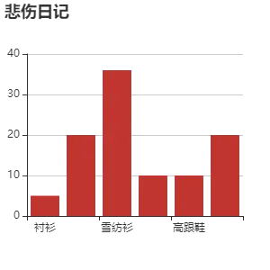
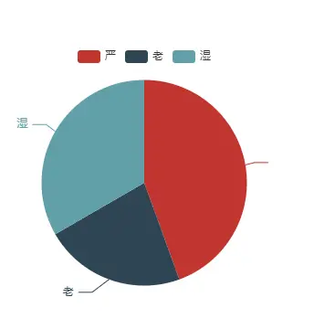
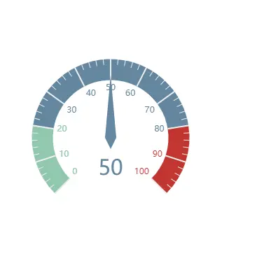
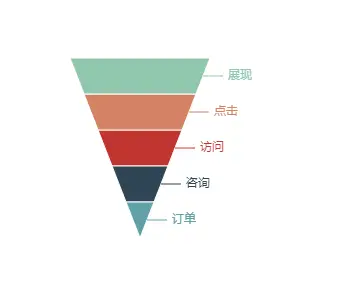
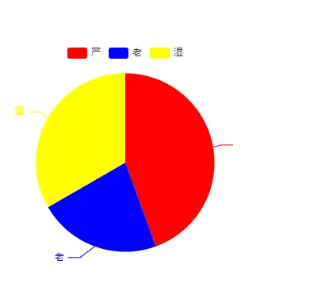
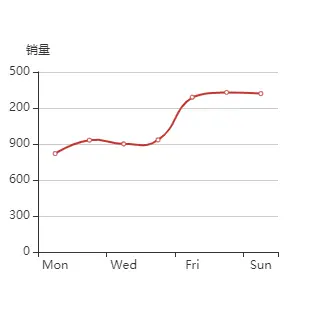
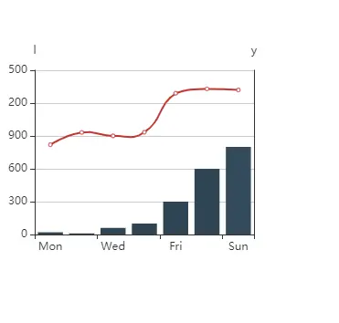
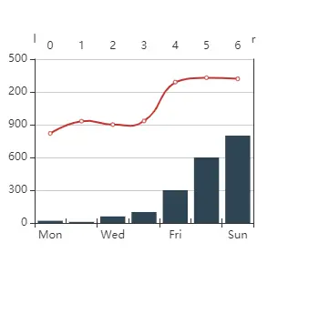

前言
--

> 最近可视化浪潮越发凶猛
> 
> 但是有些小伙伴们就慌了，觉得自己不是很懂，或者说对里面的参数不是很清楚，所以也就印象也就很模糊
> 
> 那么今天严老湿就带大家好好梳理梳理思路，顺便也带大家写几个Demo

首先得认识Echarts
------------

> ​ `Echarts` 商业级数据图表，它是一个纯`JavaScript`的图标库，兼容绝大部分的浏览器，底层依赖轻量级的`canvas`类库`ZRender`，提供直观，生动，可交互，可高度个性化定制的数据可视化图表。创新的拖拽重计算、数据视图、值域漫游等特性大大增强了用户体验，赋予了用户对数据进行挖掘、整合的能力。

简单起步
----

### 创建vue-cli

​ 我们还是老套路，先创建一个`vue-cli` ,如果你已经创建了项目可以跳转到 下一步

`vue create project cd project  yarn serve`

​ 配置啥的 就不用老严多说了吧（你已经是一个成熟的前端开发者了~）

### 安装 Echarts

​ 以下几种安装方式择其一

​ 本项目安装的是采用的`yarn`， `echarts` 版本号是 `4.8.0`

`// yarn yarn add echarts // npm npm install echarts -S // cnpm cnpm install echarts -S`

### 全局引入

​ 在main.js中

`import echarts from 'echarts' Vue.prototype.$echarts = echarts`

​ 到了这一步说明你已经把准备工作做完了

### 清空多余代码

​ 我们先把页面其他不需要用到的代码给清除吧

`<template>   
  
 </template>  `

### 创建一个容器

创建一个 id 为`EChart` 的div 作为容器 (使用id会有个小问题，在最后解答)

`

`

### 创建一个方法

`getRenderer() {       console.log(this.$echarts);       // 基于准备好的dom，初始化echarts实例       let EChart = this.$echarts.init(document.getElementById("EChart"));       // 配置参数       let config = {         title: { text: "悲伤日记" },         tooltip: {},         xAxis: {           data: ["衬衫", "羊毛衫", "雪纺衫", "裤子", "高跟鞋", "袜子"],         },         yAxis: {},         series: [           {             name: "销量",             type: "bar",             data: [5, 20, 36, 10, 10, 20],           },         ],       };       // 设置参数     EChart.setOption(config); },`

### 生命周期中调用此方法

`mounted() {     // 在生命周期中调用 getRenderer 方法     this.getRenderer(); },`

### 请看大屏幕

​

​ 吃瓜群众：“这特么不是官方示例么？能不能炫一点”

​ 严老师：“说实话确实有点low ，不要慌这才哪到哪呢，我们先从基础讲堂开始嘛”

### 先了解其参数

​ 先讲讲其中简单的一些配置参数，枯燥乏味，但是摸清楚之后，以后画图那是顺手得一\*\*

​ 先整点简单、常用的来看看（备注里面皆是对应`API`地址）

参数名

作用

备注

`title`

作为图表名称

https://echarts.apache.org/zh/option.html#title

`legend`

作为图表的标记

https://echarts.apache.org/zh/option.html#legend

`xAxis`

作为图表的X轴

https://echarts.apache.org/zh/option.html#xAxis

`yAxis`

作为图表的Y轴

https://echarts.apache.org/zh/option.html#yAxis

`series`

作为图表的系列

https://echarts.apache.org/zh/option.html#series

`color`

作为图表的颜色列表

https://echarts.apache.org/zh/option.html#color

​ 掰扯了这么多，估计大家心里也没个底，实战一下吧

来造作一下下
------

### series type

来吧！！展示

#### 折线图

​ 修改折线图,复制上面的`config`代码

​ 只用修改一处地方，那就是`series` 中的`type`属性为`line`即可

`let config = {    title: { text: "悲伤日记" },    tooltip: {},    xAxis: {       data: ["衬衫", "羊毛衫", "雪纺衫", "裤子", "高跟鞋", "袜子"],     },     yAxis: {},     series: [        {             name: "销量",             type: "line",             data: [5, 20, 36, 10, 10, 20],        },     ], };`

#### 饼状图

​ 饼状图，我们也来看看，将`type`修改为`pie`

​ 当然我们需要把多余的`X轴Y轴`配置删除咯,data数据格式也需要修改一下

`let config = {     tooltip: {},     legend:{        data : ["严","老","湿"]     },     series: [        {           name: "销量",           type: "pie",           data: [               {value:20,name:"严"},               {value:10,name:"老"},               {value:15,name:"湿"}           ],         },     ], };`

#### 仪表盘

​ 仪表盘将 `type` 修改为 `gauge`

`let config = {     series: [        {          name: "销量",          type: "gauge",          data: [50],        },     ], };`

​ 嗯~ 看起来有那么一点味道了

#### 画一个老严的脸

`let config = {       series: [           {             name: "销量",             type: "funnel",             data: [                  {value: 60, name: '访问'},                  {value: 40, name: '咨询'},                  {value: 20, name: '订单'},                  {value: 80, name: '点击'},                  {value: 100, name: '展现'}               ]            },      ], };`

哈哈哈 倒三角就是老严的脸了 （脑补一下下）

### legend

刚刚其实我们已经用到了这个参数噢 ps：饼状图

`legend` 可以作为图表的标记或颜色的名称描述(专业名词：图例)

它的type有两个参数`plain || scroll`

默认为`plain` 当图表内容比较丰富的时候可以使用 `scroll` 可以带有滚动操作

### color

​ 都说颜色是Web的灵魂所在，每一个人都是画手

​ 官方默认配色 ：

`['#c23531','#2f4554', '#61a0a8', '#d48265', '#91c7ae','#749f83',  '#ca8622', '#bda29a','#6e7074', '#546570', '#c4ccd3']`

​ 我们也可以自己修改颜色,规则是按数据对应的`index`找`color`颜色

​ 例如这样：

`let config = {      color:["red","blue","yellow"],     legend:{             data : ["严","老","湿"]     },     series: [             {                name: "销量",                type: "pie",                data: [                     {value:20,name:"严"},                     {value:10,name:"老"},                     {value:15,name:"湿"}                ],           },     ], };`

### yAxis

我们还是以线条为参考8

先看看基础篇,我们在y轴声明了一个name

`let config = {     xAxis: {         type: 'category',         data: ['Mon', 'Tue', 'Wed', 'Thu', 'Fri', 'Sat', 'Sun']     },     yAxis:[ {         name:"销量",         type: 'value'     }],     series: [{         name:'销量',         data: [820, 932, 901, 934, 1290, 1330, 1320],         type: 'line',         smooth: true     }] };`

但是有时候呢，我们会根据需求，要做一个双Y轴，顾名思义双Y轴，在加一个Y轴就好了

`let config = {     xAxis: {         type: 'category',         data: ['Mon', 'Tue', 'Wed', 'Thu', 'Fri', 'Sat', 'Sun']     },     yAxis:[ {         name:"l",         type: 'value'     }, {         name:"r",         type: 'value'     }],     series: [{         name:'l',         data: [820, 932, 901, 934, 1290, 1330, 1320],         type: 'line',         smooth: true     },     {         name:'r',         data: [20, 10, 60, 100, 300, 600, 800],         type: 'bar',     }] }`

### xAxis

x轴与y轴基本同理，直接改成数组就成为双x轴了

`let config = {     xAxis: [{         type: 'category',         data: ['Mon', 'Tue', 'Wed', 'Thu', 'Fri', 'Sat', 'Sun']     },{         type: 'category',         data: ['0', '1', '2', '3', '4', '5', '6']     }],     yAxis:[{         name:"l",         type: 'value'     }, {         name:"r",         type: 'value'     }],     series: [{         name:'l',         data: [820, 932, 901, 934, 1290, 1330, 1320],         type: 'line',         smooth: true     },     {         name:'r',         data: [20, 10, 60, 100, 300, 600, 800],         type: 'bar',     }] };`

到了上面基础篇也就差不多了

使用id为问题所在
---------

其实我们讲了这么多，我们梳理梳理最开始的问题

1.  id重名怎么办？
2.  数据多个渲染怎么办？

答案：使用ref，因为vue是单页面，使用id出现 重名会导致渲染问题

具体怎么使用我们来看看

`

`

`// 同样的初始化参数 但是我们此次使用的是ref  let EChart = this.$echarts.init(this.$refs.EChart) // 配置参数 let config = {     xAxis: [{         type: 'category',         data: ['Mon', 'Tue', 'Wed', 'Thu', 'Fri', 'Sat', 'Sun']     },{         type: 'category',         data: ['0', '1', '2', '3', '4', '5', '6']     }],     yAxis:[{         name:"l",         type: 'value'     }, {         name:"r",         type: 'value'     }],     series: [{         name:'l',         data: [820, 932, 901, 934, 1290, 1330, 1320],         type: 'line',         smooth: true     },     {         name:'r',         data: [20, 10, 60, 100, 300, 600, 800],         type: 'bar',     }] }; // 设置参数 EChart.setOption(config);`

总结
--

使用`echarts` 的熟练度最主要的就是写得多，社区的案例也是多不胜数，面向社区开发就好了

社区地址：https://gallery.echartsjs.com/explore.html#sort=rank~timeframe=all~author=all

参考文献
----

https://echarts.apache.org/zh/option.html

https://echarts.apache.org/examples/zh/index.html

本文使用 [mdnice](https://mdnice.com/?from=juejin "https://mdnice.com/?from=juejin") 排版

\- END -

