前言
--

> 因为自己最近在搭建一个自己的博客，需要有个评论功能，又不想自己建数据库，还想用第三方登录，仔细斟酌一番后，决定使用 [gitalk](https://github.com/gitalk/gitalk/ "https://github.com/gitalk/gitalk/") \[0\] ，用完之后是真香，所以来给大家安利一波~

大概长这样👇

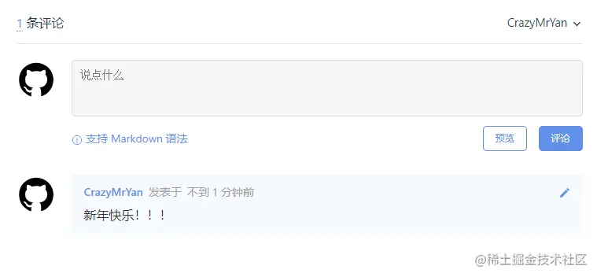

gitalk 特点
---------

✅ GitHub 登录

✅ 无需数据库

✅ 无干扰模式（设置 distractionFreeMode 为 true 开启）

✅ 支持多语言 \[en, zh-CN, zh-TW, es-ES, fr, ru, de, pl, ko\]

✅ 快捷键提交评论 （cmd|ctrl + enter）

✅ 支持个人或组织

安装
--

npm

```shell
# npm
npm i --save gitalk

# 引入
import 'gitalk/dist/gitalk.css'
import Gitalk from 'gitalk'
```

or

直接引入

```html
<link rel="stylesheet" href="https://unpkg.com/gitalk/dist/gitalk.css">
<script src="https://unpkg.com/gitalk/dist/gitalk.min.js"></script>
```

使用
--

老严就直接用的 直接引入，先创建一个index.html文件

创建一个容器用于存放 gitalk

```html
<div id="gitalk-container"></div>
```

new 一个 gitalk 来进行配置

下面这些参数还没有？等等老严再教大家一步一步填写

```js
var gitalk = new Gitalk({
    clientID: 'GitHub Application Client ID',
    clientSecret: 'GitHub Application Client Secret',
    repo: 'GitHub repo',
    owner: 'GitHub repo owner',
    admin:  ['GitHub repo owner and collaborators, only these guys can initialize github issues'],
    id: location.pathname,      // Ensure uniqueness and len
    distractionFreeMode: false  // Facebook-like distraction
})
```

render 一下

```js
gitalk.render('gitalk-container')
```

看下我们刚刚写完这些之后的效果，大致就长这样了

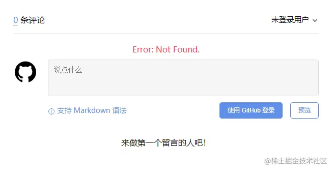

创建评论仓库
------

我们不用数据库是没错，但是我们至少需要一个容器来存放这个评论数据吧！`gitalk` 需要我们创建一个用于存放评论的空仓库，我们就叫 [gitalk-comments](https://github.com/CrazyMrYan/gitalk-comments "https://github.com/CrazyMrYan/gitalk-comments") \[2\]

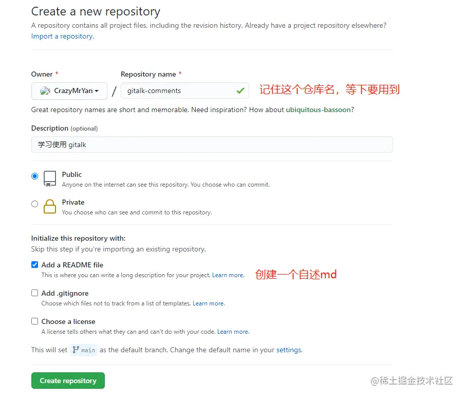

刚刚我们已经创建完了一个空仓库


创建 gitalk
---------

我们已经做完了我们的准备工作。那么接下来，我们就需要创建属于我们自己的 [gitalk 应用](https://github.com/settings/applications/new "https://github.com/settings/applications/new") \[1\]

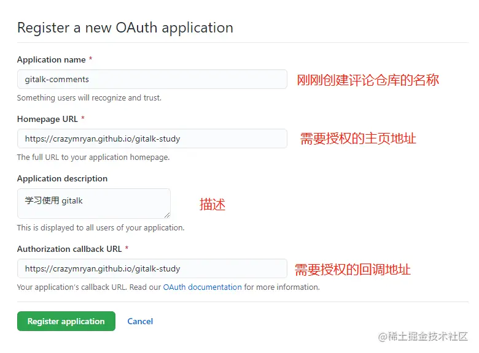

！注意：这里的 `Homepage URL` 与 `authorization callback URL` 可填写自己的域名，因为老严采用的是 `gh-pages`

点击注册之后，我们会跳转到 详细配置页面

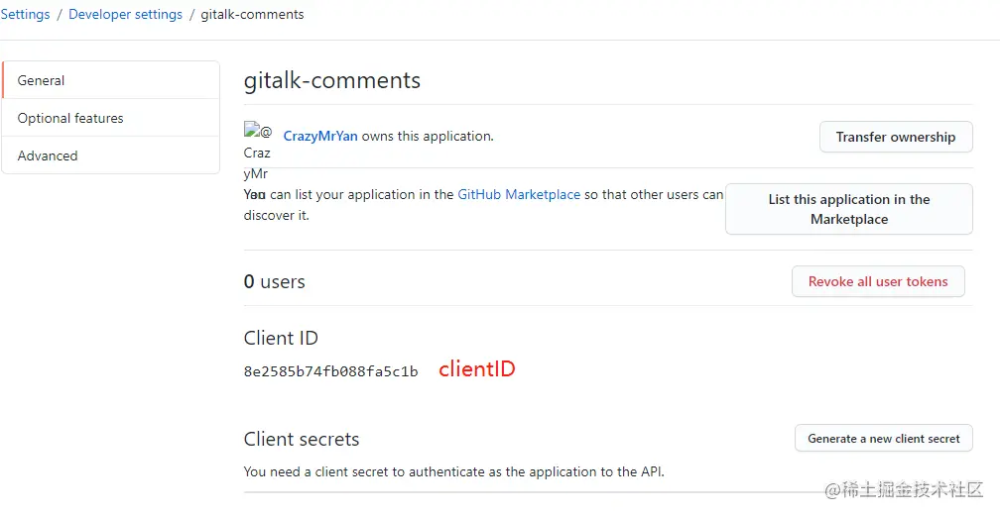

这里面的 `clientID` 是我们之前配置中需要的 ID

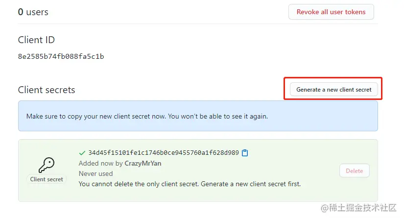

我们还需要创建这个 `clientSecret` 密钥 点击 `Generate a new client secret` 即可创建

重新配置
----

```js
var gitalk = new Gitalk({
    clientID: '8e2585b74fb088fa5c1b', // clientID 
    clientSecret: '34d45f15101fe1c1746b0ce9455760a1f628d989', // clientSecret
    repo: 'gitalk-comments', // 评论仓库名
    owner: 'crazymryan',
    admin: ['crazymryan'], // 管理人
    id: location.pathname, // 返回当前 URL 的路径部分作为id
    language:'zh-CN', // 语言
    distractionFreeMode: false  // 无干扰模式
})
```

修改完之后 ，老严直接提交到了 `gh-pages` ，如果你是自己的网站，直接上传这个 index.html 文件

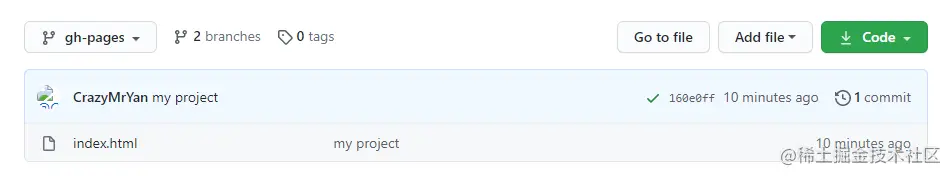

效果
--

打开 [crazymryan.github.io/gitalk-stud…](https://crazymryan.github.io/gitalk-study/ "https://crazymryan.github.io/gitalk-study/") 这个地址

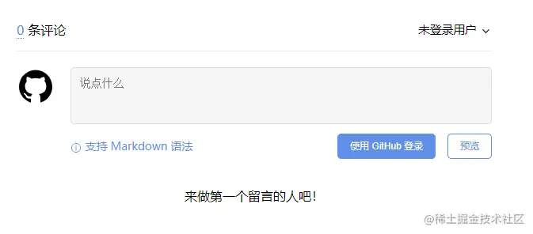

点击 `使用 GitHub 登录` 进行绑定授权

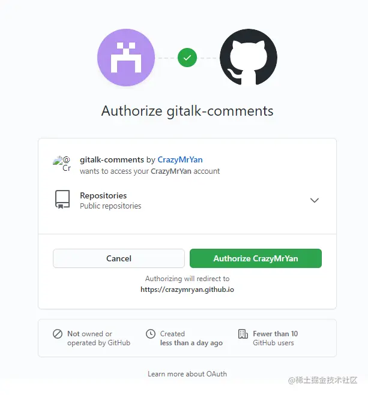

授权成功之后回到页面上

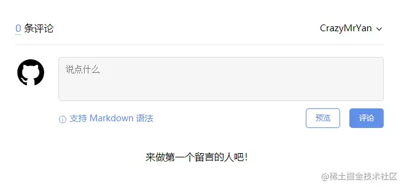

输入点东西评论一下吧！

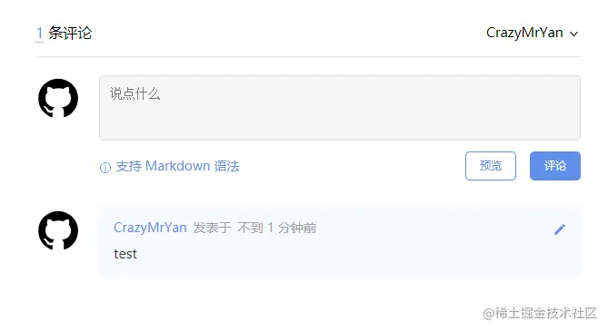

此时我们可以在之前创建的空仓库中的 `issue` 中看到我们刚刚评论的内容了

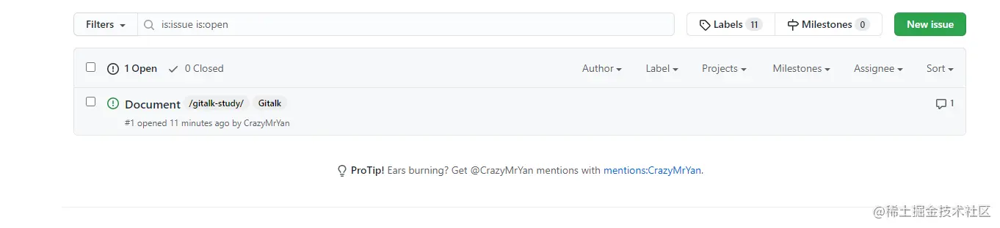

全部代码
----

如果你想看看全部代码可以去 [gitalk-study](https://github.com/CrazyMrYan/gitalk-study/tree/gh-pages "https://github.com/CrazyMrYan/gitalk-study/tree/gh-pages") \[3\] 看看，如果你有兴趣想看看老严的博客也可以访问 [blog](https://crazymryan.github.io/blog/ "https://crazymryan.github.io/blog/") \[4\]

这里也贴一下全部代码吧

```html
<!DOCTYPE html>
<html lang="en">
<head>
    <meta charset="UTF-8">
    <meta name="viewport" content="width=device-width, initial-scale=1.0">
    <title>Document</title>
    <link rel="stylesheet" href="https://unpkg.com/gitalk/dist/gitalk.css">
    <script src="https://unpkg.com/gitalk/dist/gitalk.min.js"></script>
    <style>
        #gitalk-container {
            max-width: 600px;
            margin: 0 auto;
        }
    </style>
</head>
<body>
    <div id="gitalk-container"></div>
    <script>
    var gitalk = new Gitalk({
        clientID: '8e2585b74fb088fa5c1b', //clientID 
        clientSecret: '34d45f15101fe1c1746b0ce9455760a1f628d989', //clientSecret
        repo: 'gitalk-comments', // 评论仓库名
        owner: 'crazymryan',
        admin: ['crazymryan'], //管理人
        id: location.pathname, // 返回当前 URL 的路径部分作为id
        language:'zh-CN', //语言
        distractionFreeMode: false  // 无干扰模式
    })
    gitalk.render('gitalk-container')
    </script>
</body>
</html>
```

注解地址
----

\[0\] [github.com/gitalk/gita…](https://github.com/gitalk/gitalk/ "https://github.com/gitalk/gitalk/")

\[1\] [github.com/settings/ap…](https://github.com/settings/applications/new "https://github.com/settings/applications/new")

\[2\] [github.com/CrazyMrYan/…](https://github.com/CrazyMrYan/gitalk-comments "https://github.com/CrazyMrYan/gitalk-comments")

\[3\] [github.com/CrazyMrYan/…](https://github.com/CrazyMrYan/gitalk-study/tree/gh-pages "https://github.com/CrazyMrYan/gitalk-study/tree/gh-pages")

\[4\] [crazymryan.github.io/blog/](https://crazymryan.github.io/blog/ "https://crazymryan.github.io/blog/")
