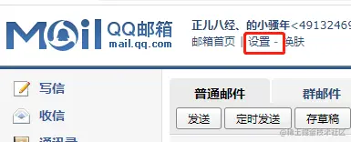
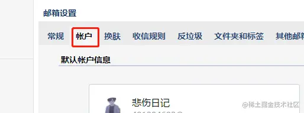
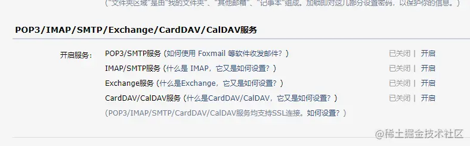
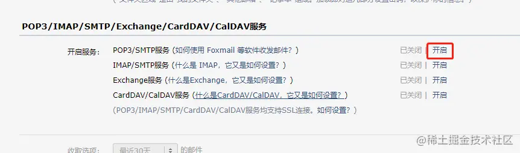
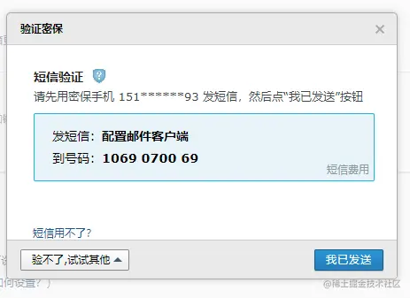
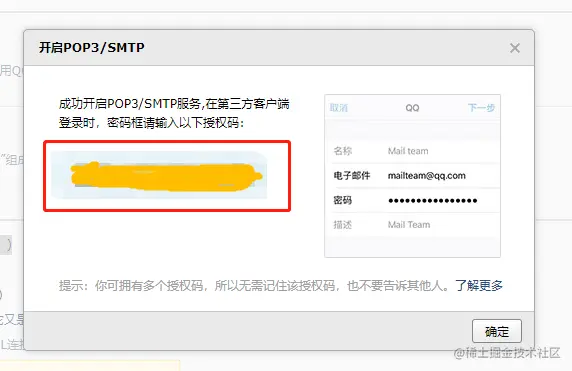
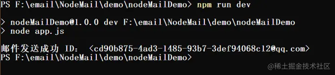
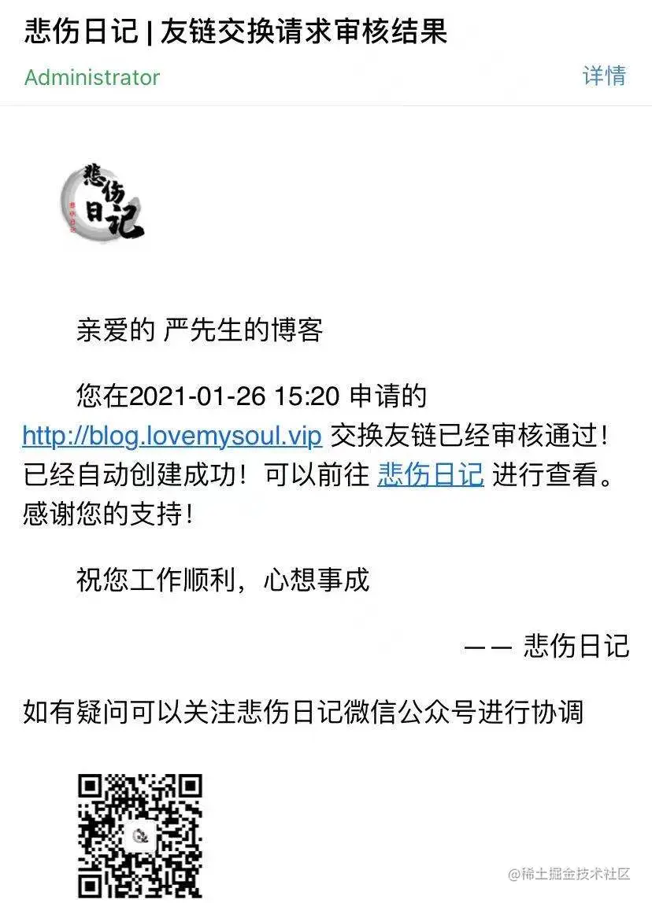
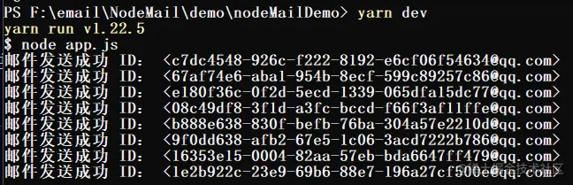
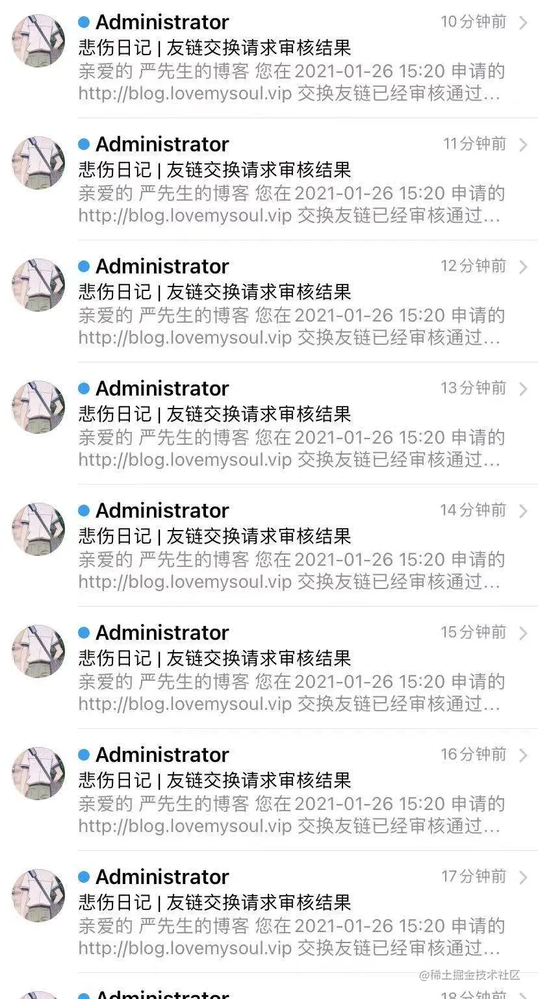

前言
--

> 因为最近自己建站需要添加友链，又不想每次去改静态文件，所以抽出来一个表单，准备给大家填写自己的信息然后提交到后台审核，但是我需要一个邮件来通知大家已经审核通过了，所以我就需要一个发邮件的插件 `nodemailer`\[0\] ，当然大佬们已经知道了。因为平时node玩的比较少，所以也在这里记录一下

先上效果图
-----


老严你这标题党 ，说好的定时给女朋友发邮件的小浪漫呢？ 咱不着急哈？后面会讲到，我们先试下自己手动一步一步的去使用这款插件 `nodemailer`

准备工作
----

我们发邮件会需要一个 SMTP 授权码！ 我们需要去邮箱里面获取，这里我选择的是QQ邮箱（因为搜到的教程就是QQ的）

1.  **进入QQ邮箱**



2.  **选择账户**



3.  **翻到POP3/IMAP/SMTP/Exchange/CardDAV/CalDAV服务**



4.  **POP3/SMTP服务后面的开启**



5.  **发送信息进行验证**



6.  **复制授权码**



配置
--

stop 就是这里，别滑太快了

#### 创建一个文件夹

目录名各位请便

#### 创建入口文件

我这里命名时 app.js 各位自便

#### 初始化

```shell
npm init -y
```

#### 安装

```shell
npm install nodemailer
```

老严这里的 nodemailer 安装的是 `4.4.0` 的版本

#### package.js

完成之后大概长这样

```json
{
  "name": "nodeMailDemo",
  "version": "1.0.0",
  "description": "",
  "main": "app.js",
  "scripts": {
    "test": "echo \"Error: no test specified\" && exit 1",
    // dev 这是老严自己加上去的哈
    "dev":"node app.js"
  },
  "keywords": [],
  "author": "",
  "license": "ISC",
  "dependencies": {
    "nodemailer": "^4.4.0"
  }
}
```

come baby
---------

大家看黑板，现在这里是重点了哈，集中注意力 进入到 app.js 中

### 引入

```js
const nodemailer = require('nodemailer'); 
```

### 创建

```js
// 创建 nodemailer 配置
let transporter = nodemailer.createTransport({
    //支持列表： https://nodemailer.com/smtp/well-known/
    service: 'QQ', // 老严用的是 QQ
    port: 465, // SMTP 端口 这个不用管
    secureConnection: true, 
    auth: {
        user: '你的邮箱@qq.com',
        pass: '这里填写我们刚刚获取到的smtp授权码', 
    }
});
```

### 发送内容

```js
let mailOptions = {
    from: '"NickName" <你的邮箱@qq.com>', 
    to: '接收人的邮箱', 
    subject: '发文章的标题', /
    text: '这里填写你发送的内容'
    // html:'这里也可以写html'
};
```

### 执行发送

```js
transporter.sendMail(mailOptions, (error, info) => {
    if (error) {
        return console.log(error);
    }
    console.log('邮件发送成功 ID：', info.messageId);
});
```

总共才 20 来行的代码到底行不行呢？

```shell
node app.js
```

### 老严的配置

```js
const nodemailer = require('nodemailer'); //发送邮件的node插件
function sendEmail (data){
    let transporter = nodemailer.createTransport({
        service: 'QQ', // 发送者的邮箱厂商，支持列表：https://nodemailer.com/smtp/well-known/
        port: 465, // SMTP 端口
        secureConnection: true, // SSL安全链接
        auth: {   //发送者的账户密码
            user: '2407488005@qq.com', //账户
            pass: 'smtp 授权码', //smtp授权码，到邮箱设置下获取
        }
    });
    let mailOptions = {
        from: '"悲伤日记" <2407488005@qq.com>', // 发送者昵称和地址
        to: data.email, // 接收者的邮箱地址
        subject: '悲伤日记 | 友链交换请求审核结果', // 邮件主题
        html: data.content
    };
    //发送邮件
    transporter.sendMail(mailOptions, (error, info) => {
        if (error) {
            return console.log(error);
        }
        console.log('邮件发送成功 ID：', info.messageId);
    }); 
}
// 这里是 nickName, createTime, link 通过 api 返回的参数进行动态填写的
let nickName, createTime, link;
nickName =  '严先生的博客'
createTime = '2021-01-26 15:20';
link = 'http://blog.lovemysoul.vip'

let data = {
    email:'491324693@qq.com',
    content:`
        <p style="text-indent: 2em;">亲爱的 ${ nickName } </p>
        <p style="text-indent: 2em;">您在${ createTime } 申请的 ${ link } 交换友链已经审核通过！已经自动创建成功！可以前往 <a href="http://blog.lovemysoul.vip/Friendship.html">悲伤日记</a> 进行查看。感谢您的支持！</p>
        <p style="text-indent: 2em;">祝您工作顺利，心想事成</p>
        <p style="text-align: right;">—— 悲伤日记</p>
        <p>如有疑问可以关注悲伤日记微信公众号进行协调 </p>
        
    `
}
sendEmail(data) 
```

### 执行发送

```shell
node app.js
# or 
npm run dev
```



### Di~ 收到了！

 打开一看 

开始定时任务
------

因为我们执行完发送邮件之后，这个任务执行完成就已经关闭了。我们需要一个定时任务来给它一直跑 `node-schedule`

### 安装

```shell
npm install node-schedule
```

### 使用

```js
// 引入
var schedule = require('node-schedule');
// 定时执行
schedule.scheduleJob('10 * * * * *', ()=>{
    sendEmail(data)
});
```

### schedule 讲解

引用一名博主的讲解 [《Nodejs学习笔记（十二）--- 定时任务（node-schedule)》](https://www.cnblogs.com/zhongweiv/p/node_schedule.html "https://www.cnblogs.com/zhongweiv/p/node_schedule.html")\[2\]

```html
*  *  *  *  *  *
┬ ┬ ┬ ┬ ┬ ┬
│ │ │ │ │  |
│ │ │ │ │ └ day of week (0 - 7) (0 or 7 is Sun)
│ │ │ │ └───── month (1 - 12)
│ │ │ └────────── day of month (1 - 31)
│ │ └─────────────── hour (0 - 23)
│ └──────────────────── minute (0 - 59)
└───────────────────────── second (0 - 59, OPTIONAL)

　　6个占位符从左到右分别代表：秒、分、时、日、月、周几

　　'*'表示通配符，匹配任意，当秒是'*'时，表示任意秒数都触发，其它类推

　　下面可以看看以下传入参数分别代表的意思

每分钟的第30秒触发： '30 * * * * *'

每小时的1分30秒触发 ：'30 1 * * * *'

每天的凌晨1点1分30秒触发 ：'30 1 1 * * *'

每月的1日1点1分30秒触发 ：'30 1 1 1 * *'

2016年的1月1日1点1分30秒触发 ：'30 1 1 1 2016 *'

每周1的1点1分30秒触发 ：'30 1 1 * * 1'
```

### 我们执行的是每分钟的第10秒钟发送邮件

大家也可以根据自己的需求去修改 

### 看看邮箱



### 全部代码

```js
const nodemailer = require('nodemailer'); //发送邮件的node插件
var schedule = require('node-schedule');

function sendEmail (data){
    let transporter = nodemailer.createTransport({
        service: 'QQ', 
        port: 465, 
        secureConnection: true, 
        auth: {  
            user: '2407488005@qq.com', 
            pass: '授权码', 
        }
    });
    let mailOptions = {
        from: '"悲伤日记" <2407488005@qq.com>',
        to: data.email, 
        subject: '悲伤日记 | 友链交换请求审核结果', 
        html: data.content
    };
    transporter.sendMail(mailOptions, (error, info) => {
        if (error) {
            return console.log(error);
        }
        console.log('邮件发送成功 ID：', info.messageId);
    }); 
}
let nickName, createTime, link ;
nickName =  '严先生的博客'
createTime = '2021-01-26 15:20';
link = 'http://blog.lovemysoul.vip'

let data = {
    email:'491324693@qq.com',
    content:`
        <p style="text-indent: 2em;">亲爱的 ${ nickName } </p>
        <p style="text-indent: 2em;">您在${ createTime } 申请的 ${ link } 交换友链已经审核通过！已经自动创建成功！可以前往 <a href="http://blog.lovemysoul.vip/Friendship.html">悲伤日记</a> 进行查看。感谢您的支持！</p>
        <p style="text-indent: 2em;">祝您工作顺利，心想事成</p>
        <p style="text-align: right;">—— 悲伤日记</p>
        <p>如有疑问可以关注悲伤日记微信公众号进行协调 </p>
        
    `
}

schedule.scheduleJob('10 * * * * *', ()=>{
    sendEmail(data)
});
```

注解地址
----

\[0\] [github.com/nodemailer/…](https://github.com/nodemailer/nodemailer "https://github.com/nodemailer/nodemailer")

\[1\] [github.com/node-schedu…](https://github.com/node-schedule/node-schedule "https://github.com/node-schedule/node-schedule")

\[2\] [www.cnblogs.com/zhongweiv/p…](https://www.cnblogs.com/zhongweiv/p/node_schedule.html "https://www.cnblogs.com/zhongweiv/p/node_schedule.html")
