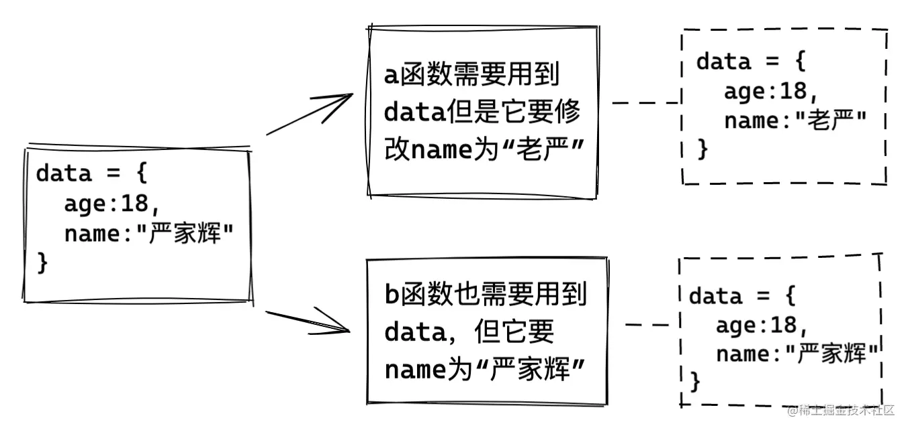
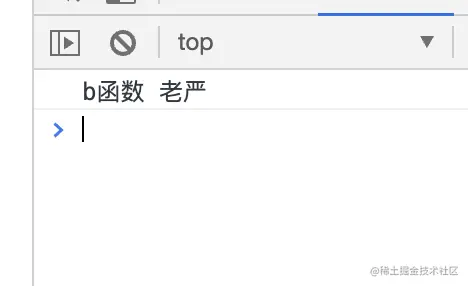
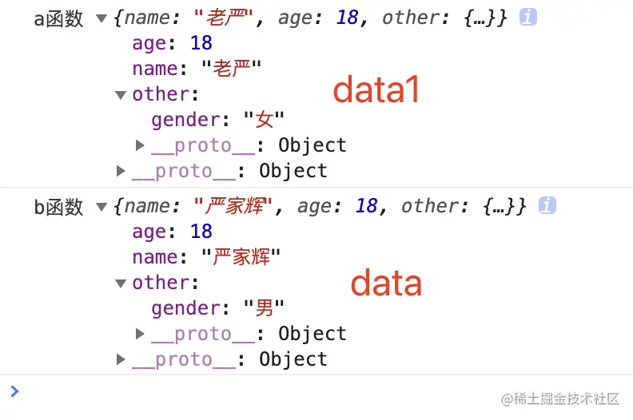
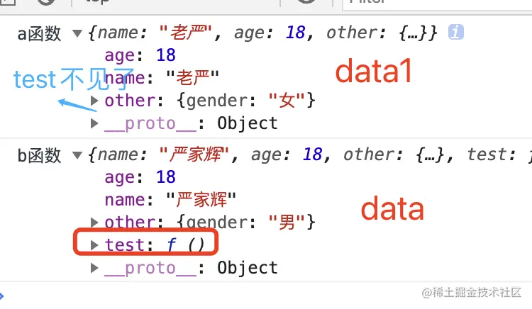
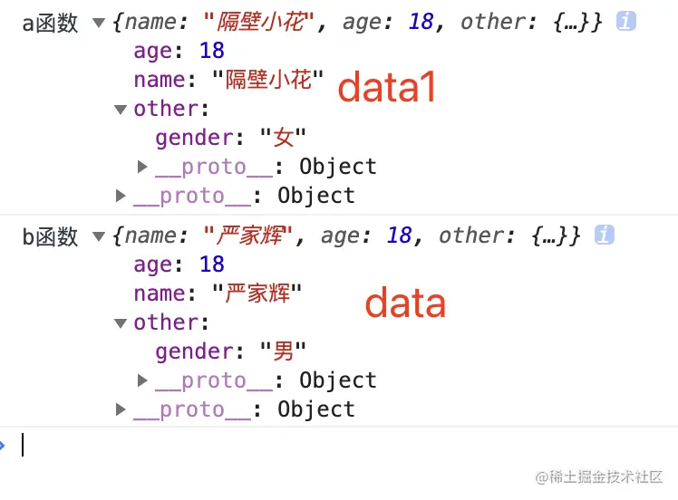
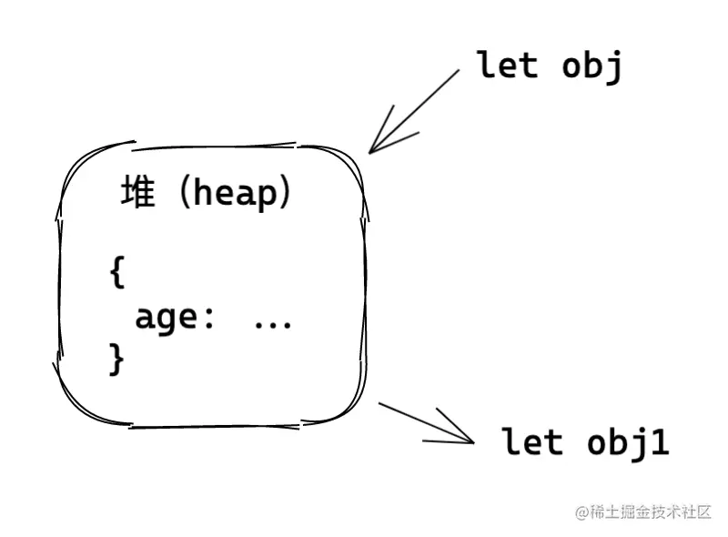
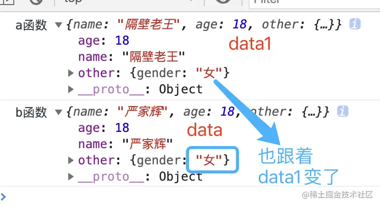
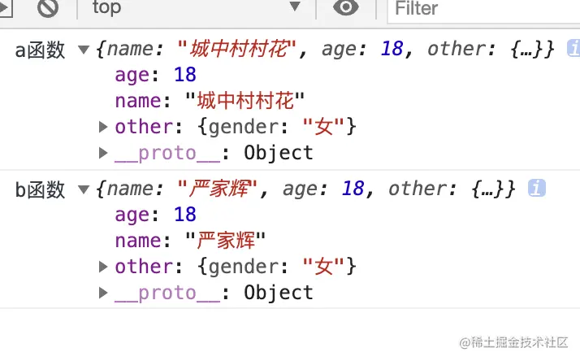

前言
--

再次谈及深拷贝，已经过了两三年了！花有重开日人无再少年啊，从当初的懵懵懂懂到现在的油腻大叔，害

基本类型 与 引用类型
-----------

在这里我们先说明 `基本类型` 与 `引用类型` 的区别

**基本数据类型**：直接存储在`栈 (stack)` 中的数据

String, Number, Boolean, Null, Undefined，Symbol

```js
let a = 1
let b = a
b = 2
console.log(a,b)
// 1 , 2
```

`a` 与 `b` 变量 都是基本类型，我们直接修改 b ，a 是不会被影响到的

**引用数据类型**：存储的是该对象在栈中引用，真实的数据存储在`堆（heap）`

Object 、Array 、Function 、Data

题来！！

```js
let obj = {
  name: '严家辉',
  age: 18
}
let obj1 = {
  name: '严家辉',
  age: 18
}
console.log(obj === obj1)
```

输出什么？

相信有一部分同学已经知道了是 `false`,那是为什么呢，真相就是引用地址不同因为是引用类型

> 引用类型的变量，== 和 === 只会判断引用的地址是否相同，而不会判断对象具体里属性以及值是否相同

### 如何比较一个对象是否相等？

1.JSON.stringify

```js
console.log(JSON.stringify(obj) === JSON.stringify(obj1))
// true
```

我们现在是将`obj` 转成了 `string` 类型，不会对比引用地址

```js
'{"name":"严家辉","age":18}' === ' {"age":18,"name":"严家辉"}'
```

但是这样有一个问题

```js
let obj = {
  name: '严家辉',
  age: 18
}
let obj1 = {
  age: 18,
  name: '严家辉'
}
console.log(JSON.stringify(obj) === JSON.stringify(obj1))
```

将 `obj1` 的顺序修改了一遍之后？现在这两个对象是否相等？还是这样转为字符串，肯定返回 `false` 嘛


那么我们需要如何判断两个对象（`不定顺序的kv`）是否相等呢？

```js
let obj = {
  name: '严家辉',
  age: 18
}
let obj1 = {
  age: 18,
  name: '严家辉'
}
const isSame = (obj1, obj2) => {
    var obj1keys = Object.keys(obj1);
    var obj2keys = Object.keys(obj2);
    if (obj2keys.length !== obj1keys.length)return false
    for (let i = 0; i <= obj1keys.length - 1; i++) {
        let key = obj1keys[i]
        if (!obj2keys.includes(key)) return false
        if (obj2[key] !== obj1[key]) return false
    }
    return true
}
console.log(isSame(obj,obj1)) // true
```

这样对象值为基本数据类型的不管是顺序是否一致都可以对比了

### 关于引用地址

好了，我们回过头来看看这个

```js
let obj = {
  name: '严家辉',
  age: 18
}
let obj1 = obj
console.log(obj === obj1)
```

我们在之前说过引用类型的 == 、=== 只是判断它的引用地址是否相同

那么它在这里的引用地址肯定是一样的，故打印 true


那么我现在需要修改 `obj1` 的 `age` 为 24

```js
let obj = {
  name: '严家辉',
  age: 18
}
let obj1 = obj
obj1.age = 24
console.log('obj',obj)
console.log('obj1',obj1)
```

输出什么呢？


为啥obj也会改变呢

> 当我们使用=将这些变量赋值到另外的变量，实际上是将对应的值拷贝了一份，然后赋值给新的变量。
> 
> 对象是通过引用传递，而不是值传递。也就是说，变量赋值只会将地址传递过去。

故我们修改 `obj1` 其实也是修改的 `obj` 本身


那么问题来了，假如我们在项目上面有个这样的需求



也就是我们目标对象 `data` ，a 函数先执行，然后执行b函数，但是b函数的要用到 `data.name` 为严家辉

```js
let data = {
    name: '严家辉',
    age: 18
}
const a = () => data.name = '老严'
const b = () => console.log('b函数',data.name) // 老严
a()
b()
```



在这里我们就需要了解一下深拷贝了

什么是深拷贝？
-------


在图中我们可以看到我们在内存中新开了一个堆用来拷贝obj的数据，但是修改obj1不会影响obj

> 建一个新的对象或数组，将原对象的各项属性的“值”（数组的所有元素）拷贝过来，是“数据”而不是“引用地址” 我们希望在改变新的对象的时候，不影响原对象

怎么实现呢？
------

### 1、JSON 序列化

```js
let data = {
    name: '严家辉',
    age: 18,
    other: {
        gender: "男"
    }
}
const a = () => {
    // 核心内容
    let data1 = JSON.parse(JSON.stringify(data))
    data1.name = '老严'
    data1.other.gender = '女'
    console.log('a函数',data1.name)
}
const b = () => console.log('b函数',data) // 老严
a()
b()
```



先通过 `JSON.stringify` 将对象转为字符串再重新序列化为对象。

这个应该是最简单的深拷贝了

缺点是如果对象中包含函数会丢失

```js
let data = {
    name: '严家辉',
    age: 18,
    other: {
        gender: "男"
    },
  	// + 个test函数
    test: function() {}
}
const a = () => {
    let data1 = JSON.parse(JSON.stringify(data))
    data1.name = '老严'
    data1.other.gender = '女'
    console.log('a函数',data1)
}
const b = () => console.log('b函数',data) // 老严
a()
b()
```

看看 `test` 凉了没



### 2、for in 遍历

```js
const deepCopy = obj => {
    // 判断是数组还是对象
    let result = typeof obj.splice === "function" ? [] : {};
    if (obj && typeof obj === 'object') {
        for (let key in obj) {
            if (obj[key] && typeof obj[key] === 'object') {
                //如果对象的属性值为object的时候，递归调用deepClone,即在吧某个值对象复制一份到新的对象的对应值中。
                result[key] = deepCopy(obj[key]);
            } else {
                //如果对象的属性值不为object的时候，直接复制参数对象的每一个键值到新的对象对应的键值对中。
                result[key] = obj[key];
            }
        }
      	// 返回拷贝完成后数据
        return result;
    }
    return obj;
}
// 使用
let data = {
    name: '严家辉',
    age: 18,
    other: {
        gender: "男"
    }
}
const a = () => {
    let data1 = deepCopy(data)
    data1.name = '隔壁小花'
    data1.other.gender = '女'
    console.log('a函数',data1)
}
const b = () => console.log('b函数',data) // 老严
a()
b()
```

通过遍历数据返回一个拷贝后船新的数据



缺点：据说如果数据深度 > 1000+ 会爆栈

### 3、lodash函数库

使用lodash函数库来进行深拷贝

html

```html
<script src="https://cdn.jsdelivr.net/npm/lodash@4.17.21/lodash.min.js"></script>
```

js

```js
let data = {
    name: '严家辉',
    age: 18,
    other: {
        gender: "男"
    }
}
const a = () => {
    // 核心代码
    let data1 = _.cloneDeep(data)
    data1.name = '隔壁小花'
    data1.other.gender = '女'
    console.log('a函数',data1)
}
const b = () => console.log('b函数',data) // 老严
a()
b()
```


### 4、$.extend

html

```html
<script src="http://code.jquery.com/jquery-2.1.1.min.js"></script>
```

js

```js
let data = {
    name: '严家辉',
    age: 18,
    other: {
        gender: "男"
    }
}
const a = () => {
    // 核心代码
    let data1 = $.extend(true,{},data);
    data1.name = '隔壁老王'
    data1.other.gender = '女'
    console.log('a函数',data1)
}
const b = () => console.log('b函数',data) // 老严
a()
b()
```


### 小结一下

推荐使用第一种或者第二种，后面两种需要通过引入外部库才行

其实还有其他的方法可以实现深拷贝，比如 Proxy 、树遍历等

那浅拷贝又是什么？
---------

万物皆有对立面，有深便有浅

刚刚我们说深拷贝是将原对象的各项属性的“值”（数组的所有元素）拷贝过来，**不是引用地址**，那么浅拷贝就是 **拷贝原对象的引用地址**

> 对于浅拷贝而言，就是只拷贝对象的引用，而不深层次的拷贝对象的值，多个对象指向堆内存中的同一对象，任何一个修改都会使得所有对象的值修改，因为它们公用一条数据

找到前面的例子和图，这就是一个最典型的浅拷贝

```js
let obj = {
  name: '严家辉',
  age: 18
}
let obj1 = obj
obj1.age = 24
```



这下明白了吗？

啥，还不明白 ，那我们再写俩栗子吧

浅拷贝的实现
------

### 1、for in

```js
const deepCopy = obj => {
    let result = typeof obj.splice === "function" ? [] : {};
    if (obj && typeof obj === 'object') {
        for (let key in obj) {
          	 // 我们直接去掉递归，让第二层的数据直接赋值（引用地址）
             result[key] = obj[key];
        }
        return result;
    }
    return obj;
}
let data = {
    name: '严家辉',
    age: 18,
    other: {
        gender: "男"
    }
}
const a = () => {
    let data1 = deepCopy(data);
    data1.name = '隔壁老王'
    data1.other.gender = '女'
    console.log('a函数',data1)
}
const b = () => console.log('b函数',data) // 老严
a()
b()
```



我们直接使用深拷贝的第二个实现方式删除递归，让它直接赋值（引用地址），这就实现了一个浅拷贝

### 2、Object.assign

```js
let data = {
    name: '严家辉',
    age: 18,
    other: {
        gender: "男"
    }
}
const a = () => {
    // 核心代码
    let data1 = Object.assign({},data);
    data1.name = '城中村村花'
    data1.other.gender = '女'
    console.log('a函数',data1)
}
const b = () => console.log('b函数',data) // 老严
a()
b()
```



### 小结一下

对于第一层的数据来说确实是拷贝成功了，但是在对象的属性是引用类型数据时我们还是拷贝的引用地址

总结
--

深浅拷贝的区别就是前者将原数据重新复制了一份然后新开了一个地址，后者则是将原数据的引用地址拷贝了一份而已

如有错误，望各位不吝赐教。

参考文档
----

[www.jianshu.com/p/f4329eb1b…](https://www.jianshu.com/p/f4329eb1bace "https://www.jianshu.com/p/f4329eb1bace")

[segmentfault.com/a/119000001…](https://segmentfault.com/a/1190000018592552?utm_source=sf-related "https://segmentfault.com/a/1190000018592552?utm_source=sf-related")
