前言
--

> 昨天晚上，我正洋洋得意的收割大家的赞的同时我正在看IG vs Ra的比赛(IG是真的不行了)，我看到有一条评论在质疑我这个按需引入，我一想不会吧，因为老严前段时间刚刚收集了很多资料都这么说的按需引入，后来我决定先不看比赛了，跑过去测试一下，果然是无效按需引入（因为不管你"按需"或者"不按需"打包后的资源大小根本没变化）。在老严再仔细收刮资料以及查看文档倒是找到了如何做按需引入的正确方法

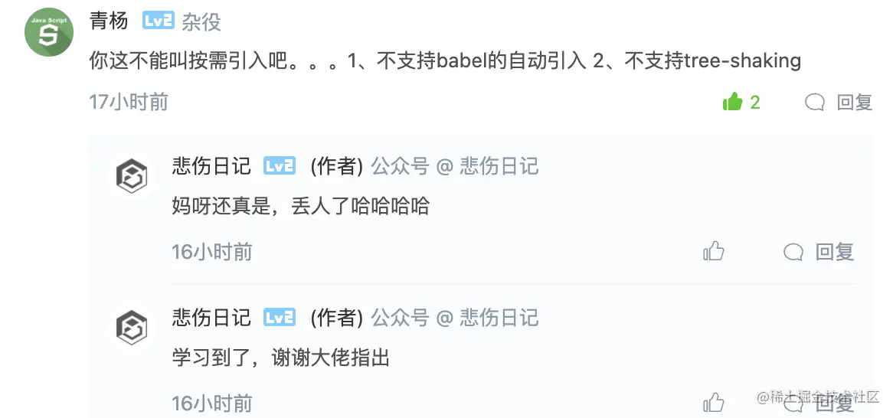

> 再次感谢 `@青杨` 大佬给我指出这个问题，同时也跟大家说声对不起，怪我没有测试这个按需引入

先看问题
----

我们拿到代码“laoyan-ui”压缩包

我们打包后的 `lib` 目录


`element` 打包后的目录

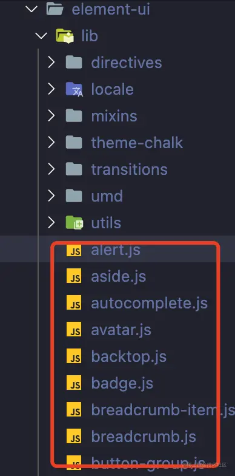

这是 `vant` 的打包 lib 内容

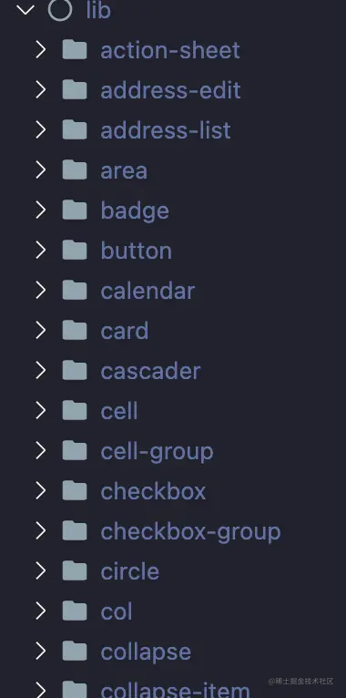

很显然这每一个都是组件

那么我们要做的无非也就是如此

配置打包
----

### 新建文件

在根目录创建一个 `config` 文件夹

然后在config里面创建两个文件，分别是 `config.dev.js` 和 `config.build.js`

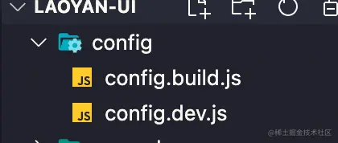

就长这样

### config.dev.js

然后我们把 `vue.config.js` 中的内容迁移至 `config.dev.js` 中

```js
module.exports = {
    pages: {
        index: {
            entry: 'examples/main.js',
            template: 'public/index.html',
            filename: 'index.html'
        }
    },
    chainWebpack: config => {
        config.module
            .rule('js')
            .include
            .add('/packages')
            .end()
            .use('babel')
            .loader('babel-loader')
            .tap(options => {
                return options
            })
    }
}
```

### config.build.js

将代码直接放到 `config.build.js`

这段代码就是按需引入核心内容

```js
const fs = require('fs');
const path = require('path');
const join = path.join;
//  获取基于当前路径的目标文件
const resolve = dir => path.join(__dirname, '../', dir);

function getComponentEntries(path) {
    let files = fs.readdirSync(resolve(path));

    const componentEntries = files.reduce((fileObj, item) => {
        //  文件路径
        const itemPath = join(path, item);
        //  在文件夹中
        const isDir = fs.statSync(itemPath).isDirectory();
        const [name, suffix] = item.split('.');

        //  文件中的入口文件
        if (isDir) {
            fileObj[item] = resolve(join(itemPath, 'index.js'));
        }
        //  文件夹外的入口文件
        else if (suffix === 'js') {
            fileObj[name] = resolve(`${itemPath}`);
        }
        return fileObj;
    }, {});

    return componentEntries;
}

const buildConfig = {
    //  输出文件目录
    outputDir: resolve('lib'),
    productionSourceMap: false,
    //  webpack配置
    configureWebpack: {
        //  入口文件
        entry: getComponentEntries('packages'),
        //  输出配置
        output: {
            //  文件名称
            filename: '[name]/index.js',
            //  构建依赖类型
            libraryTarget: 'umd',
            //  库中被导出的项
            libraryExport: 'default',
            //  引用时的依赖名
            library: 'laoyan-ui'
        }
    },
    css: {
        sourceMap: false,
        extract: {
            filename: '[name]/index.css'
        }
    },
    chainWebpack: config => {
        config.optimization.delete('splitChunks');
        config.plugins.delete('copy');
        config.plugins.delete('preload');
        config.plugins.delete('prefetch');
        config.plugins.delete('html');
        config.plugins.delete('hmr');
        config.entryPoints.delete('app');
    }
};
module.exports = buildConfig;
```

复制进去之后呢，我们接着要在 `vue.config.js` 中引入

### vue.config.js

```js
// 开发环境
const devConfig = require('./config/config.dev');
// 打包环境
const buildConfig = require('./config/config.build');
module.exports = process.env.NODE_ENV === 'production' ? buildConfig : devConfig;
```

vue.config.js 中只需要引入这两个js就可以了

先打个包试试
------

记得先下载依赖

```shell
yarn install
```

这次我们就打包是直接使用 yarn build 了

```shell
yarn build
```

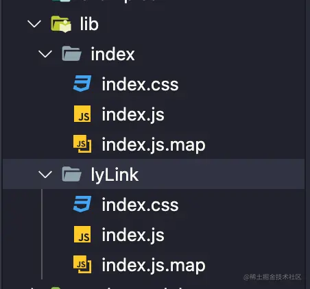

打包后的组件分别在存在 lib 对应文件夹中了

### 测试看看好不好用

我们还是在 `examples` 中测试组件, 但是我们需要将 main.js 中修改一下

```diff
  import Vue from 'vue'
  import App from './App.vue'
- import { lyLink } from '../lib/index.umd.min.js';
+ import lyLink from '../lib/lyLink';
- import '../lib/index.css'
+ import '../lib/lyLink/index.css'
  Vue.use(lyLink)
  Vue.config.productionTip = false

  new Vue({
    render: h => h(App),
  }).$mount('#app')
```

那我们来启动一下

```shell
yarn serve
```

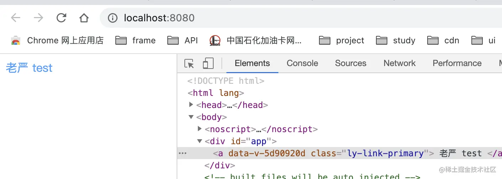

### package.json

发布包之前，我们要修改入口文件

```diff
{
  "name": "laoyan-ui",
  "version": "0.1.1",
  "private": false,
- "main": "lib/index.umd.min.js",
+ "main": "lib/index",
  "scripts": {
    "serve": "vue-cli-service serve",
    "build": "vue-cli-service build"
-   "lib": "vue-cli-service build --target lib --name index --dest lib packages/index.js"
  },
  "dependencies": {
    "core-js": "^3.6.5",
    "vue": "^2.6.11"
  },
  "devDependencies": {
    "@vue/cli-plugin-babel": "~4.5.0",
    "@vue/cli-service": "~4.5.0",
    "node-sass": "^4.12.0",
    "sass-loader": "^8.0.2",
    "vue-template-compiler": "^2.6.11"
  },
  "browserslist": [
    "> 1%",
    "last 2 versions",
    "not dead"
  ]
}
```

再写一个组件
------

在测试之前，我觉得我们这样测试项目打包根本没啥用，因为就一个 `ly-link` 组件不管你全局是不是全局注册效果不明显。

所以我准备加一个 `ly-button` 组件进去

还是上一章的内容，在`packages` 目录下写组件


### index.js

`lyButton/index.js`

```js
import lyButton from './src'

lyButton.install = function (Vue) {
    Vue.component(lyButton.name, lyButton)
}

export default lyButton
```

### index.vue

`lyButton/src/index.vue`

```js
<template>
    <!-- 用传过来 href 进行跳转 --> <!-- 用传过来的 type 修改颜色 --> 
    <a :href="href || undefined" :class="[`ly-link-${type}`]" >
        <!-- 使用默认插槽来填充文本 -->
        <slot/>
    </a>
</template>

<script>
    export default {
        // 等下 index.js 里面要用到
        name:"ly-link",
        props: {
            // 限制类型
            href: String,
            type: {
                type: String,
                default: 'default'
            }
        }
    }
</script>

<style lang="scss" scoped>
    // 定义链接字体颜色
    .ly-link-default {
        color: #606266;
    }
    .ly-link-primary {
        color: #409eff;
    }
</style>
```

### 暴露组件index.js

`packages/index.js`

```diff
  import lyLink from './lyLink'
+ import lyButton from './lyButton'
  const components = [
      lyLink,
+     lyButton
  ]

  // 定义 install 方法，接收 Vue 作为参数。如果使用 use 注册插件，则所有的组件都将被注册
  const install = function (Vue,opt = {}) {
      // 判断是否安装
      if (install.installed) return
      // 遍历注册全局组件
      components.map(component => {
          Vue.component(component.name, component)
      })
  }

  // 判断是否是直接引入文件
  if (typeof window !== 'undefined' && window.Vue) {
      install(window.Vue)
  }

 export default install

  export {
      // 导出的对象必须具有 install，才能被 Vue.use() 方法安装
      install,
      // 以下是具体的组件列表
      lyLink,
+     lyButton
  }
```

### 打包一下

```shell
yarn build
```

接着在 `examples/main.js` 引入

```js
import Vue from 'vue'
import App from './App.vue'
// 引入link组件
import lyLink from '../lib/lyLink';
// 引入button组件
import lyButton from '../lib/lyButton';
// 引入link样式
import '../lib/lyLink/index.css'
// 引入button样式
import '../lib/lyButton/index.css'

Vue.use(lyLink)
Vue.use(lyButton)

Vue.config.productionTip = false

new Vue({
  render: h => h(App),
}).$mount('#app')
```

在`App.vue` 中引入使用一下 `ly-button`

```html
<template>
  <div id="app">
    <ly-link type="primary"> 老严 test </ly-link>
    <ly-button type="primary"> 老严 test </ly-button>
  </div>
</template>
```

启动项目

```shell
yarn serve
```


我们看这个效果是没问题的

可以再试试全局引入

```js
import laoyanUi from '../lib/index';
import '../lib/index/index.css'
Vue.use(laoyanUi)
```

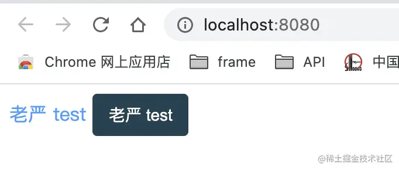

那么我们就可以开始测试这个按需引入效果呢

但是我们还是先上传一下 `npm`

记得修改package.json中的版本号（如 v0.1.1 至少修改成 v0.1.2），不然提交不上去

```shell
npm login
&
npm publish 
```

测试按需引入
------

创建一个干干净净的cli 来做测试

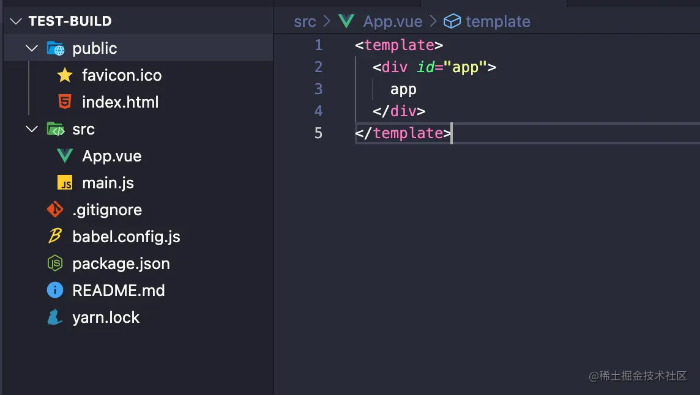

长这样就行

### 不引入组件打包

我们先不引入组件看看打包之后的大小

```shell
yarn build
```

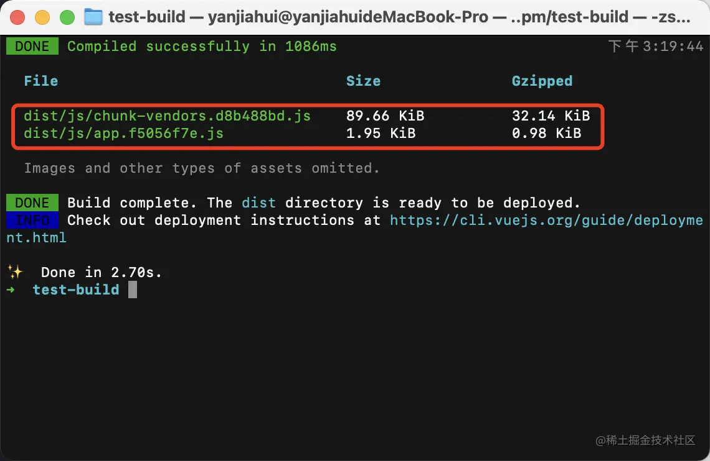

### 全局引入组件打包

先安装 `laoyan-ui`

```shell
yarn add laoyan-ui
```

在 `main.js` 引入组件库

```js
import Vue from 'vue'
import App from './App.vue'

import laoyanUi from 'laoyan-ui'
import 'laoyan-ui/lib/index/index.css'
Vue.use(laoyanUi)
Vue.config.productionTip = false

new Vue({
  render: h => h(App),
}).$mount('#app')
```

再次执行打包


可以看到已经多了个 css 并且 app.js 多了 0.03 kib

### 试试按需引入

```js
import Vue from 'vue'
import App from './App.vue'

import lyLink from 'laoyan-ui/lib/lyLink/index.js'
import 'laoyan-ui/lib/lyLink/index.css'
Vue.use(lyLink)
Vue.config.productionTip = false

new Vue({
  render: h => h(App),
}).$mount('#app')
```

执行打包

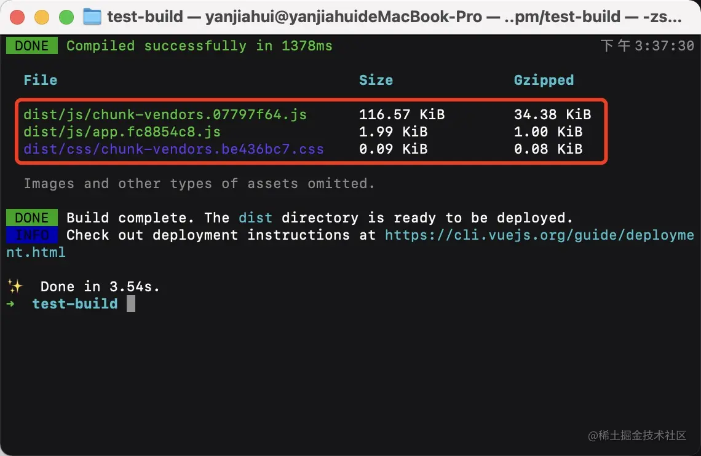

js反而还多了一点0.01kib，不过css的收益确实可观

难道是因为组件还是太少了？还是有什么错误，希望有大佬提醒一下

### 配置按需引入

这样引入实在是太繁琐了，说说那个用户跟你这样一个一个引入

每次引入一个组件还要找文件夹名还要引入样式，完了还要注册

可以借助 `babel-plugin-import` 来实现一个便捷的写法

### 先安装

```npm
yarn add babel-plugin-import
```

### 配置babel.config.js

```js
module.exports = {
  presets: ['@vue/cli-plugin-babel/preset'],
  plugins: [
    [
      'import',
      {
        libraryName: 'laoyan-ui',
        style: (name) => {
          return `${name}/index.css`;
        },
        camel2DashComponentName: false, // 是否需要驼峰转短线
        camel2UnderlineComponentName: false // 是否需要驼峰转下划线
      }
    ]
  ]
};
```

配置完成把main.js 入口文件的引入删除

### App.vue

```html
<template>
    <div id="app">
        <ly-button>111</ly-button>
    </div>
</template>

<script>
  	// 引入
    import { lyButton } from "laoyan-ui";
    export default {
        name: "App",
        // 注册
        components: { lyButton },
    };
</script>

```

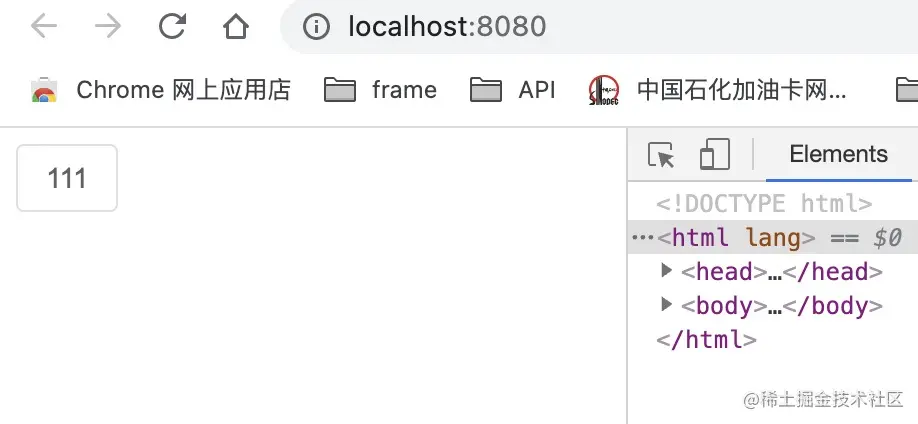

效果也是可以，如果你多个地方需要用到呢？那我们还是去 main.js 中配置，但是我们只需要 引入注册即可

```js
import Vue from 'vue'
import App from './App.vue'
// 引入
import { lyButton } from "laoyan-ui";
// 注册
Vue.use(lyButton)

Vue.config.productionTip = false
new Vue({
  render: h => h(App),
}).$mount('#app')
```

最后
--

如果还有错误希望也有大佬指点一下

然后再次感谢 @清杨 大佬

也谢谢阅读点赞评论的大哥们

资料
--

测试demo 和 laoyan-ui 我都放云盘了

链接: [pan.baidu.com/s/1rK9Navx\_…](https://pan.baidu.com/s/1rK9Navx_fPWZL0MT7XOBpQ "https://pan.baidu.com/s/1rK9Navx_fPWZL0MT7XOBpQ")

密码: gm16
