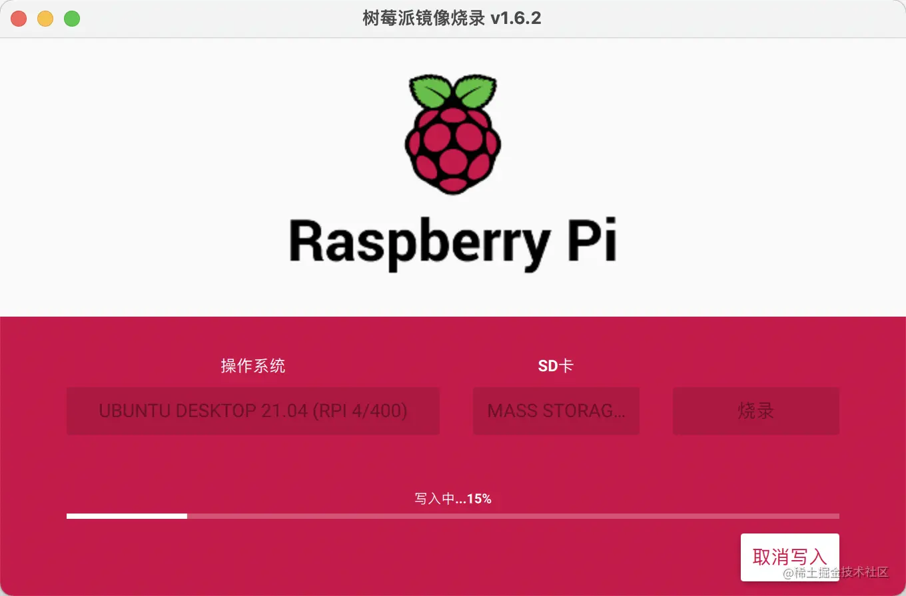
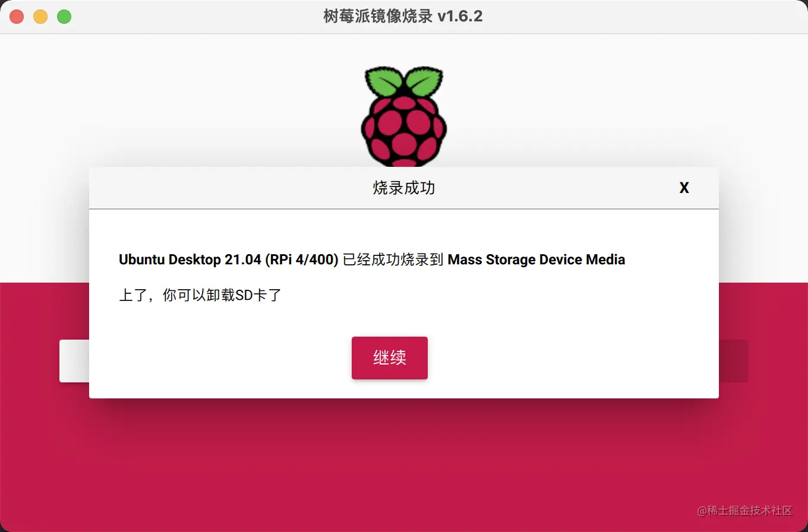
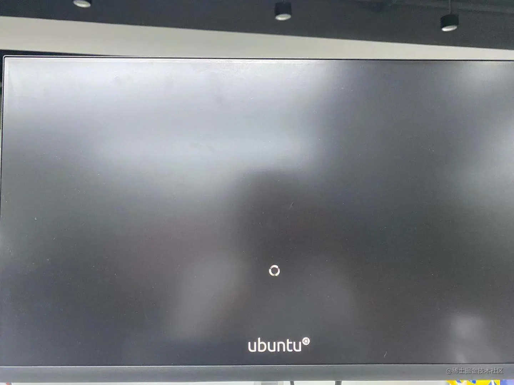
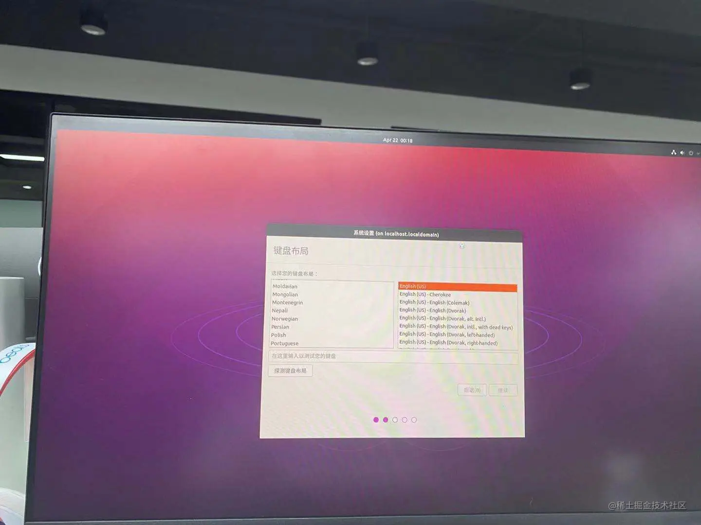
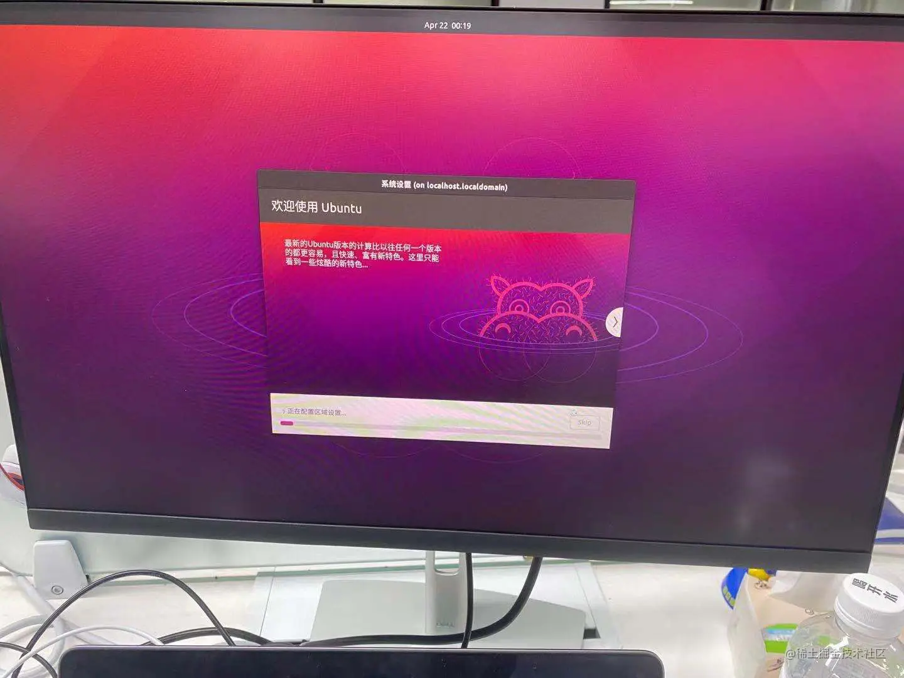
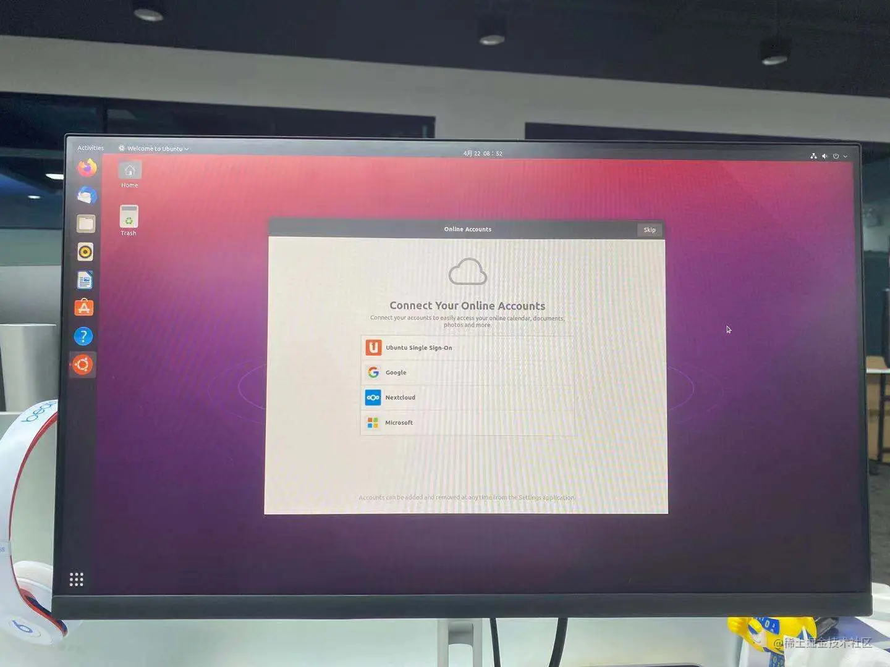

背景
--

因盛哥闲置一台树莓派4B，所以我就想着折腾一番

准备工作
----

*   SD卡 (≥16GB)
*   读卡器
*   树莓派 4B
*   电脑（用于烧录镜像）

烧录镜像
----

第一步 我们先要去官网下载烧录镜像的 Raspberry Pi Imager 应用，到电脑上

[www.raspberrypi.org/software/](https://www.raspberrypi.org/software/ "https://www.raspberrypi.org/software/")

1.  下载完成之后安装到电脑上
2.  插入SD卡到电脑上
3.  打开 Raspberry Pi Imager
4.  选择操作系统（我这里选的是 ubuntu 桌面版）
5.  选择你要烧录的SD卡
6.  点击开始写入

静静地的等待烧录完成吧

到这里我们就已经完成了烧录

安装系统
----

把SD卡插入树莓派，连接电源 开机

选择语言、键盘布局等等

选择完成之后开始安装

安装完成
----

噔噔噔～ 完成

我们直接连接Wi-Fi，下载我们需要的应用即可

完结撒花
----

到这里我们就完成了我们的树莓派安装ubuntu系统
