丑话）说在前面
-------

> 稍等稍等，要是5分钟没搞定也别骂我，老严不是标题党
> 
> 如果顺利的话，5分钟可能都不要（顺利的话！！！）

介绍
--

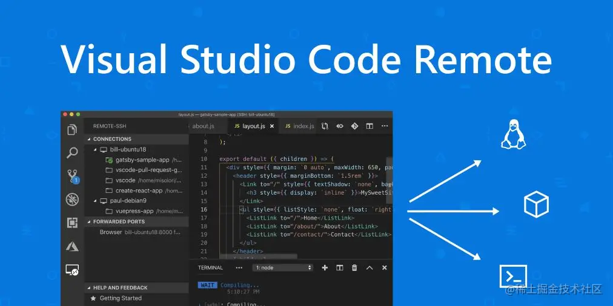

> 2019 年 5 月 3 日，在 PyCon 2019 大会上，微软发布了 VS Code Remote，开启了远程开发的新时代！这次发布包含了三款核心的全新插件，它们可以帮助开发者在容器，物理或虚拟机，以及 Windows Subsystem for Linux (WSL) 中实现无缝的远程开发。通过安装 Remote Development Extension Pack ，你可以快速上手远程开发。 Remote Development extension pack 包括三个扩展：

**Remote - SSH**

*   通过使用 SSH 打开远程计算机或者VM上的文件夹，来连接到任何位置。

**Remote - Containers**

*   把 Docker 作为你的开发容器。

**Remote - WSL**

*   在 Windows Subsystem for Linux 中，获得 Linux 般的开发体验。

而我们今天要讲的是 `Remote - SSH`

**Visual Studio Code Remote - SSH扩展**

可直接使用本地的 `VS Code` 来连接服务器( `server`)上的开发环境，而本地只是一个前端的展示界面，任何代码的运行都是直接在服务器上进行操作的

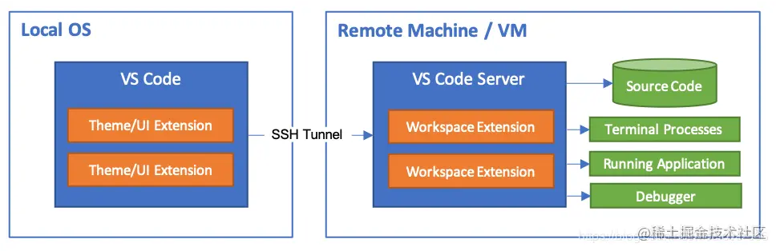

可以说成是直接远程操作一台电脑。

优点
--

直接通过 ssh 连接服务器开发有什么好处？

> 官方回答
> 
> *   在比本地机器更大、更快或更专业的硬件上进行开发。
> *   在不同的远程开发环境之间快速切换，安全地进行更新，而不必担心影响本地计算机。
> *   调试在其他位置运行的应用程序，例如客户网站或云端。

个人认为

1.  减少自己电脑的性能损耗。
2.  自由选择操作系统。
3.  好玩。

准备事项
----

1.  服务器（我的是轻量级丐版1核1G）

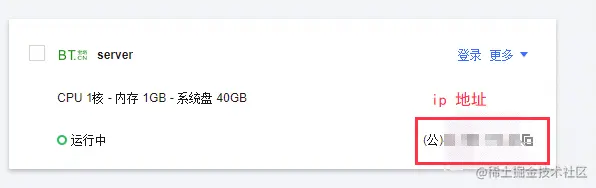

2.  VS Code

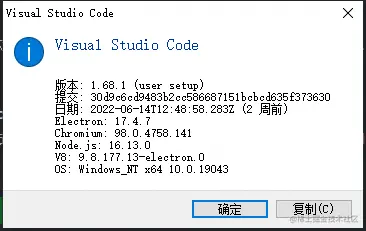

3.  ssh 访问端口

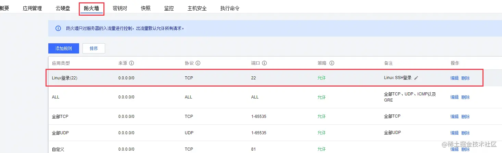

开搞开搞
----

浅测一下

本地先尝试通过 ssh 链接服务器。 默认端口是 22 如有特殊自行修改

```shell
ssh <服务器登录名>@<公网ip>
```

输入服务器登录密码

```shell
xxx@xxxx's password:*************
```

连接成功

> Tips

如果遇到端口未开放的情况

```shell
ssh: connect to host xx.xx.xx.xx port 22: Connection refused
```

可以看下 ssh 的配置是否正确

```shell
sudo vim /etc/ssh/sshd_config
```

安装 Remote - SSH
---------------

可以在 VS Code 里面搜索一下

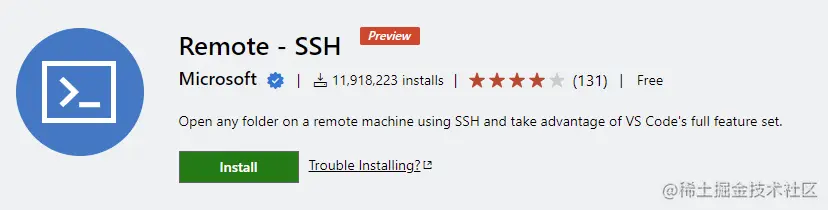 或者直接打开此处 [Remote - SSH](https://marketplace.visualstudio.com/items?itemName=ms-vscode-remote.remote-ssh "https://marketplace.visualstudio.com/items?itemName=ms-vscode-remote.remote-ssh")

开始连接
----

添加一个 `ssh` 连接 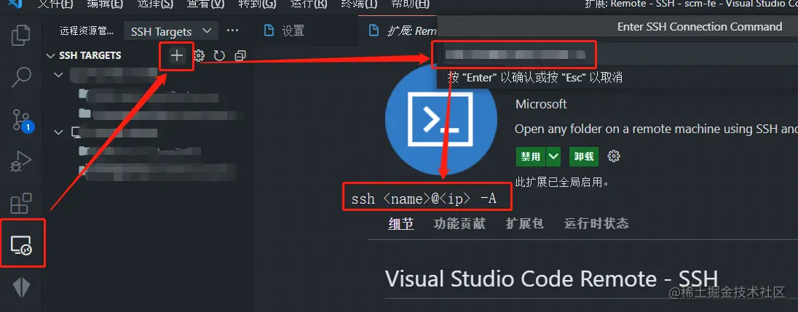

#### 配置

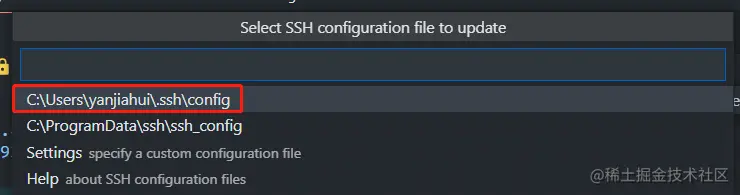

> config 文件

这是我的

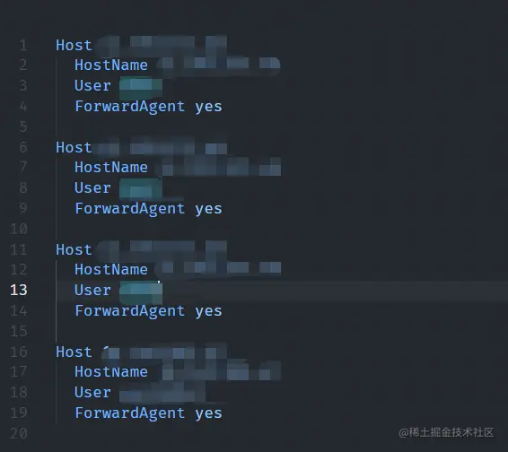

写一个就够了

```text
Host <ip>
  HostName <ip or name>
  User <username>
  ForwardAgent yes
```

修改完成之后

点击这个红框里的内容 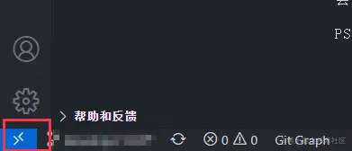

Connect to Host 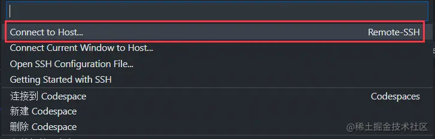

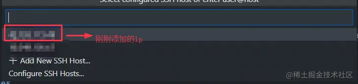

此时会打开一个`VS Code`新窗口，不要慌。

#### 输入密码

输入你的服务器连接密码 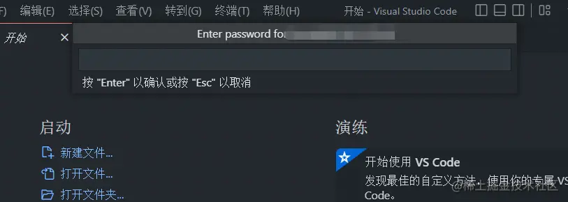

此时连接已经成功 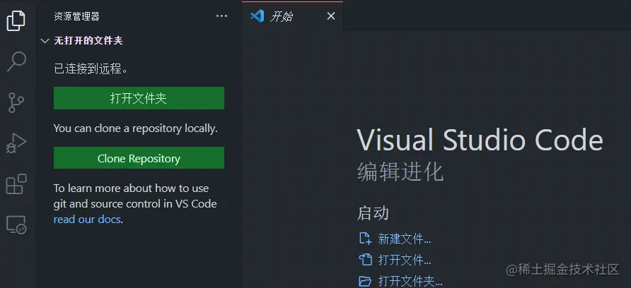

选择一个文件夹 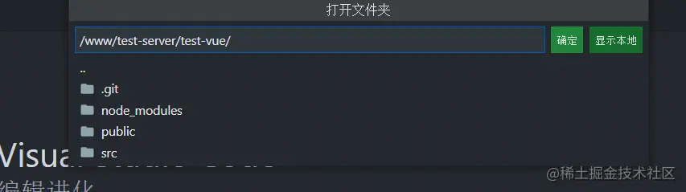

初步完成
----

到这里我们的连接，已经完成了，可以直接进行一些简单开发。 因为你的服务器开发环境还没有配置好 你或许需要

*   Node
*   Git
*   Vue
*   MySQL
*   ...

这些东西安装完成之后，基本上就够开发了

浅测一下端口转发
--------

我通过 `Vue-Cli` 创建了一个 demo

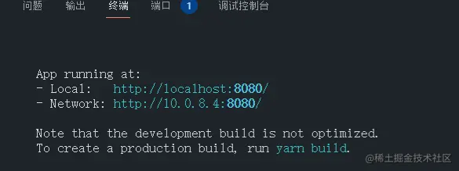

此时你可以直接在本地打开 `http://localhost:8080/`

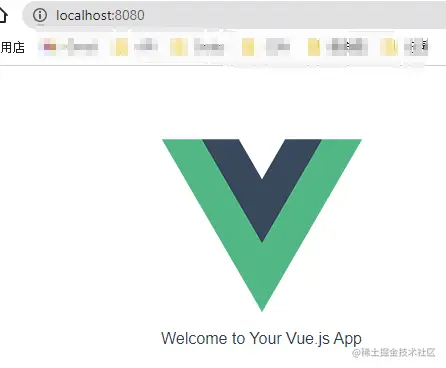

OK 看来已经完成了

最后
--

直接通过远程连接来修改网站。真的很方便。

> 这个算不算简单？
> 
> 嗯～～～ 怎么不算呢？

未经授权谢绝转载。谢谢～
