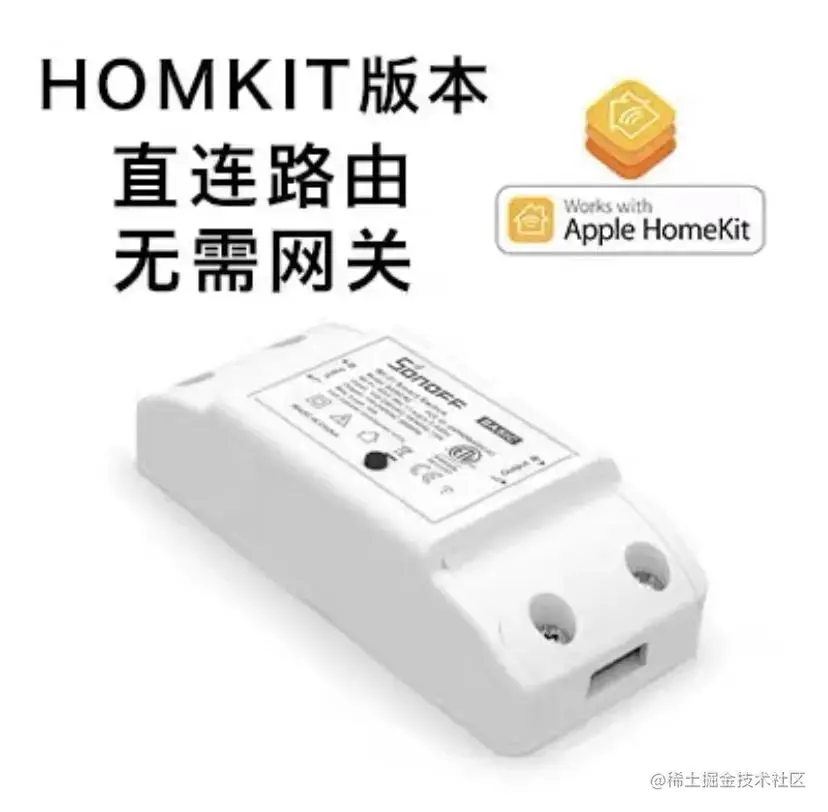
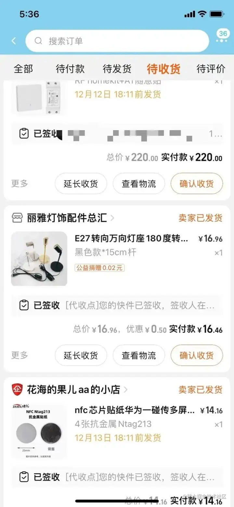
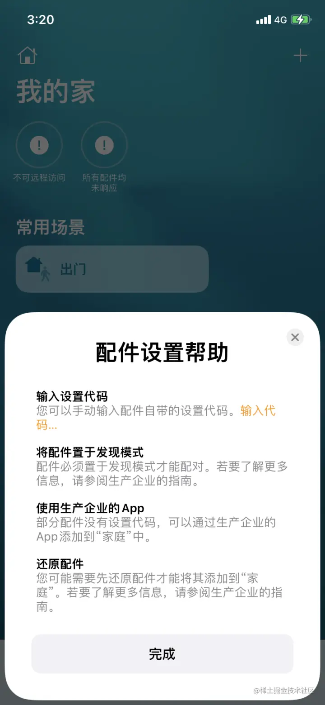
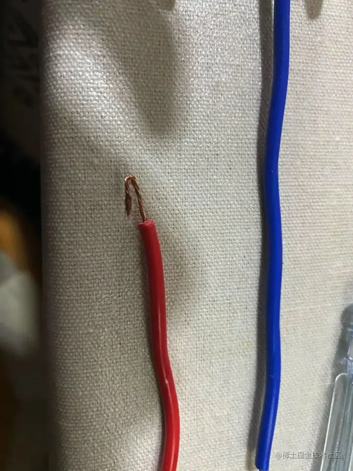
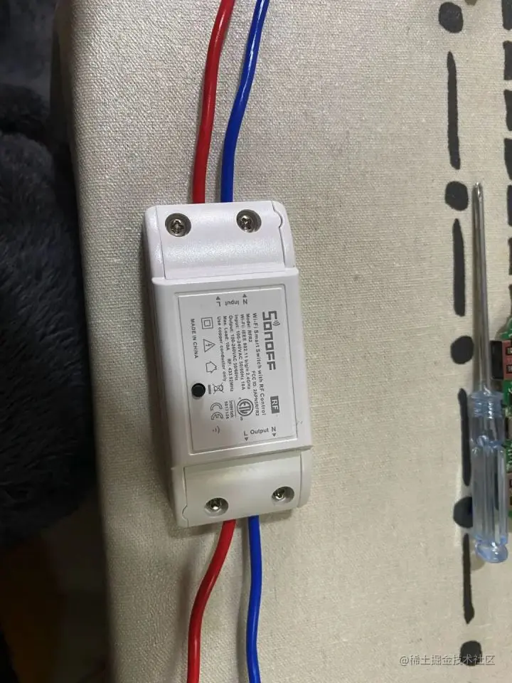
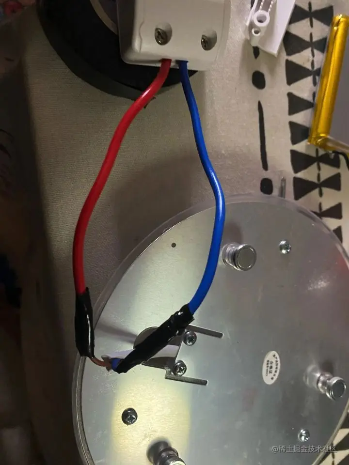

HomeKit，是苹果2014年发布的智能家居平台。

起因
--

> 最近长沙温度有点低，因为刚回湖南没多久，一时半会还适应不了这冬天的味道。 洗漱完到床上玩会儿手机后，就不想下去关灯。于是想到了 “家庭” app。

​效果
---

先给大家看看效果（这个封面颜色不太对劲的样子）

了解
--

在网上看了一些文章之后呢。我发现 homekit 是需要网关的，而网关是智能化的基础，然而网关大几百一个，我深知这不是我这种穷困潦倒家庭玩得起的。于是我到某宝上找到了 homekit 模块，直连路由的，基础款才 39 大洋岂不美哉。

​

编辑切换为居中

添加图片注释，不超过 140 字（可选）

下单
--

最后挑选了半天之后，我买了以下几个玩意儿

homekit 基础模块 \* 2

homekit （Wi-Fi + RF 射频）\* 1

Wi-Fi 开关 \* 1

智能灯泡LED \* 1

灯座 （E27）\* 1

抗金属 NFC \* 4

总计花了 ¥ 250.62

这点钱买个一般点的网关还不够

大家还是根据自己的需求按量购买（模块的店铺叫 “Homekit”，老板人挺好的）

​

编辑切换为居中

添加图片注释，不超过 140 字（可选）

开工
--

等待了三天，设备已经到齐了

### 安装智能灯泡

首先，我们先用把智能灯泡装到灯座上，插上电。

智能灯泡里面是有homekit模块的，我们通过Wi-Fi直接连接到灯泡发出的Wi-Fi信号，选择家里的网络并且输入密码。这样就连上的家庭的网络了。

这时候我们就可以打开 “家庭” app 了，点击右上角添加设备

​

编辑切换为居中

添加图片注释，不超过 140 字（可选）

输入设备的 homekit 设置代码，这个代码可以找商家要

然后添加完成之后直接按住调节灯光颜色&开关

### 安装homekit模块到吸顶灯上

这时候就用上了homekit（Wi-Fi + RF 射频）+ Wi-Fi 开关了

如果你不需要无线开关，完全可以买基础款的，我是把无线开关放到了床头（因为太困了，手机都不想打开）

1、先注意，把电闸关了！！！

2、关电闸之后，把吸顶灯拆下来，将线剪断

3、将电线两头绝缘胶去掉一部分（我是自己又买了一截电线）

​

编辑切换为居中

添加图片注释，不超过 140 字（可选）

4、两头连接 homekit 模块

​

编辑切换为居中

添加图片注释，不超过 140 字（可选）

5、连接到吸顶灯上

注意别装反了

input是出电

output是入电

最好弄点绝缘胶带

​

编辑切换为居中

添加图片注释，不超过 140 字（可选）

6、将吸顶灯装回去，像前面装智能灯一样，我们连接到Wi-Fi上，选择Wi-Fi，输入密码，再去“家庭” app 添加设备

看看效果吧

\\

### 安装Wi-Fi开关

前面的 homekit 模块已经通电了，上面有个按键，长按五秒钟之后指示灯变颜色后，按下开关之后就会自动匹配上 homekit 模块

自动化
---

不知道大家有没有用过苹果的自动化，个人觉得是挺好用的

个人使用情况

*   工作日会在特定时间给我打一辆滴滴去上班
*   每天早上关闭起床闹钟会播放当天的天气预报
*   开始运动的时候会播放音乐
*   靠近特定的 NFC 的时候会做出相应的动作

接下来来说下 靠近特定的 NFC 的时候触发的操作

到这里就全部完成了前面的视频，还有两个模块暂时没做其他处理，先放着吃灰吧。后续可能会接小太阳和电风扇

如果想要远程控制可以使用 iPad 或者 Home Pod，反正树莓派好像弄不了，如果有其他方案大家可以私信告诉我
