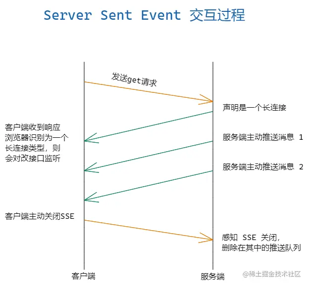
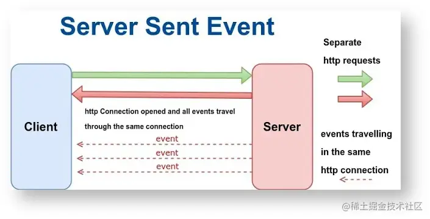
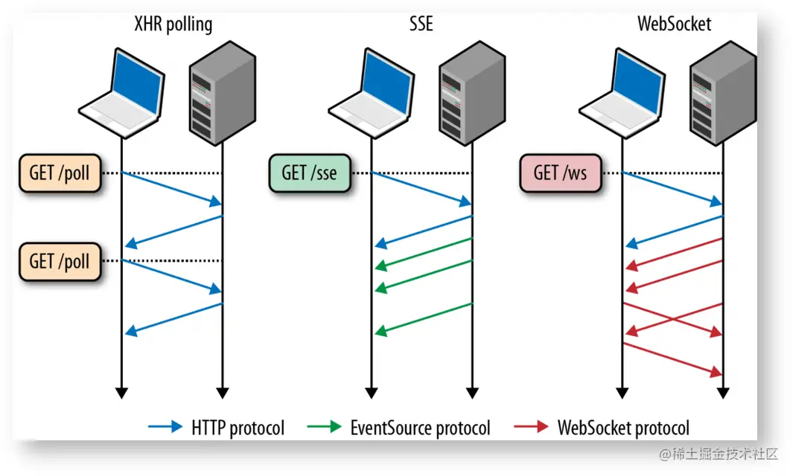
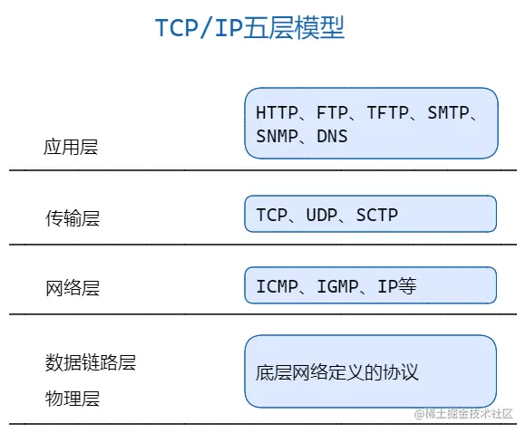
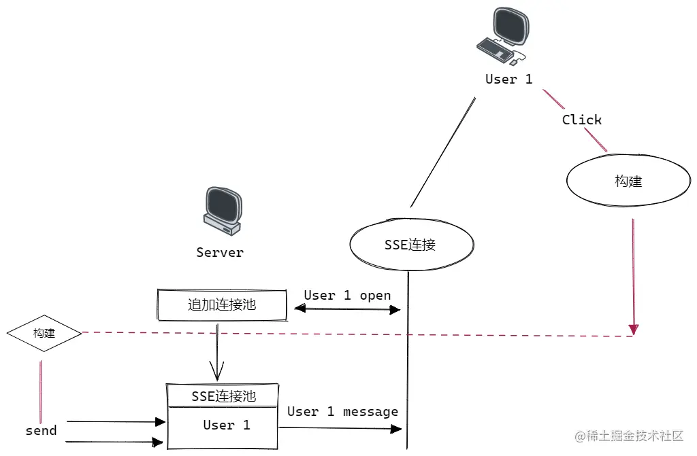
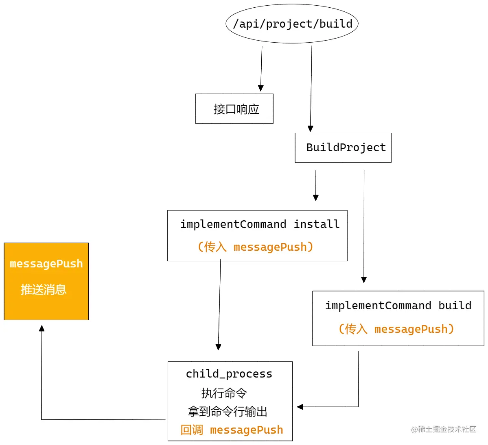

SSE 是什么？
--------

> SSE 全称是 Server Sent Event，翻译过来的意思就是 服务器派发事件。
> 
> 一个网页获取新的数据通常需要发送一个请求到服务器，也就是向服务器请求的页面。
> 
> 使用 server-sent 事件，服务器可以在任何时刻向我们的 Web 页面推送数据和信息。
> 
> 这些被推送进来的信息可以在这个页面上作为 _[Events](https://developer.mozilla.org/zh-CN/docs/Web/API/Event "https://developer.mozilla.org/zh-CN/docs/Web/API/Event") `[0]` + data_ 的形式来处理。

白话篇
---

**SSE** 的本质其实就是一个 **HTTP** 的长连接，只不过它给客户端发送的不是一次性的数据包，而是一个 **stream** 流，格式为 text/event-stream。

所以客户端不会关闭连接，会一直等着服务器发过来的新的数据流





SSE 与其他交互方式的区别
--------------



### SSE 与 WS 有什么区别？

方式

协议

交互通道

内容编码

重连

事件类型

总结

SSE

HTTP

服务端单向推送

默认文本

默认支持断线重连

支持自定义消息类型

轻量级

WebSocket

WS（基于 TCP 传输层的应用层协议，[RFC6455](https://tools.ietf.org/html/rfc6455 "https://tools.ietf.org/html/rfc6455") `[1]` 对于它的定义标准）

双向推送

默认二进制

手动实现

NO

扩展性、功能性强大

> TCP/IP 五层模型
> 
> 

SSE 兼容性
-------

API


SSE

6.0

79.0

6.0

5.0

11.5

WS

4.0

12

11

4.2

12.1

IE 不支持？兼容性不好？ **[event-source-polyfill](https://www.npmjs.com/package/event-source-polyfill "https://www.npmjs.com/package/event-source-polyfill")** 助你实现 **SSE** 梦

接下来的示例不会通过这个 event-source-polyfill 实现。

> 正经人谁考虑兼容性？
> 
> 狗头护体.jpg

SSE 的 API
---------

### 属性（只读）

名称

作用

类型

备注

readyState

当前状态

Number

`0` — connecting`1` — open`2` — closed

url

当前连接的地址

String

withCredentials

是否开启凭据收集

Boolean

### 方法

名称

作用

返回值

close

客户端主动关闭连接

\-

### 事件

名称

作用

返回值

onclose

连接关闭触发

event

onopen

连接开启触发

event

onmessage

服务端消息推动消息触发

event

服务端 API
-------

### 字段

名称

作用

类型

备注

data

传输的文本

String（默认）\\ 可以传输JSON

可以多行累加

event

事件名称

String

可自定义

id

当前推送 id

String

作为消息的标识

retry

超时重试时间

Number

客户端在感知 server 连接异常后。会通过 retry 设定时间进行重新连接

需求评审
----

我们在前面已经初步的了解了 SSE，并且知道了它的一些 API。

我们接下来需要做一件事情，了解需求

需求就是


需求评审结束

> 产品经理给你一张图都不错了，自己看着来吧。

技术评审
----

前面的 \*\* 产品经理竟然只给了一张图



用户在打开窗口时，会建立一个 SSE 的连接

服务端需要将建立这次连接，保存在连接池中。

如果用户点击了构建，后台程序会执行打包命令

在打包中进行消息的推送，然后前端进行消息的展示。

接口评审
----

GET `api/log/push` (通信 API)

> 连接 SSE 的通道，用于后续消息通信

* * *

POST `api/project/build` (构建 API)

参数 `projectPath` 传入你需要构建的项目路径

> 用于项目构建，构建时触发消息推送

### 冷静一下

等等~ 是不是说得太简单了

#### 构建 API 如何帮我们打包？

nodejs 里面有个 `child_process[3]` 模块叫做 子进程

你可以通过它执行 `install`、`build`。

#### 如何触发通信 API 消息推送？

`child_process` 是可以异步推送消息

里面会有 `stdout` 和 `stderr` 钩子。

会感知到命令行的`正常`和`异常`输出。

我们在这一步进行消息的实时推送岂不美哉。

> 解答完这两个疑问之后，我们就可以愉快的写代码了

后端开发
----

### 引入需要用到的包

这些包看起来引了挺多，实际上与 SSE 相关的 只有 koa-sse-stream，它其实就是一个别人封装好的中间件，如果你看过阮一峰老师的 《Server-Sent Events 教程》`[4]`

```js
const Koa = require('koa');
const router = require('koa-router')();
const KoaSSEStream = require('koa-sse-stream'); // 封装好的 SSE 中间件
const child_process = require('child_process'); // Node 子进程
const bodyParser = require('koa-bodyparser');
const cors = require('@koa/cors');
const moment = require('moment');
const newDate = () => moment().format('YYYY-MM-DD HH:mm:ss');
const app = new Koa();
 
app.use(cors());
app.use(bodyParser());

/*
  接下来的代码存放处
*/

app.use(router.routes())  
app.listen(3000);
```

### 通信 API

在前面我们已经说过每次增加一个连接，会放到连接池中，而这个连接池相当于一个通讯录。

后续会遍历这个通讯录，进行消息的推送

```js
// 连接池
const clientList = [];
// koa-sse-stream 配置
const SSE_CONF = {
    maxClients: 2, // 最大连接数
    pingInterval: 40000 // 重连时间
}
router.get('/api/log/push', KoaSSEStream(SSE_CONF), ctx => {
    // 每次连接会进行一个 push
    clientList.push(ctx.sse);
})
```

### 构建 API

我们在这个接口调用的时候，先进行响应，不然这个接口会一直等到构建完成之后再响应。

谁也不知道构建完成某个项目，需要花费多长时间，可能设置的请求超时时间都过了也没响应。

```js
router.post('/api/project/build', ctx => {
    // 接收项目绝对路径
    const { projectPath } = ctx.request.body;
    try {
        // 先响应
        ctx.body = {
            msg: '开始构建，请留意下方的构建信息。'
        }
        // 再执行构建
        buildProject(projectPath)
    } catch (error) {
        ctx.body = {
            msg: error
        }
    }
})
```

### child\_process 执行打包命令

简单的封装了一个执行脚本的函数，后面再通过 callback 进行消息的推送

```js
/**
 * 执行命令
 * @param {String} script 需要执行的脚本
 * @param {Function} callback 回调函数
 * @returns 
 */
const implementCommand = async (script, callback) => {
    callback(script)
    return new Promise((resolve, reject) => {
        try {
            const sh = child_process.exec(script, (error, stdout, stderr) => {
                // 这里的 stdout stderr 在执行之后才会触发
                if (error) {
                    reject(error);
                    callback(error)
                }
                resolve()
            });
            // 成功的推送
            sh.stdout.on('data', (data) => {
                callback(data)
            })
            // 错误的推送
            sh.stderr.on('data', (error) => {
                callback(error)
            })
        } catch (error) {
            callback(error)
            reject()
        }
    })
}

```

### 打包项目 + 消息推送

`buildProject` 只负责整合需要执行哪些命令

整合之后调用 `implementCommand` 执行命令

`implementCommand` 会执行 `messagePush` 进行消息推送。

```js
/**
 * 打包项目
 * @param {String} projectPath 打包路径
 */
const buildProject = async projectPath => {
    // 执行 install 命令
    await implementCommand(`cd ${projectPath} && yarn install`, messagePush)
    // 执行 build 命令
    await implementCommand(`cd ${projectPath} && yarn build`, messagePush)
    messagePush('打包完成！！！') 
}

/**
 * 消息推送
 * @param {String} content 需要推送的内容
 */
const messagePush = content => {
    clientList.forEach(sse => sse.send(`[${currentTime()}] ${content}`))
    // send 自定义事件写法
    // clientList.forEach(sse => sse.send({ data: content, event: 'push' }))
}

```

### 服务端执行过程示意图

到这里服务端就已经全部完成了，看得出来构建 + 消息推送是最麻烦的一步，所以我画了个草图。

什么？看不懂？放过我吧，就这水平... 

前端开发
----

> 本次需求，前端比较简单，只需要三步
> 
> *   连接 SSE (调用 通信 API)
> *   构建项目 (调用构建 API)
> *   接收到 SSE 的推送进行内容展示

### HTML 结构

```html
<!-- 输入项目的路径 -->
<input type="text" value="C:/xxx" id="dirPath">
<!-- 构建点击的按钮 -->
<button id="buildSubmit">构建</button>
<!-- 输出内容的载体 -->
<pre><code id="app"></code></pre>
```

### 开启 SSE 连接

```js
// 通过 new EventSource 开启 SSE
const source = new EventSource(`http://127.0.0.1:3000/api/log/push`);
// 监听 message 事件
source.onmessage = event => {
  // 挂到载体上面
  app.innerHTML += `${event.data} \n`
}
```

### 调用构建 API

通过构建按钮点击之后触发调用构建接口

```js
buildSubmit.onclick = () => {
  // 构建之前清空载体
  app.innerHTML = '';
  const projectPath = dirPath.value;
  // 做了个简单校验
  if(!projectPath) return alert('目标打包路径不能为空');
  // 发起请求
  $.ajax({
    url: 'http://127.0.0.1:3000/api/project/build',
      method: 'post',
      data: {
        projectPath // 项目路径
      },  
      // 成功回调
      success: res => {
        alert(res.msg)
      }
  })
}
```

> 到这里我们就已经开发完了这个需求， 大家可以动手去试一试
> 
> 当然这只是 SSE 一些基本的使用而已。

写在后面
----

如果大家对这篇文章有任何质疑，可以留言或者私信给我。我将逐一回复(我了解的就回复的快一些，不知道的，我会查询资料再进行回复，就可以稍微慢一些~)

注解
--

`[0]` **Event** -- [developer.mozilla.org/zh-CN/docs/…](https://developer.mozilla.org/zh-CN/docs/Web/API/Event "https://developer.mozilla.org/zh-CN/docs/Web/API/Event")

`[1]` **RFC6455** -- [www.rfc-editor.org/rfc/rfc6455](https://www.rfc-editor.org/rfc/rfc6455 "https://www.rfc-editor.org/rfc/rfc6455")

`[2]` **event-source-polyfill** -- [www.npmjs.com/package/eve…](https://www.npmjs.com/package/event-source-polyfill "https://www.npmjs.com/package/event-source-polyfill")

`[3]` **child\_process** -- [nodejs.org/dist/latest…](https://nodejs.org/dist/latest-v16.x/docs/api/child_process.html "https://nodejs.org/dist/latest-v16.x/docs/api/child_process.html")

`[4]` **Server-Sent Events 教程** -- [www.ruanyifeng.com/blog/2017/0…](http://www.ruanyifeng.com/blog/2017/05/server-sent_events.html "http://www.ruanyifeng.com/blog/2017/05/server-sent_events.html")
