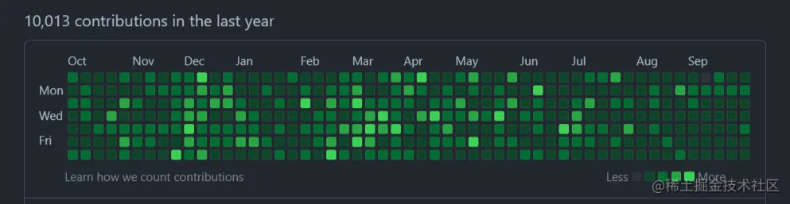
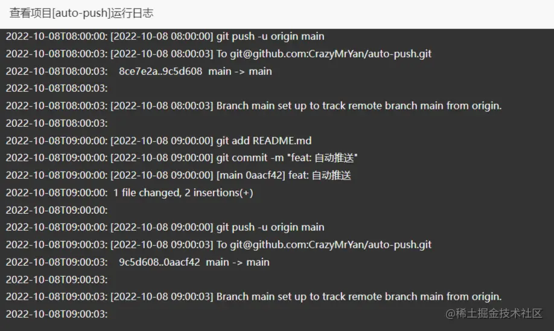
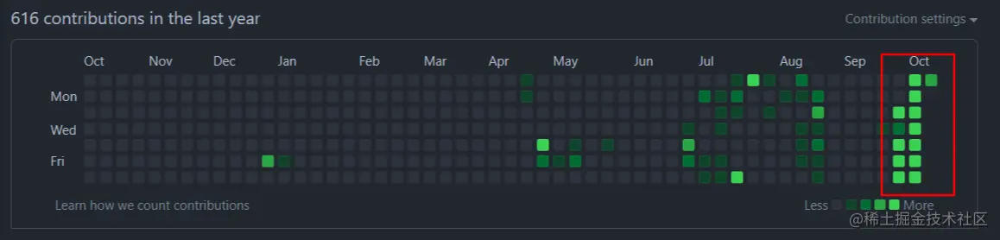

> 最近看着别人的GitHub Commit 贡献图， 我也很想拥有，
> 
> 我仔细想了想，这玩意不就是 Commit 的的数据而已，但是的确没那么多需要提交的代码，我模拟 Commit 不就行了吗？
> 
> 说实话，有点不道德。但只要我没有道德，你们就绑架不了我。



先看效果
----

> 我已经连续运行两周的时间了，目前没有遇到什么问题

### PM2 运行日志



### Commit 贡献图



一共分三步
-----

1.  通过 `fs` 编辑文件内容
2.  通过 `child_process` 执行命令
3.  通过 `schedule` 定时执行任务

### 引入资源和常量定义

```js
const schedule = require('node-schedule');
const child_process = require('child_process');
const fs = require('fs');
const moment = require('moment');
// 需要修改的文件路径
const FILE_PATH = `${__dirname}/README.md`;
// 获取最新的时间
const newDate = () => moment().format('YYYY-MM-DD HH:mm:ss');
```

### 1\. fs 读取 & 修改文件

`commit` 的前提就是需要保证有文件改动，所以通过 `fs` 去写入文件。

```js
const editFile = () => {
    return new Promise((resolve, reject) => {
        // 读取文件
        fs.readFile(FILE_PATH, 'utf-8', (err, data) => {
            if (err) {
                reject(err);
                throw err;
            }
            // 定义模板 = 文件当前的内容 + 新的内容
            const temp = `${data}
- ${newDate()}
` 
            // 执行文件写入
            fs.writeFile(FILE_PATH, temp, null, err => err ? reject(err) : resolve())
        });
    })
}
```

### 2\. child\_process 执行命令

改动文件之后，我们需要执行 提交代码 `三步曲`

*   add
*   commit
*   push

怎么让 `Nodejs` 去帮我们执行命令呢?

通过 `child_process` 子进程模块，它会新开一个进程去执行一些命令。

下面也是简单的封装了一个执行函数。

```js
/**
 * 执行命令
 * @param {String} script 需要执行的脚本
 * @param {Function} callback 回调函数
 * @returns 
 */
const implementShell = async (shell, callback) => {
    callback(`[${newDate()}] ${shell}`)
    return new Promise((resolve, reject) => {
        try {
            const sh = child_process.exec(`cd ${__dirname} && ${shell}`, (error, stdout, stderr) => {
                if (error) {
                    reject(error);
                    callback(`[${newDate()}] ${error}`)
                }
                resolve()
            });
            sh.stdout.on('data', (data) => {
                callback(`[${newDate()}] ${data}`)
            })
            sh.stderr.on('data', (error) => {
                callback(`[${newDate()}] ${error}`)
            })
        } catch (error) {
            callback(`[${newDate()}] ${error}`)
            reject(error)
        }
    })
}
```

### 3\. schedule 执行任务

`schedule` 会保证我们的 `node` 服务不会直接关闭。 而是像一个定时调用一样，帮你监听时间，去触发回调函数。

这个我在之前的 `《Node.js之自动发送邮件 | 仅二十行代码即可》` 上面也有讲过。

```code
* * * * * *
┬ ┬ ┬ ┬ ┬ ┬
│ │ │ │ │ │
│ │ │ │ │ └ day of week (0 - 7) (0 or 7 is Sun)
│ │ │ │ └───── month (1 - 12)
│ │ │ └────────── day of month (1 - 31)
│ │ └─────────────── hour (0 - 23)
│ └──────────────────── minute (0 - 59)
└───────────────────────── second (0 - 59, OPTIONAL)
```

6个占位符从左到右分别代表：秒、分、时、日、月、周几

`*` 表示通配符，匹配任意，当秒是 `*` 时，表示任意秒数都触发，其它类推

下面可以看看以下传入参数分别代表的意思

每分钟的第30秒触发： `30 * * * * *`

每小时的1分30秒触发 ：`30 1 * * * *`

每天的凌晨1点1分30秒触发 ：`30 1 1 * * *`

每周1的1点1分30秒触发 ：`30 1 1 * * 1`

每月的1日1点1分30秒触发 ：`30 1 1 1 * *`

2022年的1月1日1点1分30秒触发 ：`30 1 1 1 2022 *`

**上代码**

```js
// 每小时的第 0 分执行
schedule.scheduleJob('0 0 * * * *', async () => {
    // 执行编辑文件
    await editFile();
    // 执行脚本
    // 回调函数直接传入 console.log 去执行打印
    await implementShell('git add README.md', console.log)
    await implementShell('git commit -m "feat: 自动推送"', console.log)
    await implementShell('git push -u origin main', console.log)
});
```

启动服务
----

到这里执行运行 `Node` 服务就好了。

```bash
node index.js
# PM2
pm2 start index.js
```

我这里是直接运行在 `Linux` 服务器

目前连续运行时 13 天

如果你想直接使用
--------

在 `GitHub` 找到我的 `auto-push` 仓库 `fork` 一下

然后进行 `Clone` 到你本地再运行即可

[GitHub auto-push](https://github.com/CrazyMrYan/auto-push "https://github.com/CrazyMrYan/auto-push")

> 前提是你配置好 Github 的密钥~
> 
> 好了，本次分享到此为止。感谢阅读！
