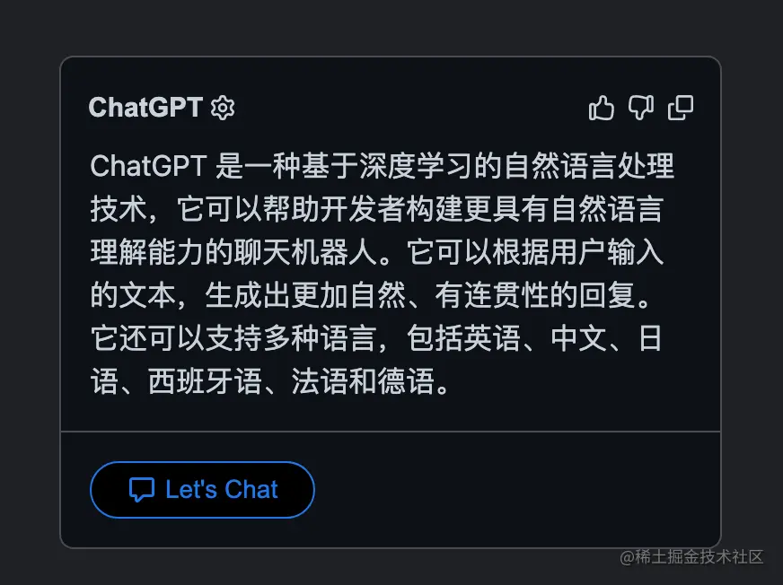
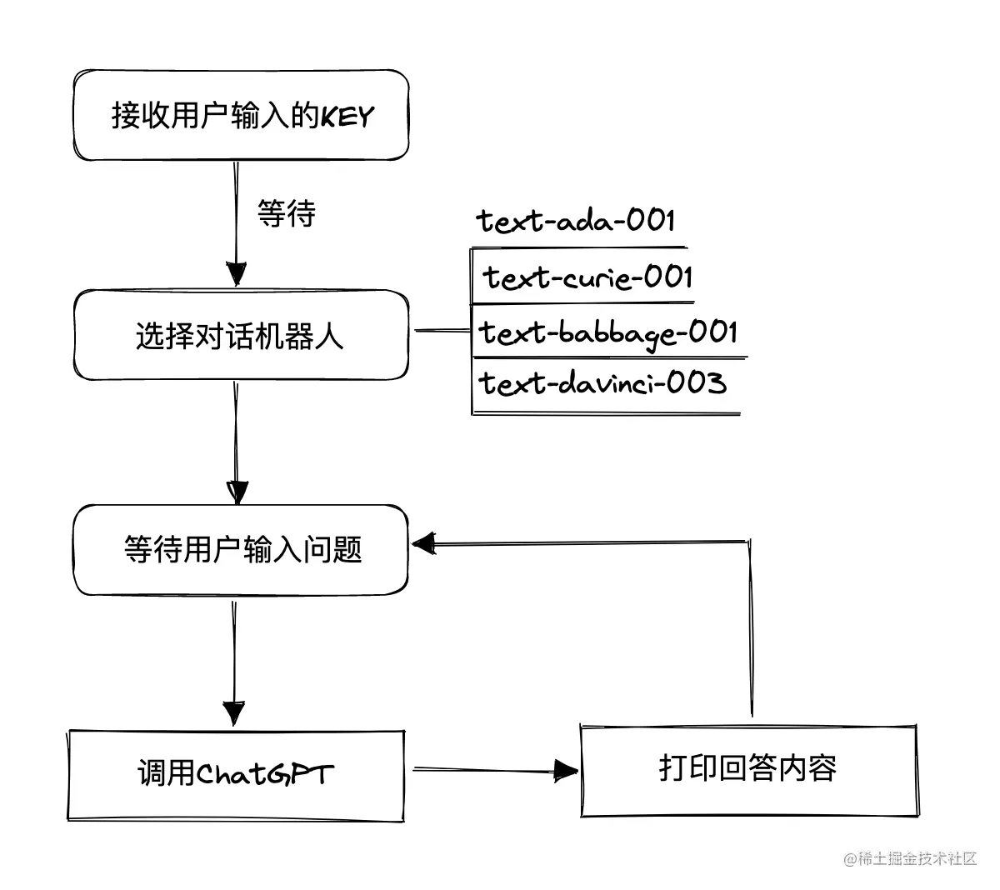
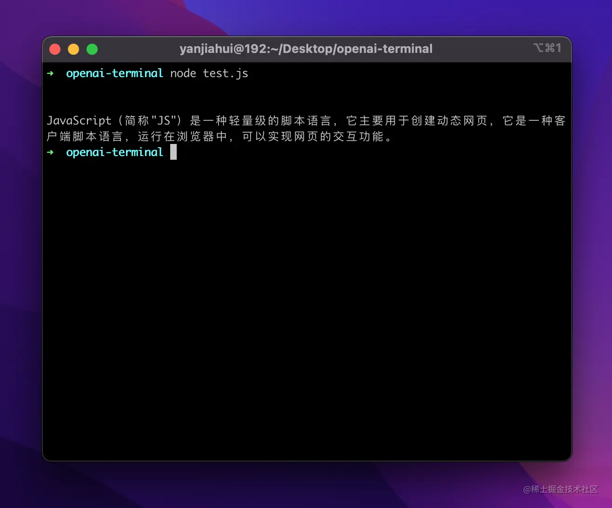
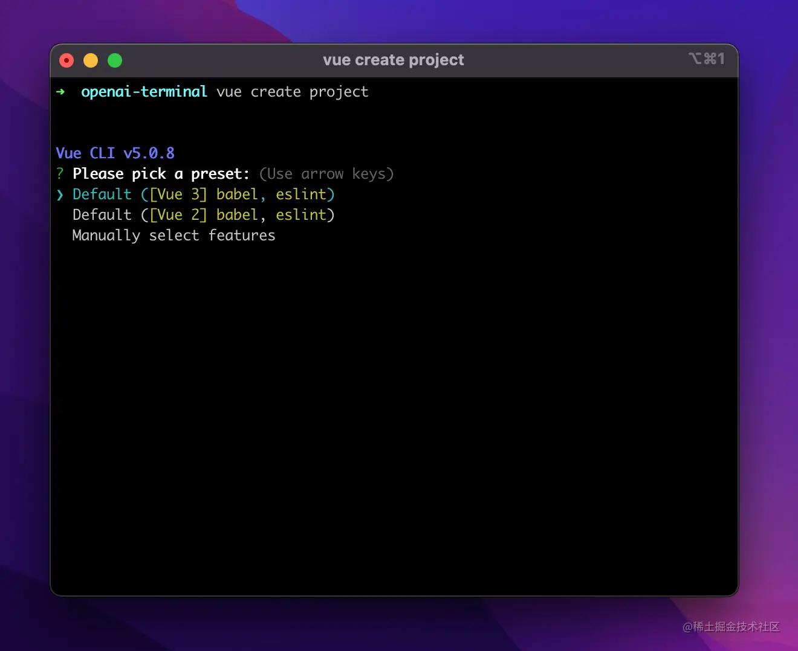
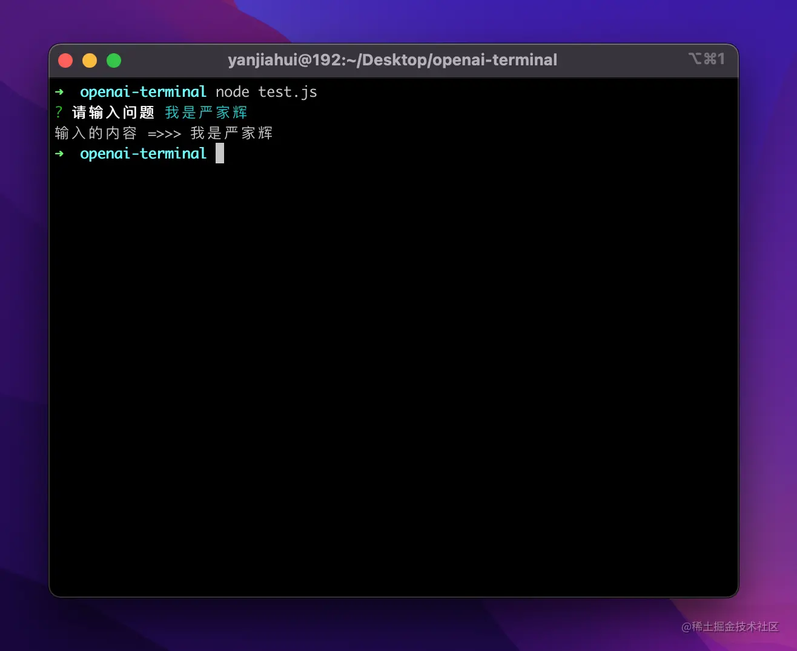
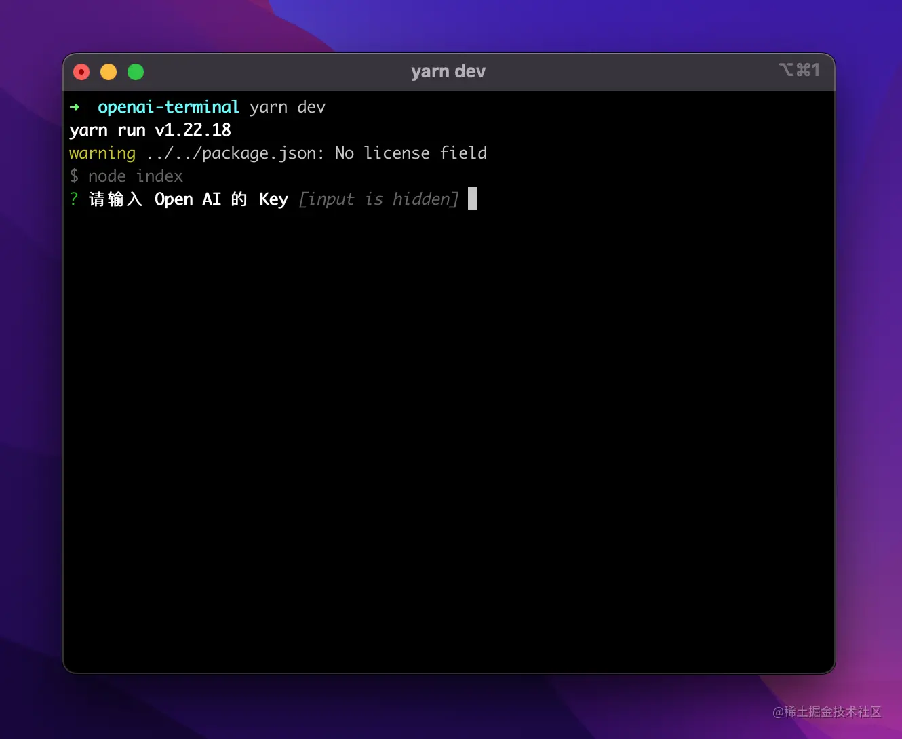
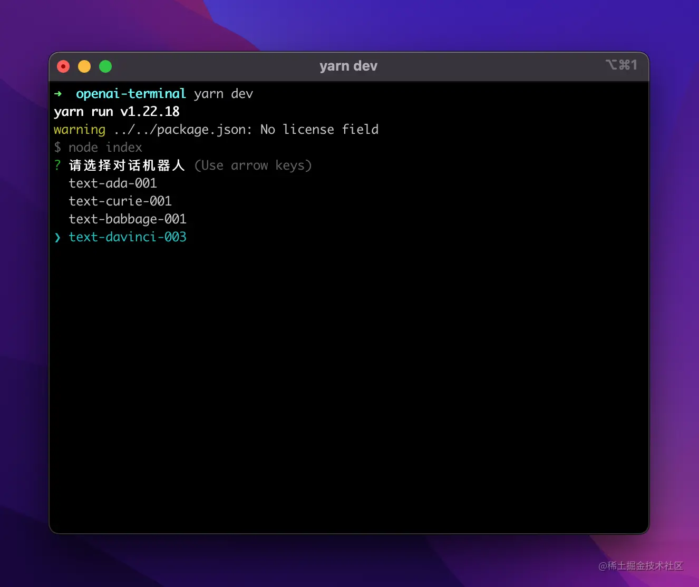
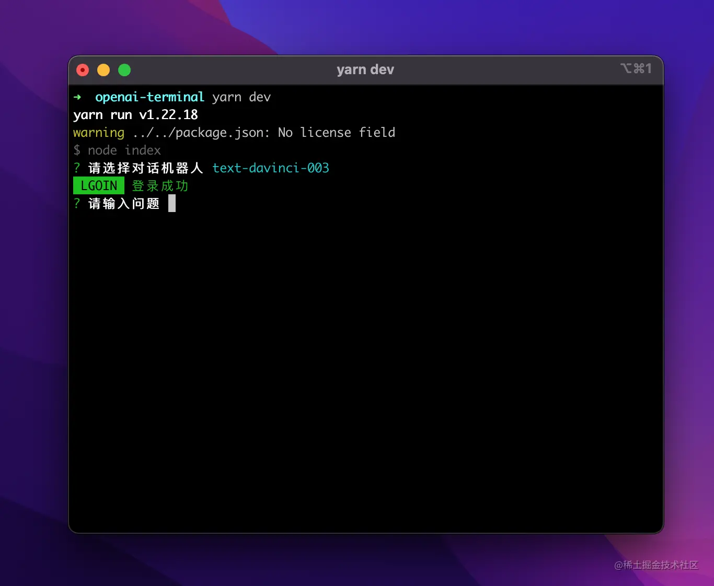

引导篇
---

从去年12月初了解到 `ChatGPT`，也注册了账号，但是一直没去使用（真是太懒了）。

相信大家就算没使用过，也听闻过它的传说，简单来说就是一个解答性聊天机器人。



最近呢，有几位朋友也一直在向我咨询一些 `ChatGPT` 的问题，想了想还是做个小应用，带各位来了解并使用上`ChatGPT`。

> 声明一下，此篇文章真不是用 `ChatGPT` 生成的。

注册篇
---

已经有很多大佬来介绍这个注册方式了，我简单的说一下步骤吧。

1.  准备好科学上网的节点（香港、越南的不行）；
2.  在 [sms-activate.org/](https://sms-activate.org/ "https://sms-activate.org/") 验证码平台上充值个1$；
3.  去 [chat.openai.com/auth/login](https://chat.openai.com/auth/login "https://chat.openai.com/auth/login") 通过邮箱注册（推荐谷歌直接注册）；
4.  在验证码平台上找一个 `openai` 的验证码服务（最便宜的是印尼的，有效期20分钟）；
5.  输入验证码平台上的手机号进行验证；
6.  等待验证码出现，粘贴之后即可完成注册；
7.  可以直接在 [platform.openai.com/account/api…](https://platform.openai.com/account/api-keys "https://platform.openai.com/account/api-keys") 生成 `apiKey`;

实战篇
---

本次做的小工具，是一个终端对话助手。通过用户的输入内容，让 `ChatGPT` 进行识别回答并输出。



### 效果图


### 准备工作

初始化

```csharp
yarn init -y
```

安装插件

1.  `openai`（对话功能）
2.  `inquirer`（处理命令行输入等操作）
3.  `cli-spinner`（Loading效果）

准备 `openai` 的 `apiKey`

对接 OpenAI
---------

引入 openai，并且写一个调用入口函数。

```js
const { Configuration, OpenAIApi } = require("openai");

async function main() {
    // 创建 openai 配置
    const configuration = new Configuration({
        apiKey: 'apiKey'
    });
    // 初始化 openai
    const openai = new OpenAIApi(configuration);
    const { data: { choices } } = await openai.createCompletion({
        model: 'text-davinci-003', // 对话机器人模型
        prompt: 'js 是什么？', // 问题
        temperature: 0.5, // 准确性的概率，0是最精准的
        max_tokens: 150, // 输出内容长度
        top_p: 1.0, // 避免重复和不相关的内容
        frequency_penalty: 0.0, // 控制语言模型中出现的词语频率，惩罚
        presence_penalty: 0.0, // 控制语言模型中出现的词语频率，惩罚
    })
    console.log(choices[0].text); // 输出的内容
}

main()
```

输出的结果如下图

这一步已经将 `openai` 对接完了。



让用户配置和提问
--------

我们需要让用户提问，不应该直接将问题写在文件里，缺少与用户之间的交互。

这时候 `inquirer` 出现了，它是一个命令行交互工具，可以做很多事情，比如各种 `cli` 的一些问题及选择配置的方式，如 `VueCli` 的创建的这种多选、单选它都可以做到。

 

使用方式也很简单

```js
const { prompt } = await inquirer.prompt({
    type: 'input', // 可以是 password｜list 等
    name: 'prompt', // 定义的字段名
    message: '请输入问题', // 提示信息
});

console.log('输入的内容 =>>>', prompt)
```



现在可以拿到用户的输入内容了，我们就可以做很多事情了。

1.  获取用户输入的 `apiKey`；
2.  获取用户选择的对话机器人模型；
3.  获取用户提问内容；

### 引入&定义配置

```js
const inquirer = require('inquirer');
// 定义一个配置 config
const config = Object.create(null);
const fs = require('fs');
```

### 写入 Key 到文件

让用户输入密钥，为了持久化存储，我选择直接创建文件来进行存 `key`，以免每次都需要重新输入。

```js
// 判断文件是否存在
const keysIsExist = fs.existsSync('openai_keys');
// 如果不存在
if (!keysIsExist) {
    const { apiKey } = await inquirer.prompt({
        type: 'password',
        name: 'apiKey',
        message: '请输入 Open AI 的 Key',
    })

    // 覆盖写入
    fs.writeFile('openai_keys', apiKey.trim(), { flag: 'w' }, (err) => {
        if (err) console.error(err)
        else main() // 重新执行
    })
} else {
  	// 存在此文件直接读取赋值给 config.apiKey
    fs.readFile('openai_keys', (err, data) => {
        if (err) {
            console.error(err)
            return
        }
        config.apiKey = data.toString();
    })
}
```



### 让用户选择机器人

```js
const { model } = await inquirer.prompt({
    type: 'list',
    name: 'model',
    message: '请选择对话机器人',
    choices: [
        { name: 'text-ada-001', value: 'text-ada-001' },
        { name: 'text-curie-001', value: 'text-curie-001' },
        { name: 'text-babbage-001', value: 'text-babbage-001' },
        { name: 'text-davinci-003', value: 'text-davinci-003' },
    ],
    default: 'text-davinci-003'
})
config.model = model;
```



### 让用户提问

```js
const { prompt } = await inquirer.prompt({
    type: 'input',
    name: 'prompt',
    message: '请输入问题',
});
```



加个 Loading 效果
-------------

因为 `openai` 响应有点慢，所以为了减少蕉绿，引入了 `cli-spinner`

```js
const Spinner = require('cli-spinner').Spinner;
// %s 会被下面的 ▂ ▃ ▄ ▅ ▆ ▇ █ 替代，是个占位符
const spinner = new Spinner('Loading.. %s');
// 这里是loading字符，按照这个顺序去渲染
spinner.setSpinnerString('▂ ▃ ▄ ▅ ▆ ▇ █');
```

在请求`openai`之前调用

```js
// 请求开始
spinner.start();
// 请求完成之后暂停
spinner.stop(true); // 参数 bool ，是否需要清除输出内容
```

全部代码
----

[仓库地址](https://github.com/CrazyMrYan/openai-terminal "https://github.com/CrazyMrYan/openai-terminal")

终于完结撒花了，现在已经是凌晨一点半了。

```js
const { Configuration, OpenAIApi } = require("openai");
const inquirer = require('inquirer');
const fs = require('fs');
const config = Object.create(null);
const Spinner = require('cli-spinner').Spinner;
const spinner = new Spinner('Loading.. %s');
spinner.setSpinnerString('▂ ▃ ▄ ▅ ▆ ▇ █');

async function main() {
  // 判断文件是否存在
  const keysIsExist = fs.existsSync('openai_keys');
  if(!keysIsExist) {
    const { apiKey } = await inquirer.prompt({
      type: 'password',
      name: 'apiKey',
      message: '请输入 Open AI 的 Key',
    })

    // 覆盖写入
    fs.writeFile('openai_keys', apiKey.trim(), { flag: 'w' }, (err) => {
      if (err) console.error(err)
      else main()
    })
  } else {
    fs.readFile('openai_keys', (err, data) => {
      if (err) {
        console.error(err)
        return
      }
      config.apiKey = data.toString();
    })
  }

	const { model } = await inquirer.prompt({
		type: 'list',
		name: 'model',
		message: '请选择对话机器人',
		choices: [
			{ name: 'text-ada-001', value: 'text-ada-001' },
			{ name: 'text-curie-001', value: 'text-curie-001' },
			{ name: 'text-babbage-001', value: 'text-babbage-001' },
			{ name: 'text-davinci-003', value: 'text-davinci-003' },
		],
		default: 'text-davinci-003'
	})
	config.model = model;

  const { apiKey } = config;
	console.log('\033[42;30m LGOIN \033[40;32m 登录成功\033[0m');
	const configuration = new Configuration({
		apiKey
	});
	config.openai = new OpenAIApi(configuration);
	start()
}

async function start() {
	const { model } = config;
	const { prompt } = await inquirer.prompt({
		type: 'input',
		name: 'prompt',
		message: '请输入问题',
	});
	if(!prompt.trim()) {
		start()
		return false
	}
	try {
		spinner.start();
		const { data: { choices } } = await config.openai.createCompletion({
			model,
			prompt,
			temperature: 0.5,
			max_tokens: 150,
			top_p: 1.0,
			frequency_penalty: 0.0,
			presence_penalty: 0.0,
		})
		const answer = choices[0]?.text?.replace(/\ +/g, '');
		spinner.stop(true);
		console.log('\033[32mOpen AI：' + answer?.trim() + '\033[0m');
		start()
	} catch (error) {
		spinner.stop(true);
		console.log(error);
	} 
}

main();
```
