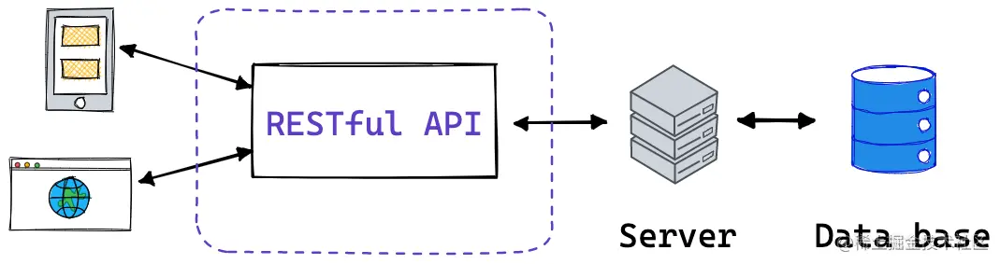

引导篇（RESTful API 是什么？）
---------------------

`REST` 全称是 `Representational State Transfer`，中文意思是表现层（编者注：通常译为表征）状态转化， 它首次出现在 `2000`年 `Roy Fielding`的博士论文中。 `Roy Fielding`在论文中提到："我这篇文章的写作目的，就是想在符合架构原理的前提下，理解和评估以网络为基础的应用软件的架构设计，得到一个功能强、性能好、适宜通信的架构。`REST` 指的是一组架构约束条件和原则。"

`REST` 本身并没有创造新的技术、组件或服务，而隐藏在 `RESTful` 背后的理念就是使用 `Web` 的现有特征和能力， 更好地使用现有 `Web` 标准中的一些准则和约束。虽然 `REST` 本身受 `Web` 技术的影响很深， 但是理论上 `REST` 架构风格并不是绑定在 `HTTP`上，只不过目前 `HTTP` 是唯一与 `REST` 相关的实例。

> 简单来说，`RESTful` 是一种 `API` 风格，重点！！是风格，不是什么规范。

场景篇
---

> 上面讲了这么多关于 RESTful 的知识。
> 
> 下面我们来模拟使用 `RESTful API` 风格来定义几个对文章操作的 `API`。

### GET

*   获取文章详情

```json
# 接口
api/articles/:id

# 状态码 200

# 返回详情
{
	"id": "xxx",
	"content": "xxx",
	"author": "严家辉",
	"createTime": "2023-03-02 23:37:20",
}
```

*   获取文章列表数据

```json
# 接口
api/articles

# 状态码 200

# 返回列表数据和总数
{
  "items": [
    {
      "id": "xxx",
      "content": "xxx",
      "author": "严家辉",
      "createTime": "2023-03-02 23:37:20",
    }
  ],
  "total": 100
}
```

### POST

*   新增文章

```json
# 接口
api/articles

# 状态码 201

# 返回新增数据的详情
{
	"id": "xxx",
	"content": "xxx",
	"author": "严家辉",
	"createTime": "2023-03-02 23:37:20",
}
```

### PUT

*   更新文章内容

```json
# 接口
api/articles/:id

# 状态码 200

# 返回更新后的详情
{
	"id": "xxx",
	"content": "xxx",
	"author": "严家辉",
	"createTime": "2023-03-02 23:37:20",
}
```

### DELETE

*   删除一篇文章

```json
# 接口
api/articles/:id

# 状态码 204

# No content
```

### 合起来看下

方法

API

用途

GET

api/articles/:id

获取文章详情

GET

api/articles

获取文章列表

POST

api/articles

新增文章

PUT

api/articles/:id

更新文章

DELETE

api/articles/:id

删除文章

> RESTful 的核心思想就是，客户端发出的数据操作指令都是`动词` + `宾语`的结构。
> 
> 用一句话来描述`RESTful API` 就是`URL`定位资源，用HTTP动词（`GET`,`POST`,`PUT`,`DELETE`)描述操作。

> 看URL 就知道要什么
> 
> 看HTTP Method 就知道干什么
> 
> 看HTTP Status Code 就知道结果如何
> 
> 引知乎高赞回答 - [徐磊](https://www.zhihu.com/people/xu-lei-69-24 "https://www.zhihu.com/people/xu-lei-69-24")

使用 RESTful API 遇到的问题
--------------------

可以先看看对用户的其他操作吧

方法

API

用途

GET

api/users/:id

获取用户信息

GET

api/users

获取用户列表

POST

api/users

新增用户

PUT

api/users/:id

更新用户信息

DELETE

api/users/:id

更新用户信息

看着好像没啥问题。

上面我们都在操作 `users` 资源，那用户的登录怎么使用 `RESTful API` ？

> 但是 `HTTP Method` 里面压根没有一个叫登录的动词让我们直接操作 `users` 的登录。怎么办呢？
> 
> 难道是使用 `api/login`?
> 
> 当然不行 `login` 已经是动词了，按照 `RESTful API` 的风格， `URL` 只能是用来表示`资源主体` 的名词？且推荐使用复数。

其实登录我们也是操作一个资源，这个资源就是 `session`。

所以我们可以定义登录登出为

方法

API

用途

POST

api/sessions

登录

DELETE

api/sessions

登出

优点
--

*   提供简单的 `URL` 结构，可以更容易地理解和记忆。
*   每个 API 专注做一件事，提高各种组合的可能性。
*   支持多种 `HTTP` 方法，如 `GET`、`POST`、`PUT` 和 `DELETE`，可以更容易地实现不同的操作。

因此，`RESTful API` 可以提供一种简单、灵活的方式来构建 `Web`服务，可以更容易地实现服务器端的性能优化，也可以更容易地实现跨域数据共享。

缺点
--

*   若一次需要操作多个资源，还需要多个请求 request，效能方面较差
*   网络上所有东西都是`资源`，需要正确将资源抽象化，写出资源的`URI`，并使用正确的动词(`HTTP Method`) 去操作它。

总结
--

> RESTful 的核心思想就是，客户端发出的数据操作指令都是`动词` + `宾语`的结构。 用一句话来描述`RESTful API` 就是`URL`定位资源，用HTTP动词（`GET`,`POST`,`PUT`,`DELETE`)描述操作。

`RESTful API` 一般看是场景来使用的，因为毕竟只是一种 API 风格。

如果你的团队有自己的风格或者规范，那么按照团队的来就行，保持风格一致就是最好的，当然如果你想进行尝试尝试，推荐在新模块中进行使用，不然显得有点突兀。

就像下面这样

*   `api/project/data-info/:id`
*   `api/project/most-used-project-list`

突然变成了

*   `api/projects/:id`
*   `api/projects`

推荐新项目小项目可以尝试着使用一下 `RESTful API`, 对于我这个不太喜欢命名的人来说，`RESTful API` 是个不错的选择。

参考文献
----

*   [www.zhihu.com/question/28…](https://www.zhihu.com/question/28557115 "https://www.zhihu.com/question/28557115")
*   [segmentfault.com/a/119000002…](https://segmentfault.com/a/1190000020029993 "https://segmentfault.com/a/1190000020029993")
