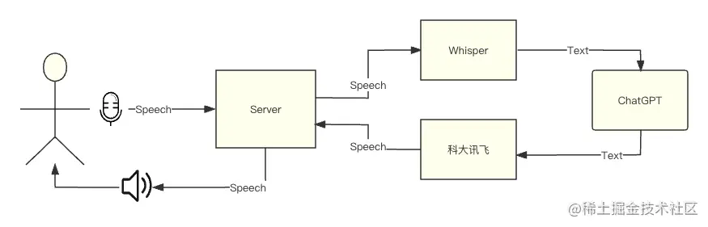
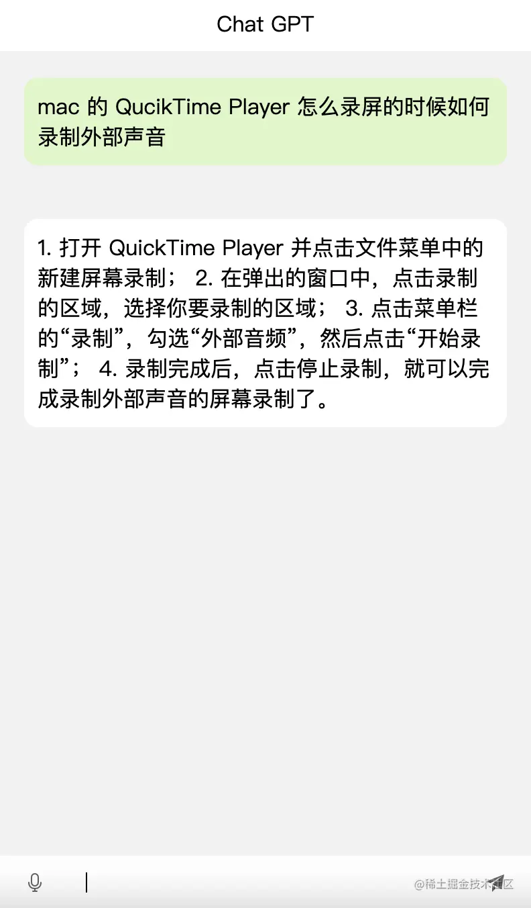
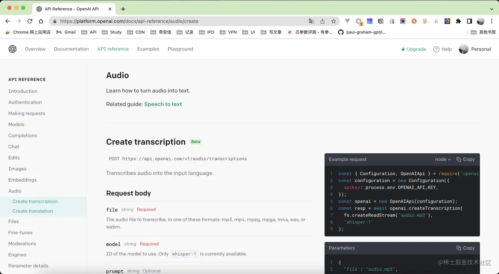
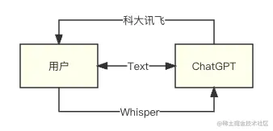
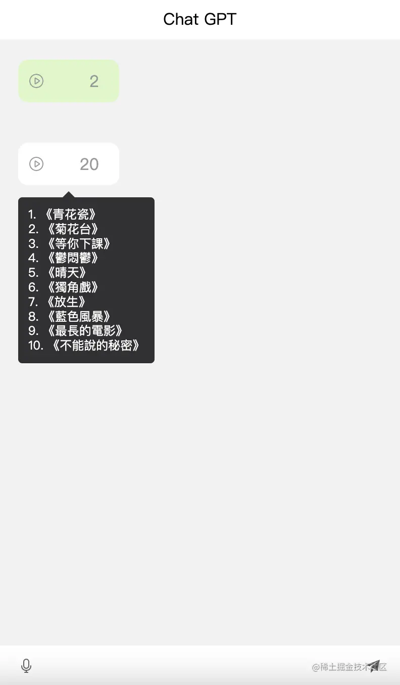
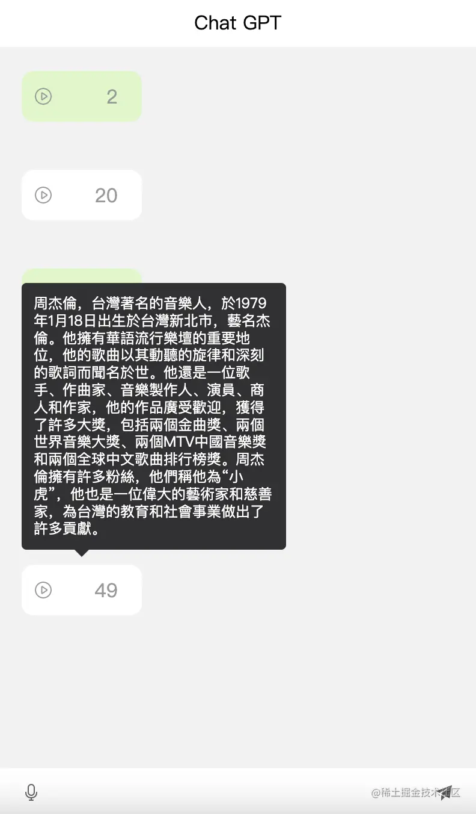

效果图
---





什么是 STT 和 TTS？
--------------

*   `STT` 是语音转文字（Speech To Text）
    
*   `TTS` 是文字转语音（Text To Speech）
    

> 为什么要使用 `SST` + `TTS` 如果用户直接输入音频，`OpenAI` 的 `API` 中并没有直接使用语音和 `GPT` 进行对话的功能。

所需依赖
----

*   express
*   express-fileupload
*   openai
*   websocket
*   nodemon
*   dotenv

实现语音转文字（STT）
------------

前面说到了，`OpenAI` 中不存在这种 `API`，但是提供了一个 `Whisper` 机器人，支持将音频流转化为文本，也就是 `STT`。



实现如下返回的 `text` 就是识别的语音内容

```js
const {
   data: { text: prompt },
} = await openai.createTranscription(
  fs.createReadStream(fileName),
  "whisper-1"
);
```

实现文字转语音（TTS）
------------

`OpenAI` 目前只提供了 `STT`，如果需要返回给用户一个音频的话。就需要用到国内的 科大讯飞 每天有 `5.05w` 次免费的 [TTS](https://console.xfyun.cn/services/tts "https://console.xfyun.cn/services/tts")。


如果你有国外信用卡，可以考虑使用微软推出 `Azure`，很多电报机器人就是用的它来开发的，免费使用 12个月。


所以在这里还是使用科大讯飞的 `TTS`

### 文字生成音频文件

音频没有直接返回流，而是直接生成一个音频返回文件路径给前端播放。

回复音频存放在 chat-audio/client/audio 中

先在 [讯飞TTS](https://console.xfyun.cn/services/tts "https://console.xfyun.cn/services/tts") 中获取需要的 keys


```js
const tts = promisify(require("./utils/tts"));
// 环境变量
require("dotenv").config();
// 生成音频
const generateAudio = (text) => {
  return new Promise((resolve, reject) => {
    const auth = {
      app_id: process.env.TTS_APP_ID,
      app_skey: process.env.TTS_API_SECRET,
      app_akey: process.env.TTS_API_KEY
    };
    // 讯飞 api 参数配置
    const business = {
      aue: "lame",
      sfl: 1,
      speed: 50,
      pitch: 50,
      volume: 100,
      bgs: 0,
    };
    const id = new Date().getTime()
    // 存储文件的路径
    const file = path.resolve(__dirname, `client/audio/${id}.m4a`);
    try {
      // 执行请求
      tts(auth, business, text, file).then((res) => {
        // 返回静态文件地址
        resolve(`audio/${id}.m4a`)
      });
    } catch (e) {
      reject(e)
    }
  })
};
```

封装好的讯飞的语音包 `TTS`，放在 [ChatAudio 仓库](https://github.com/CrazyMrYan/chat-audio "https://github.com/CrazyMrYan/chat-audio") 里面。这里就不展示出来了

调用 STT & TTS
------------

### 音频对话接口

通过 api/audio，让客户端调用此方法

```js
app.use(fileUpload());
app.post("api/audio", async (req, res) => {
  // 没有上传音频抛出异常
  if (!req.files) return res.status(400).send({ message: "缺少参数", error: true });

  const file = req.files.file;
  // 存放用户上传的文件
  const fileName = "audio.m4a";

  file.mv(fileName, async (err) => {
    if (err) {
      return res.status(500).send(err);
    }
        // 使用ChatGPT 的 STT 机器人（Whisper）
    const {
      data: { text: prompt },
    } = await openai.createTranscription(
      fs.createReadStream(fileName),
      "whisper-1"
    );
    console.log("解析的音频内容是>>>", prompt);

    // 判断用户上传音频是否存在内容
    if (!prompt.trim().length)
      return res.send({ message: "未识别到语音内容", error: true });

    // 将转用户提问的文本内容，去调用 ChatGPT 的回复
    const chatReply = await handleIssueReply(prompt);

    // 将 ChatGPT 的回复通过 TTS 转化为语音
    const content = await generateAudio(chatReply);
    console.log("生成的音频是>>>", content);

    res.send([
      { type: "system", content, chatReply, infoType: "audio", playStatus: false },
    ]);
  });
});
```

### ChatGPT 回复问题能力

不管是 `TTS`、`STT`还是`TTT`，最核心对话功能还是通过 `ChatGPT`实现的。



ChatGPT 配置就不细说了，配置一个 `KEY` 然后封装一个回复问题的方法

[获取 ChatGPT KEY](https://platform.openai.com/account/api-keys "https://platform.openai.com/account/api-keys")

```js
const { Configuration, OpenAIApi } = require("openai");
// openai 配置
const configuration = new Configuration({
  apiKey: process.env.OPENAI_API_KEY,
});
// 创建 openai 实例
const openai = new OpenAIApi(configuration);

const handleIssueReply = async (prompt) => {
  const {
    data: { choices },
  } = await openai.createCompletion({
    model: "text-davinci-003",
    prompt,
    temperature: 0.5,
    max_tokens: 1000,
    top_p: 1.0,
    frequency_penalty: 0.0,
    presence_penalty: 0.0,
  });
  const chat = choices[0].text?.trim();
  console.log("生成的文本内容是>>>", chat);
  return chat;
};
```

实现效果如下，没有录屏可以自行感受下。





补充功能 Text To Text
-----------------

前面做的语音对话，只是为了让你不再孤单寂寞，但是在日常开发工作中基本上不会使用到语音对话，所以单独做了个可以直接使用的文字聊天功能。

所以新开了一个接口直接调用 ChatGPT 的回复。

```js
app.get("/api/issue", async (req, res) => {
  // 从 query 中取出用户提出的问题
  const { issue } = req.query;
    if (!issue.trim()) return res.status(400).send({ message: "缺少参数", error: true });
  const chatReply = await handleIssueReply(issue);
  return res.send([{ type: "system", content: chatReply }]);
});
```

前端实现
----

前端没什么太多需要注意的，列一下依赖吧，均采用的 `CDN`。

*   Vue
*   Elment UI

代码在 chat-audio/client/index.html 这里

使用 ChatAudio
------------

### 克隆

```git
git clone git@github.com:CrazyMrYan/chat-audio.git
```

### 配置 Key

在 ENV 文件中配置 `科大讯飞` 和 `OpenAI` 的 `key`

### 安装启动

```sql
yarn install

yarn start
```

### 使用

浏览器打开 localhost:3000

就可以看到聊天界面了

> tips:
> 
> 开下 ke xue shang wang
> 
> 最好是 🇺🇸 节点
