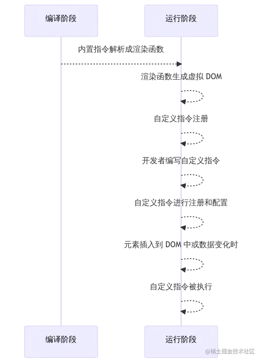
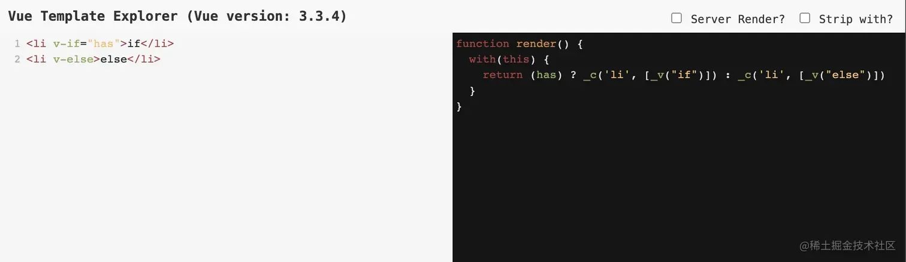
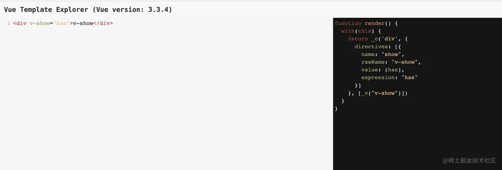
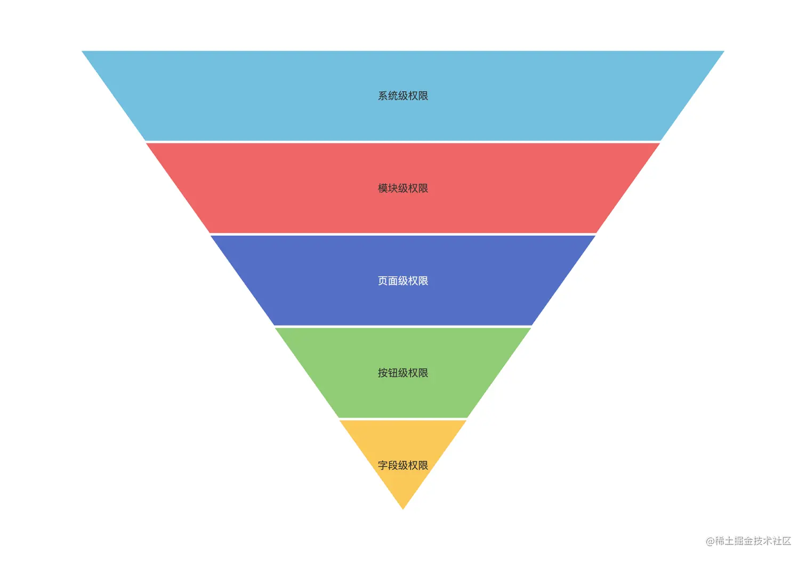
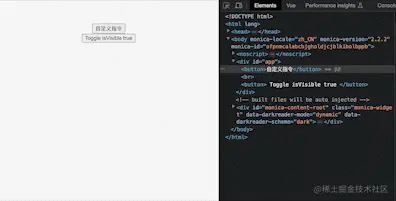
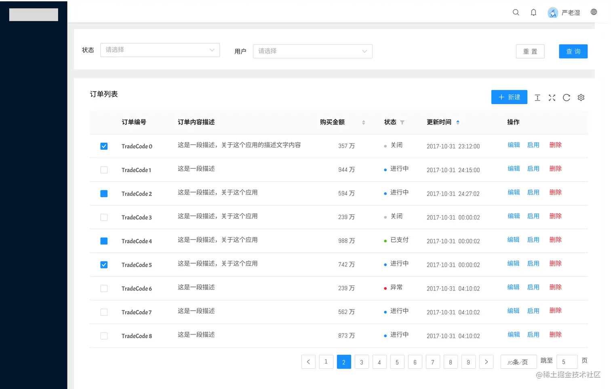
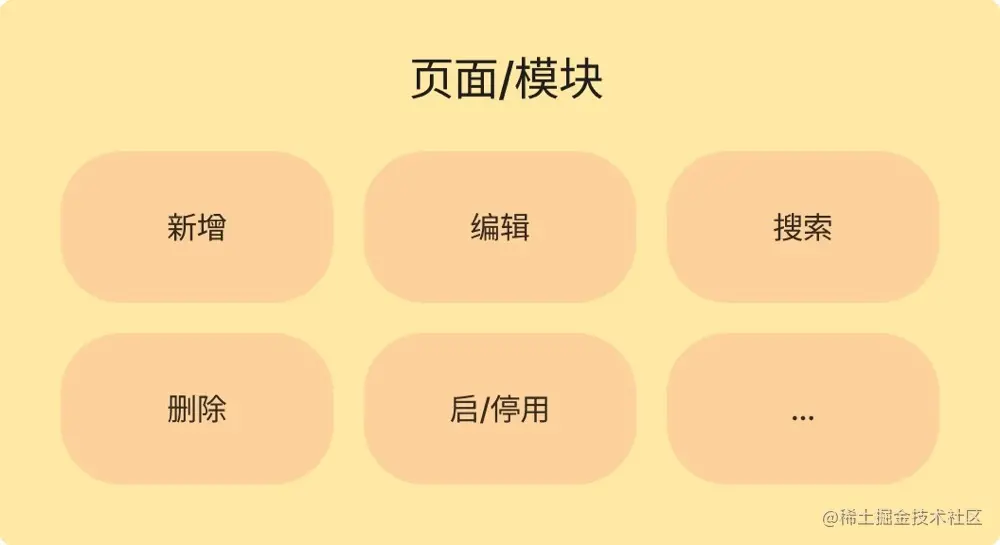
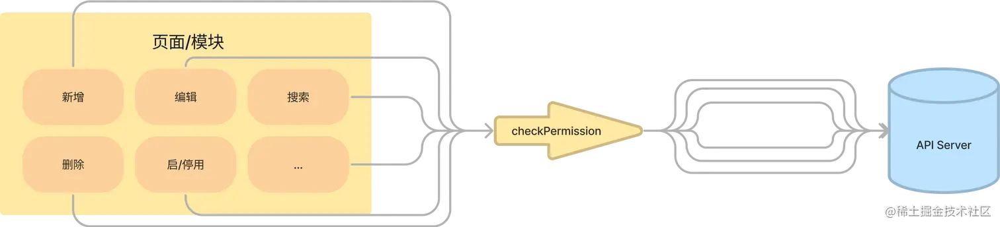
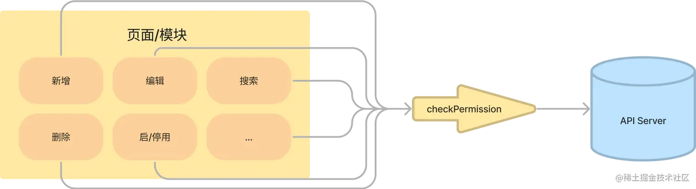
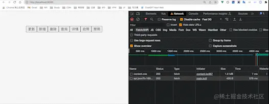

先简单介绍下自定义指令
-----------

> 在介绍 Permission 指令之前，我们先来简单了解一下自定义指令是什么。

Vue的自定义指令通过`Vue.directive`方法来创建。

*   `bind`：指令第一次绑定到元素时调用。在这里可以执行一次性的初始化设置。
    
*   `inserted`：被绑定元素插入父元素时调用。注意，父元素可能还未存在，所以不能进行DOM操作。
    
*   `update`：被绑定元素所在的组件更新时调用，但是可能发生在其子组件更新之前。可以比较更新前后的值，执行相应的操作。
    
*   `componentUpdated`：被绑定元素所在的组件及其子组件全部更新后调用。可以执行操作，例如更新DOM。
    
*   `unbind`：指令与元素解绑时调用。可以执行清理操作。
    

除了上述的钩子函数外，还可以在指令对象中定义其他属性和方法：

*   `name`：指令的名称，用于在模板中绑定指令。
    
*   `value`：指令的绑定值，可以是一个表达式或变量。
    
*   `arg`：指令的参数，用于传递额外的信息。
    
*   `modifiers`：修饰符对象，可以用于传递额外的标记信息。
    
*   `el`：指令所绑定的元素。
    
*   `vm`：指令所属的Vue实例。
    
*   `expression`：指令的表达式。
    
*   `context`：指令所在上下文的Vue实例。
    

下面是一个简单的自定义指令示例：

```javascript
Vue.directive('my-directive', {
  bind(el, binding, vnode) {
    // 初始化设置
  },
  inserted(el, binding, vnode) {
    // 元素插入父元素时调用
  },
  update(el, binding, vnode) {
    // 组件更新时调用
  },
  componentUpdated(el, binding, vnode) {
    // 组件及子组件更新后调用
  },
  unbind(el, binding, vnode) {
    // 解绑时调用
  }
});
```

在模板中使用自定义指令：

```html
<div v-my-directive="value"></div>
```

内置指令与自定义指令
----------

> 常用的内置指令有 `v-if`、`v-show`、`v-bind`、`v-for`等等，大家都用过，也就不在过多赘述了。

先问一个问题

Q: Vue 自定义指令在什么时机执行？

A: 是在运行时解析并执行的

从内置到自定义指令中间到底发生了什么？

可能是由于之前没有深入了解，一直认为内置指令和自定义指令都在编译时解析。

从下图中可以`编译时`内置指令在到 `Render` 时已经执行完成，然而到了`运行时`之后才开始自定义指令的解析工作。



### 简单举个例子

常常碰到的面试题，“v-if 和 v-show有什么区别”，区别可不是简简单单的一个前者是直接删除DOM，后者是改变display属性。

`v-if` 在生成 `VNode` 前就已经在模板编译阶段进行了判断，而 `v-show` 也是在编译时解析，只不过在 `v-if` 在编译时就确定了渲染元素，而`v-show`在运行时根据条件进行显示和隐藏。

如下摘抄 《深入浅出Vue.js》中 `15.1.1 中 v-if 指令的原理概述` 的部分代码

**v-if**

```html
<!-- 模板 -->
<li v-if="has">if</li>
<li v-else>else</li>
```

```js
// 编译后
(has)
    ? _c('li',[_v("if")])
    : _c('li',[_v("else")])
```

 当 has 为 true，就会将第一个 li 元素创建 `VNode`。

*   `_c` 指的是 createElement，用于创建组件节点。
    
*   `_v` 是用来创建文本 VNode
    

**v-show**

我们再看看 `v-show`, 很明显是一个指令，与我们在`render` 函数中写指令是一样的，但是这样来看 v-if 肯定是一个语法糖，因为它并不是真正意义上的指令。



也就是说自定义指令时机不可能在内置指令之前解析（当然，如果你要是通过 vue-template-compiler 直接修改编译时或者其他骚操作，就当俺没说）。

感兴趣的朋友可以去 [vue-template-explorer.netlify.app/](https://vue-template-explorer.netlify.app/ "https://vue-template-explorer.netlify.app/") 上试试

在真正了解了内置指令的执行时机，之后我们接下来写一个自定义的指令

写一个的 Permission 指令
------------------

### 常见的权限颗粒度

在实现 Permission 指令之前，我们需要先了解一下常见的权限颗粒度。下面是一些常见的方案。



### 一般常见的方案有

*   将按钮封装成组件，然后通过 props 传递参数，来控制是否显示or可操作
    
*   封装一个组件，通过插槽形式传递按钮，再通过prop传值控制
    
*   写一个自定义指令，通过 value 控制元素是否显示
    

### 相比 v-if 的好处有以下几点

1.  可以轻松地扩展权限控制功能。
    
2.  支持多个权限码、支持异步获取权限等。
    
3.  语义化效果更加明显。
    

### 如何实现

先写一个简单的显示隐藏控制，可以通过响应式数据控制。

```js
// 全局自定义指令
Vue.directive("permission", {
  // 在元素被插入到 DOM 中时触发
  inserted(el, binding) {
    // 如果绑定值为 false，则从父节点中移除元素
    if (!binding.value) {
      el.parentNode.removeChild(el); // 移除元素
    }
  },
  // 在元素更新时触发
  update(el, binding) {
    // 如果绑定值为 true
    if (binding.value) {
      // 如果元素没有父节点（即之前被移除了）
      if (!el.parentNode) {
        // 将元素插入到原来的位置
        el.__v_originalParent.insertBefore(el, el.__v_anchor || null);
      }
    } else {
      // 如果元素有父节点
      if (el.parentNode) {
        // 创建一个注释节点作为替换元素的占位符
        el.__v_anchor = document.createComment("");
        el.__v_originalParent = el.parentNode;
        // 用注释节点替换原来的元素
        el.parentNode.replaceChild(el.__v_anchor, el); 
      }
    }
  },
});
```

在 `inserted` 钩子中，当元素被插入到 DOM 中时，根据绑定值的状态，如果为 `false`，则从父节点中移除该元素，实现隐藏的效果。

在 `update` 钩子中，当元素更新时，根据绑定值的状态，如果为 `true`，并且元素之前被移除了（没有父节点），则将元素插入到原来的位置，实现显示的效果。如果绑定值为 `false`，并且元素当前有父节点，则创建一个注释节点作为替换元素的占位符，并将注释节点替换掉原来的元素，实现隐藏的效果。

### 使用方式

使用方式很简单，在指令中传入需要的值即可。

```html
<template>
  <div id="app">
    isVisible: {{ isVisible }}
    <button v-permission="isVisible">自定义指令</button>
    <button @click="isVisible = !isVisible">Toggle</button>
  </div>
</template>

<script>
export default {
  name: "App",
  data() {
    return {
      isVisible: true,
    };
  },
};
</script>
```

### 效果

可以看到效果基本上与 `v-if` 一致，当然这个是运行时的操作，在原理上来说还是有区别的。



但是如果只是一个简单的变量的话，我们的这个 `v-permission` 没有太大意义。真的可以直接通过 `v-if` 控制即可，因为我们需要异步请求，并且实现统一管理。接下来会加强一下这个指令。

强化一下功能
------

在常见中后台中表格页出现4个以上的按钮，如下图，有新增、删除、编辑、查询。从业务中来，又从业务中走出去。



一般需要在某个模块、功能又或者某个路由下的`add`|`delete`|`update`|`query`进行权限控制，又或者其他的一些操作。



所以我们一个按钮权限应该是 `页面::新增`，接下来就需要一个`checkPermission` 方法来提供支撑。

假设现在在某个API中能够拿到所有按钮级别的权限，并且与服务端同学约定的格式一致。

```json
{
    "orders": [
        "add",
        "update",
        "delete",
        "query",
        "detail",
        "enable",
        "disable"
    ]
}
```

如上JSON，orders 作为订单页面，而对应能够操作 Actions 放在数组内，若不存在则认定为没有此权限。

### 消费方

消费方传入`orders::update` 则代表需要获取到`订单的编辑权限`

```html
<button v-permission="'orders::update'">Update</button>
```

### 指令

在指令区域，我们需要将指令的钩子（这里的示例只在inserted中调整了）改为异步等待，刚进入 `inserted`钩子时需要将 `display` 设置为 `none`，或者在 `bind` 钩子里面去做这个事情，不然会出现一闪而过的效果。

然后在这里面去调用`checkPermission`传入 `binding.value` 也就是 `orders::update` 然后在这里等待 `checkPermission` 的返回值然后判断是否需要删除此元素。

```js
Vue.directive("permission", {
  async inserted(el, binding) {
    // 默认先改为 none，等数据回来之后再进行操作，你通过class来控制
    el.style.display = "none";
    const hasPermission = await checkPermission(binding.value);
    el.style.display = "";
    if (!hasPermission) {
      el.parentNode?.removeChild(el); // 移除元素
    }
  },
  ...
});
```

### checkPermission 校验权限

接收 `orders::update`，通过`splitPermissionString`分割成`orders`和`update`。

然后再去发送请求，但是如果一个页面有多处同时调用`v-permission`，可能会存在重复请求的问题。 

所以通过 `controller.hasRequested` 和 `controller.task` 来控制请求的重复性。这个是有必要的，目前`JavaScript`中没发现类似与`Java`中的`wait/notify`（锁机制）。所以只是一个仿造Java的锁机制 

```js
const controller = {
  // 是否发过请求
  hasRequested: false,
  // 权限集合
  permissionList: [],
  // 真正的请求任务
  task: null,
};

const checkPermission = async (value = null) => {
  // 截取对应的模块和操作
  const [module = null, operate = null] = splitPermissionString(value) ?? [];

  // 判断模块和操作是否存在
  if (!module || !operate) return false;

  // 判断是否发送过请求
  if (!controller.hasRequested) {
    controller.hasRequested = true;
    controller.task = getPermissionsApi();
  }

  // 获取权限数据，进行赋值
  controller.permissionList = await controller.task ?? [];

  // 判断是否有权限
  return controller.permissionList[module]?.includes(operate) ?? false;
};
```

### 看看效果

可以看到在发送请求前默认先隐藏，而后等待接口数据回来，重新判定哪些没有权限，然后控制显示或者删除元素节点。



### 补充其他辅助性方法

```js
// 模拟请求
const getPermissionsApi = async () =>
  fetch(`/api.json?t=${new Date().getTime()}`).then((res) => res.json());

// 分割字符串
const splitPermissionString = (str) => {
  try {
    if (typeof str === "string" && str.includes("::")) {
      const [firstPart, secondPart] = str.split("::");
      return [firstPart.trim(), secondPart.trim()];
    } else {
      throw new Error("Invalid permission string or delimiter not found");
    }
  } catch (error) {
    console.error(error.message);
    return [];
  }
};
```

最后
--

> 这篇文章耗费时间三天，希望大家能够喜欢，如果有不正确的地方，望及时指出，以免误导他人。 如果你觉得对你有所帮助请你一键三连，蟹蟹

参考文献
----

*   [v2.cn.vuejs.org/v2/api/#Vue…](https://v2.cn.vuejs.org/v2/api/#Vue-directive "https://v2.cn.vuejs.org/v2/api/#Vue-directive")
*   [www.liaoxuefeng.com/wiki/125259…](https://www.liaoxuefeng.com/wiki/1252599548343744/1306580911915042 "https://www.liaoxuefeng.com/wiki/1252599548343744/1306580911915042")
*   [blog.csdn.net/milugloomy/…](https://blog.csdn.net/milugloomy/article/details/108478262 "https://blog.csdn.net/milugloomy/article/details/108478262")
*   《深入浅出Vue.js》
