前言
--

> 事情是这样的，在写完上一篇文章后，将 `markdown`文件部署到了自己的服务器上，然后发现自己博客的图片全部没有了，F12一看，才发现都变成了 403。这是为啥呢？

噢，原来是我之前，把掘金当图床在使，狠狠得薅掘金一两年的羊毛。结果不知道啥时候突然开启了防盗链。导致了出现这个`P1`级事故（破站虽然没人访问）。

因为我的文章都是靠图片占面积的，这么多图片一个个替换太麻烦了，所以我接下来打算将掘金上的文章全部爬下来包括图片，重新部署到自己的博客（vitepress）上去。

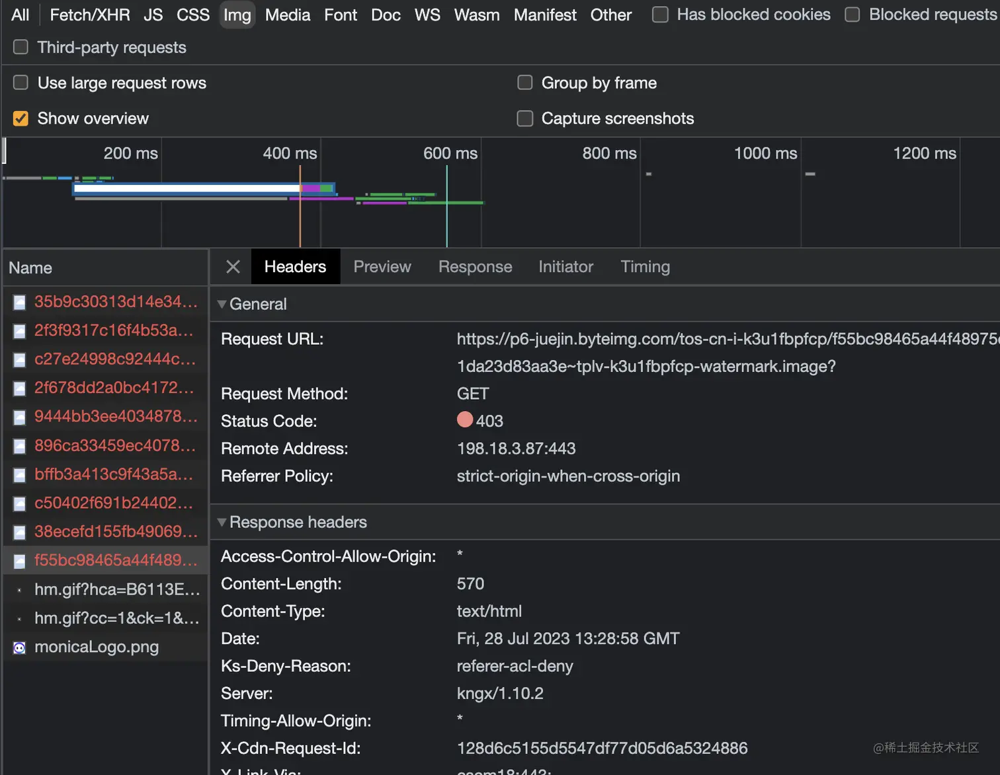

什么是防盗链
------

首先静态资源就是一个URI，防盗链就是为了防止别人拿你的链接，到处引用。比如我的个人博客，又或者其他平台的文章都在用掘金的图片，那么掘金的流量就会暴增。

所以一般开启防盗链是有必要的，当然我那个小破站，月 UV 数量，估摸着也就 5个左右。防人之心不可无，我还是先开启为敬了。

本次先不带来防盗链的实现，后续有机会补充吧。

实践Nodejs爬虫
----------

在前面说到了，我需要将文章还有图片都下载下来，文章我转为 `Markdown` 存储。图片保持文件类型就行，直接下载到一个 images 目录内。

需要用到的插件

*   cheerio 类似 JQuery 一样的DOM操作(golang 有个 goquery)
*   turndown 将 HTML 转化成 Markdown

大致思路如下

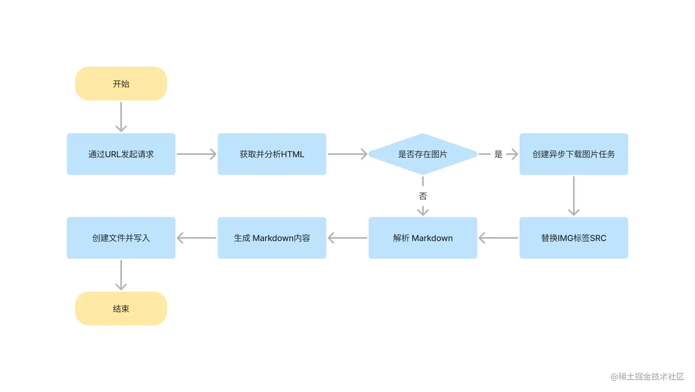

### 实现一个简易爬虫

简单实现一个通过URL获取HTML的小功能，先请求拿到内容，然后通过`cheerio`插件选中到掘金存放文章的根元素，最后通过 `turndown` 插件转化成 Markdown。

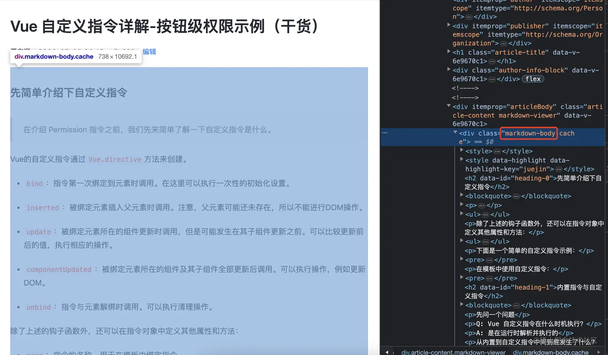

```js
const request = require('request');
const cheerio = require('cheerio');
const fs = require('fs');
const TurndownService = require('turndown');
const turndownService = new TurndownService();
// 掘金文章链接
const url = 'https://juejin.cn/post/7221567098466615353';

request(url, (error, response, body) => {
  if (!error && response.statusCode === 200) {
    // 解析DOM元素
    const $ = cheerio.load(body);
    // 获取文章内容
    const content = $('.markdown-body').html();
    // 转换为markdown
    const markdown = turndownService.turndown(content);
    // 写入文件
    fs.writeFileSync('./docs/严老湿的文章.md', markdown);
  }
});
```

可以看到`markdown`文件已经出来了。

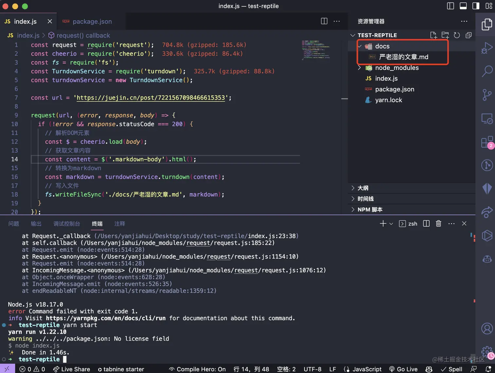

文件内容也都转换成功了，只是图片地址，我们还没有将图片进行保存和替换，接下来一起处理下。

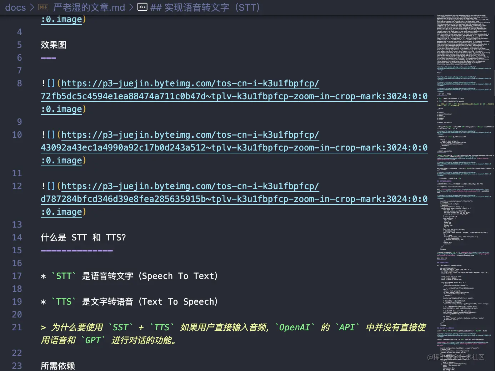

### 下载文章内的图片

大家应该也猜到了，前面我们使用的 `$` 用法，我们可以通过这个 `find('img')`这个API获取所有的img标签然后进行遍历，注意在这使用的 `map` 是 `cheerio` 提供的。

```diff
request(url, (error, response, body) => {
  if (!error && response.statusCode === 200) {
    // 解析DOM元素
    const $ = cheerio.load(body);
    // 获取文章内容
    const content = $('.markdown-body').html();
+   const imageElements = $('.markdown-body').find('img');

+   imageElements.map((index, img) => {
+     console.log(img.attribs.src);
+   })
    // 转换为markdown
    const markdown = turndownService.turndown(content);
    // 写入文件
    fs.writeFileSync('./docs/严老湿的文章.md', markdown);
  }
});
```

可以看到已经遍历出所有图片的链接了，接下来就只需要，将图片保存下来就行了。

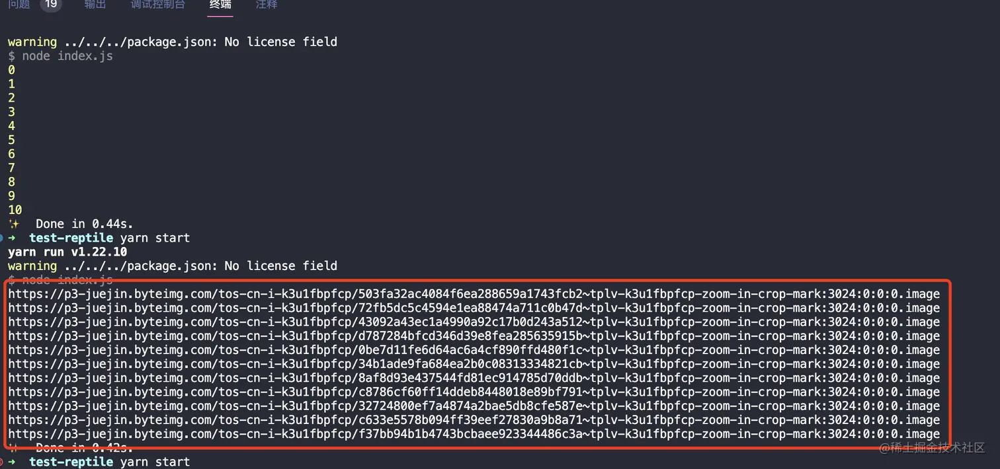

#### 保存图片

先通过`request`发起一次 `head` 这样可以拿到请求头的信息，获取扩展名。

> Tips： head 请求只会返回响应头的信息。与其他 HTTP 请求有所不同。

使用`path.basename`方法从URL中提取文件名并继续通过`request`请求进行图片下载，然后通过 `fs` 模块进行写入流并保存到本地。

```js
const imageElements = $('.markdown-body').find('img');
// 遍历图片元素
imageElements.map((index, img) => {
  const imageUrl = img.attribs.src;
  request.head(imageUrl, (err, res, body) => {
    // 获取文件扩展名
    const contentType = res.headers['content-type'];
    const extname = contentType ? `.${contentType.split('/')[1]}` : '';
    // 获取文件名
    const filename = path.basename(imageUrl);
    // 创建写入流
    const stream = fs.createWriteStream(path.join(__dirname, 'docs/images', filename + extname));
    // 管道流
    request(imageUrl)
      .pipe(stream)
      .on('close', () => console.log('Image downloaded successfully.'));
  });
});
```

#### 替换图片路径

> 现在我们已经将文章内的所有图片都保存到本地了，但是我们并未将`Markdown`里面的图片链接进行替换成本地路径，这样并没有解决我的实际问题，于是接下来将进行替换。

我的思路如下，在真正写入 `Markdown` 之前必须将所有图片替换下载完成。才能开始，所以得将下载和替换放在一个任务队列中，等待全部执行完毕，才能写入 `Markdown` 文件，可能已经有同学猜出来了，可以使用 `Promise.all` 来实现此功能。

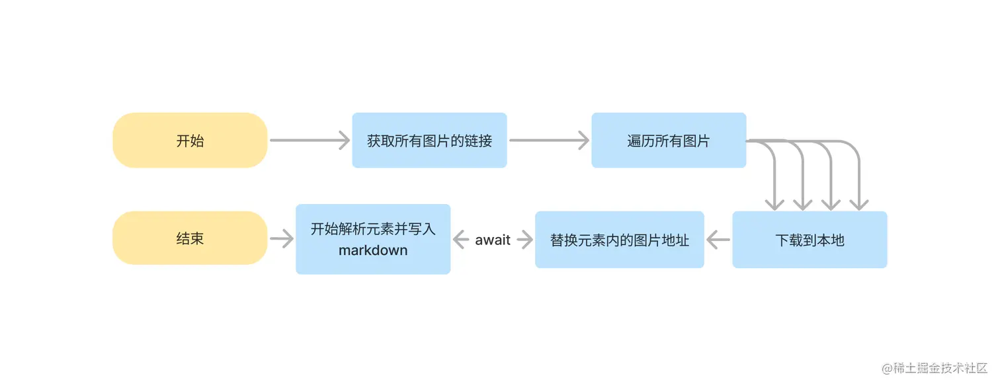 实现代码如下

```js
// tasks 存放所有图片的 Promise
const tasks = imageElements.map((index, img) => {
  // 抛出 Promise
  return new Promise((resolve, reject) => {
    request.head(imageUrl, (err, res, body) => {
      // 此处省略部分代码
      request(imageUrl)
        .pipe(stream)
        .on('close', () => {
          // 修改元素的 src 属性
          $(img).attr('src', `./images/${filename + extname}`);
          // 在下载完成后 resolve
          resolve();
        });
    });
  });
});
// 等待其下载完成
await Promise.all(tasks)
// 此处省略写入 markdown 的代码
```

可以看到 `Markdown` 文件内的所有图片都替换了本地的图片路径。

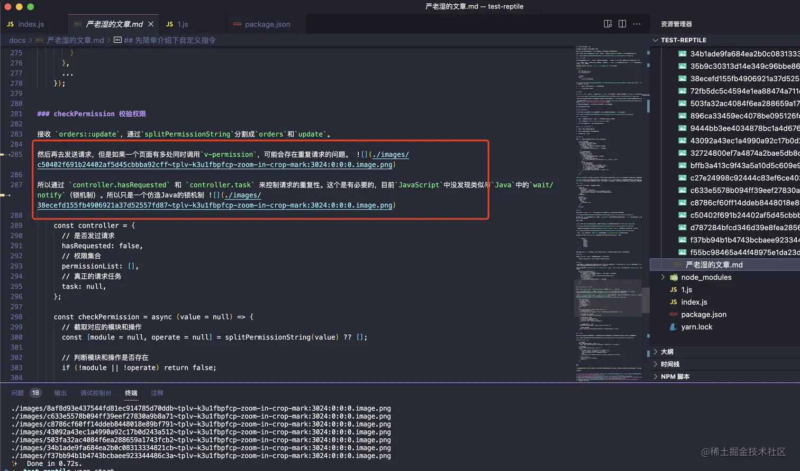

优化+容错
-----

> 到这里我们的核心需求就算解决了，当然里面还有一些细节和一些容错处理，其实还没处理完，有兴趣的同学可以接着往下看，如果需要源码的同学可以直接去 [github.com/CrazyMrYan/…](https://github.com/CrazyMrYan/node-reptile "https://github.com/CrazyMrYan/node-reptile") 获取最新爬虫代码，喜欢可以先点个 `star`。

### 去掉烦人中间页

众所周知，掘金（知乎、CSDN等等）所有的链接都加上了一个烦人的中间页，每次点击跳转还来个提示。到时候部署到自己博客上去，点这个链接还会保留，那岂不是恶心自己，恶心别人吗？

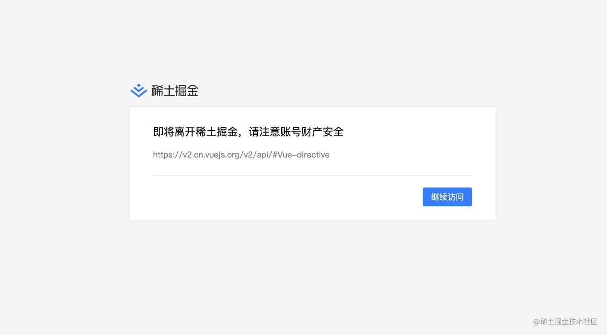

掘金上被转换的链接如下

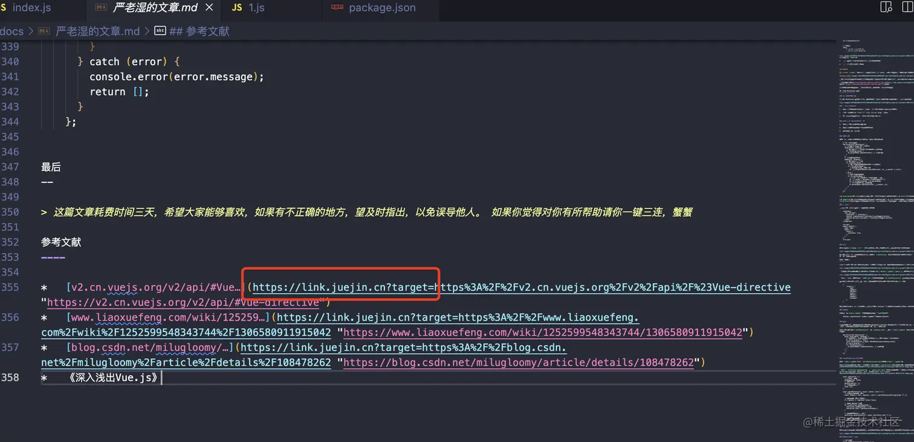

```diff
- https://link.juejin.cn?target=
+ https%3A%2F%2Fgithub.com%2FCrazyMrYan%2Fchat-audio
```

所以我们需要替换掉所有链接上的 `https://link.juejin.cn?target=`。

```js
const linkElements = $('.markdown-body').find('a');
linkElements?.map((index, link) => {
  const url = $(link).attr('href')?.replace('https://link.juejin.cn?target=', '');
  $(link).attr('href', decodeURIComponent(url));
})
```

被替换后的链接就可以正常跳转了。

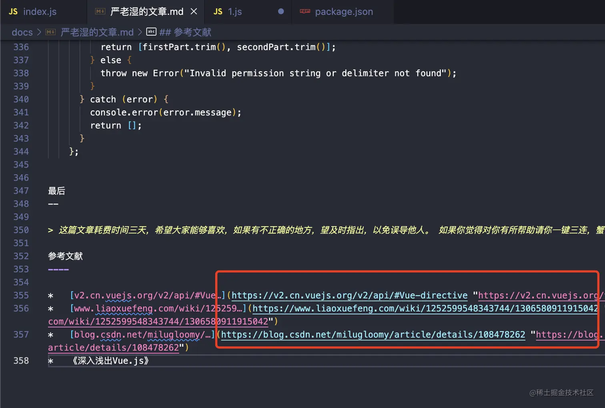

### 解决语言高亮丢失的问题

可以看到目前的代码转成markdown之后，表示代码块的反应号都不见了，就是就是代码界《消失的它（\`\*3）》;

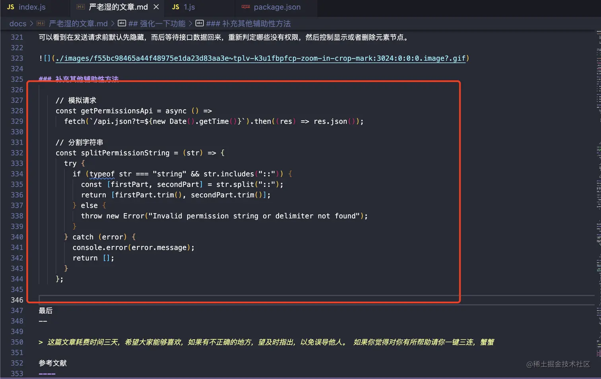

怎么解决？我试了挺多次自定义校验规则的，但没成功，功夫不负有心人，我找到了一个大佬写的使用 turndown 的校验规则，所以就直接搬运过来了。如果你有更好的方案，可以留言私信我～

```js
// 添加名为“code”的规则
turndownService.addRule('code', {
  // 过滤需要转换的HTML节点
  filter (node, options) {
    // 选择nodeName为“PRE”并且第一个子节点的nodeName为“CODE”的节点
    return (
      node.nodeName === 'PRE' &&
      node.firstChild.nodeName === 'CODE'
    )
  },

  // 替换选定的HTML节点，将其转换为Markdown代码块
  replacement (content, node, options) {
    // 定义一个repeat函数，用于生成重复字符串
    const repeat = (str, times) => {
      return new Array(times + 1).join(str);
    }

    // 获取代码块的class属性和语言类型
    const className = node.firstChild.getAttribute('class') || '';
    const language = (className.match(/language-(\S+)/) || [null, ''])[1];
    const code = node.firstChild.textContent;

    // 定义fence字符和大小
    const fenceChar = options.fence.charAt(0);
    let fenceSize = 3;
    const fenceInCodeRegex = new RegExp('^' + fenceChar + '{3,}', 'gm');

    // 计算fence大小
    let match;
    while ((match = fenceInCodeRegex.exec(code))) {
      if (match[0].length >= fenceSize) {
        fenceSize = match[0].length + 1;
      }
    }

    // 生成fence字符串，并将其包裹在代码块外
    const fence = repeat(fenceChar, fenceSize);

    return (
      '\n\n' + fence + language + '\n' +
      code.replace(/\n$/, '') +
      '\n' + fence + '\n\n'
    )
  }
});
```

感谢 CSDN`绝不原创的飞龙`大佬的《Turndown 源码解析：二、规则》，果然站在大佬的肩膀上，视野更加开阔

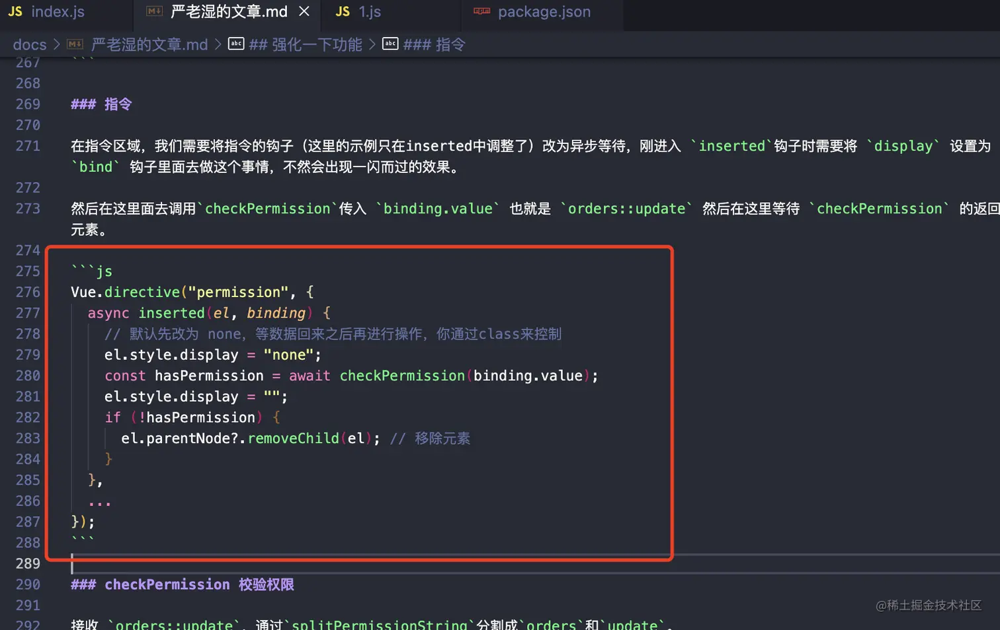

### 去掉掘金md样式

可以看到掘金在文章内容区域放了个 style 标签。但里面的内容并不是我们需要的 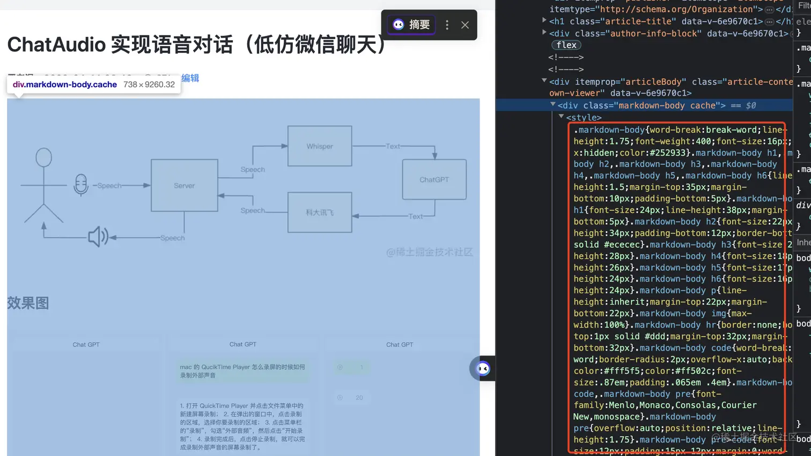

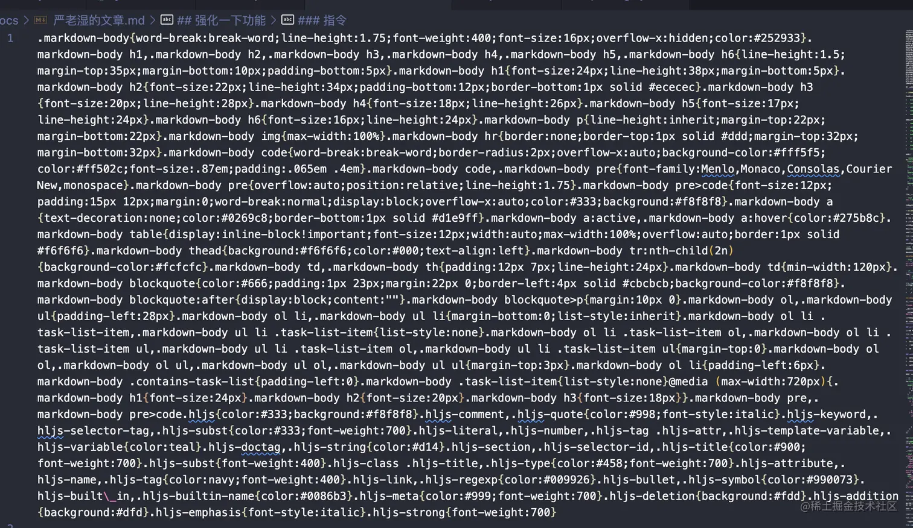

有了前面的经验，照猫画虎加个校验规则就行，我们只需找到`style`标签然后把元素的内容清空一下。

```js
filter(node, options) {
  return node.nodeName === 'STYLE'
},

replacement(content, node, options) {
  return ''
}
```

这样就清空了内置样式。

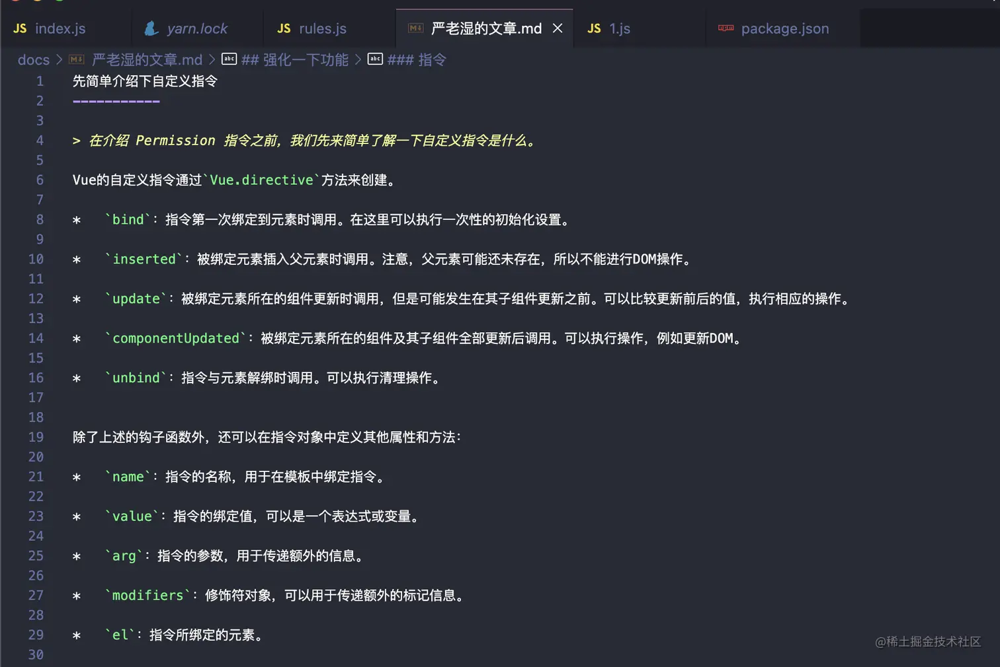

### 获取文章标题作为文件名

我们之前的文件标题都是固定的，我们需要动态获取，怎么实现呢？

很简单直接通过 title 标签拿就行。

```js
// 去掉掘金title的标志
const filename = $('title').text().replace(' - 掘金', '')?.trim();

// 写入文件
fs.writeFileSync(`docs/${filename}.md`, markdown);
```

这样文件名就调整好了。

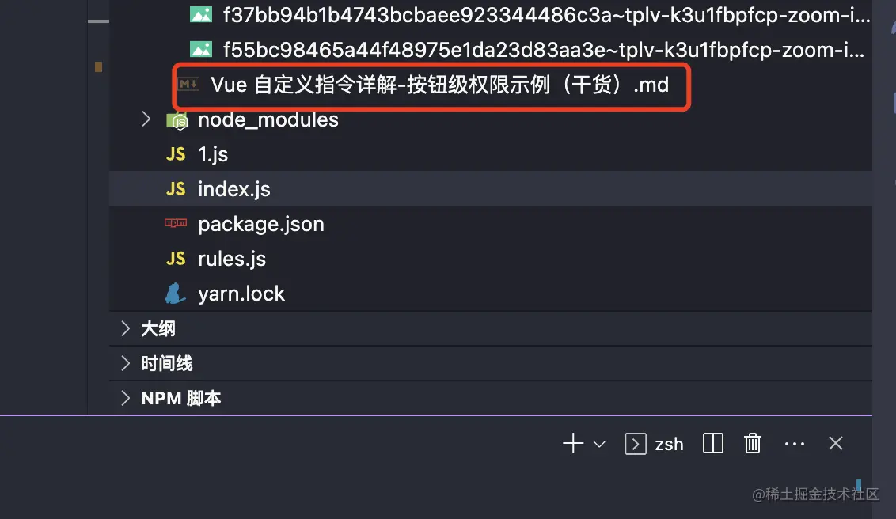

### 容错处理

默认是没有 docs 或者 images 目录的，我们需要判断一下是否存在，没有则创建一个空目录，放在代码运行之前即可。

```js
// 创建目录
const docsDir = path.join(__dirname, 'docs');
const imagesDir = path.join(__dirname, 'docs/images');

if(!fs.existsSync(docsDir)) {
  fs.mkdirSync(docsDir);
}

if (!fs.existsSync(imagesDir)) {
  fs.mkdirSync(imagesDir);
}
```

最后
--

处理得差不多了，其实我还有个痛点需求，通过用户id，能够爬取到当前用户掘金在掘金的所有文章，而不是像我现在一样一个个的去处理。后续我会持续更新此仓库直到解决了我所有痛点。

> 这个有点像N年前我第一次玩 `Wordpress` 的那个爬取别人文章的插件一样。但是记不清插件名字了，好了今天的爬虫分享先到这里吧。

仓库地址: [github.com/CrazyMrYan/…](https://github.com/CrazyMrYan/node-reptile "https://github.com/CrazyMrYan/node-reptile")

参考文献
----

*   [blog.csdn.net/wizardforce…](https://blog.csdn.net/wizardforcel/article/details/130369650 "https://blog.csdn.net/wizardforcel/article/details/130369650")
*   [www.npmjs.com/package/che…](https://www.npmjs.com/package/cheerio "https://www.npmjs.com/package/cheerio")
*   [www.npmjs.com/package/tur…](https://www.npmjs.com/package/turndown "https://www.npmjs.com/package/turndown")
