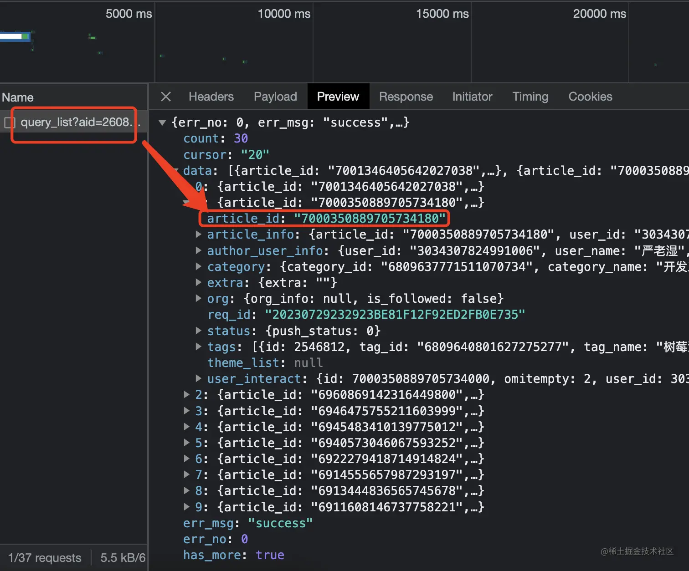
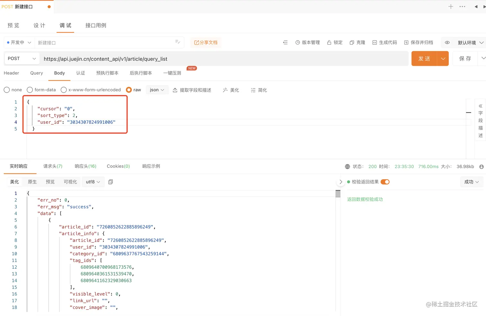
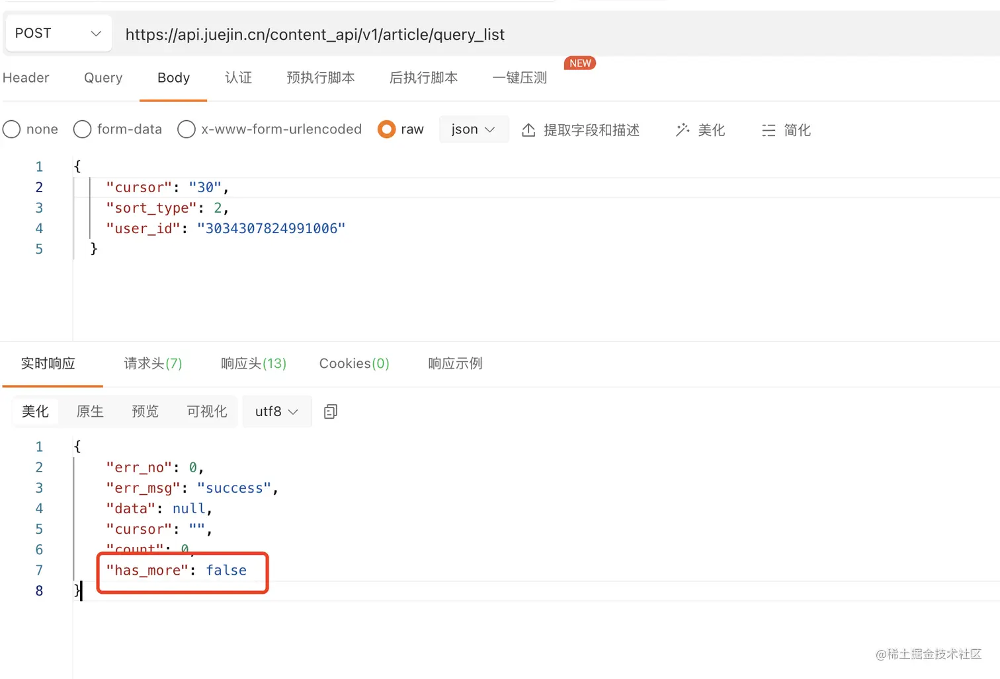
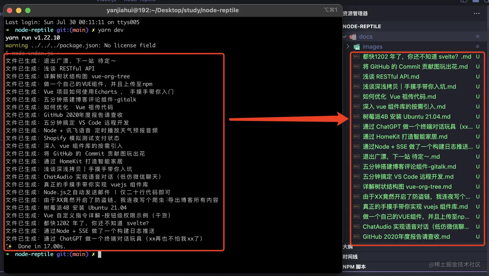
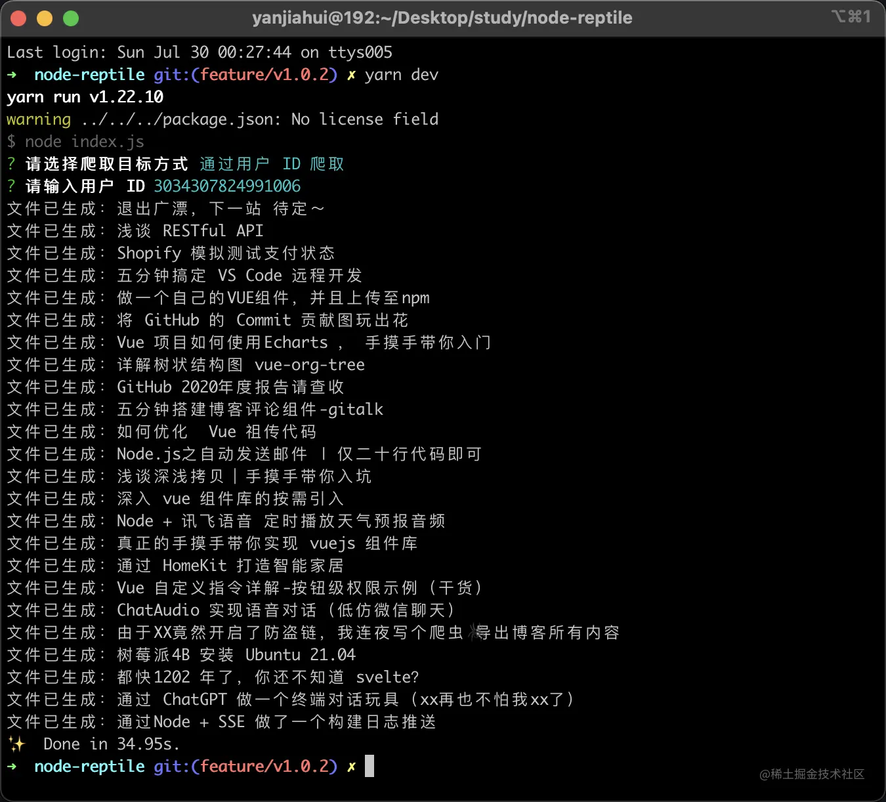
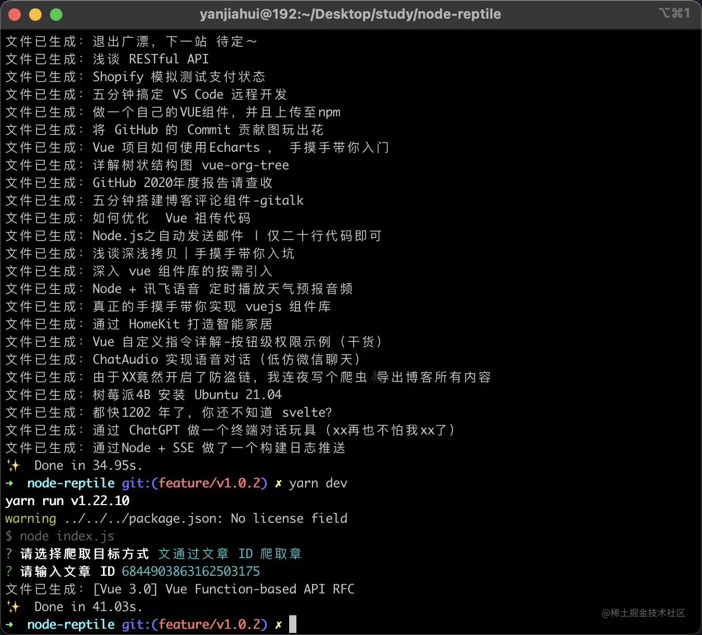
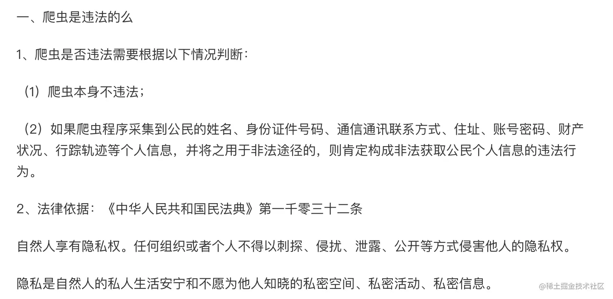

前言
--

就在昨天晚上，做了一个通过掘金文章链接进行解析`html`转化为`markdown`文档，并且把图片进行下载和替换，但是最后也留了个伏笔（我一定会回来的～）就是通过用户id，把所有的文章都转化出来，今天实现了这个功能，已经更新仓库且来补充下文章。

拿到所有文章
------

怎么通过 `userid` 拿到所有文章呢，掘金肯定是有 API 的，通过翻页触发了一个接口`/v1/article/query_list`



### 参数说明

**请求参数**

参数

说明

cursor

类似于offset，偏移量

sort\_type

排序方式，1热门，2最新

user\_id

掘金用户 ID

`user_id` 在掘金用户页的 URL 上获取即可。


**返回参数**

参数

说明

data

文章数据

cursor

下次请求的 cursor

count

文章总数

has\_more

是否还有更多文章

Array<{ article\_id: int }>

文章id



> 本来是想着有个啥 `limit` 直接拉满 999999，但是发现没这参数。
> 
> 但是在返回值里面发现了 `has_more` 代表是否还有更多文章。



开始遍历
----

既然不能一次性拿到所有文章，那就递归处理下，当发现还有更多文章时，先将文章的id都存起来，然后接着发请求，直到 `has_more` 为 `false`，将前面的`ids`遍历进行转`markdown`。

```js
const postList = []

const handleGrabUserArticles = (requestOptions) => {
  request.post(requestOptions, (error, response) => {
    if(!error && response.statusCode === 200) {
      const { 
        data = [], 
        has_more, cursor 
      } = JSON.parse(body);
      
      // 数据存在则存入ids
      if(data?.length) {
        postList.push(...data?.map(article => article.article_id));
      }
      
      // 判断是否还有更多文章
      if(has_more) {
        configs.cursor = cursor;
        // 继续递归请求
        handleGrabUserArticles(getRequestOptions());
      } else {
        // 开始
        postList.forEach(id => handleGrabArticles(`https://juejin.cn/post/${id}`));
      }
    }
  })
}
```

运行一下看看效果



可以看到文章全部拉取下来了，但是我觉得需要在代码里面修改太死板，于是乎，我决定加了个命令行交互。

继续优化
----

我的想法是让用户选择爬取方式，然后输入对应的ID开始爬取。

1.  用户 ID
2.  文章 ID

### 使用 inquirer 进行命令行交互

> inquirer 在年初的终端GPT中使用过这个包，所以这次就不细说了。直接上代码。

```js
const main = async () => {
  // 选择目标方式
  const { model: target } = await inquirer.prompt({
    type: 'list',
    name: 'model',
    message: '请选择爬取目标方式',
    choices: [
        { name: '通过用户 ID 爬取', value: 'user' },
        { name: '通过文章 ID 爬取', value: 'post' },
    ],
    // 默认选择用户
    default: configs.target
  })
  
  configs.target = target;
  // 如果选的是用户，就让用户输入 userid
  if(configs.target === 'user') {
    const { prompt: userId } = await inquirer.prompt({
      type: 'input',
      name: 'prompt',
      message: '请输入用户 ID',
    });
    configs.userId = userId?.trim();
    // 调用前面实现的获取用户所有文章方法
    handleGrabUserArticles(getRequestOptions())
    // 如果是文章则直接调用文章方法
  } else {
    const { prompt: postId } = await inquirer.prompt({
      type: 'input',
      name: 'prompt',
      message: '请输入文章 ID',
    });
    configs.postId = postId?.trim();;

    handleGrabArticles(`https://juejin.cn/post/${configs.postId}`)
  }
}
```

### userId 获取所有文章

> 可以看到我在掘金的文章正在以一种优雅的形式输出。



### 单独处理某一篇文章

再试一下，通过文章 ID 爬取，效果也是一样的。



最后
--

同样，这里的代码已经更新到了 GitHub。希望喜欢的朋友一键三连～

仓库地址：[github.com/CrazyMrYan/…](https://github.com/CrazyMrYan/node-reptile "https://github.com/CrazyMrYan/node-reptile")


