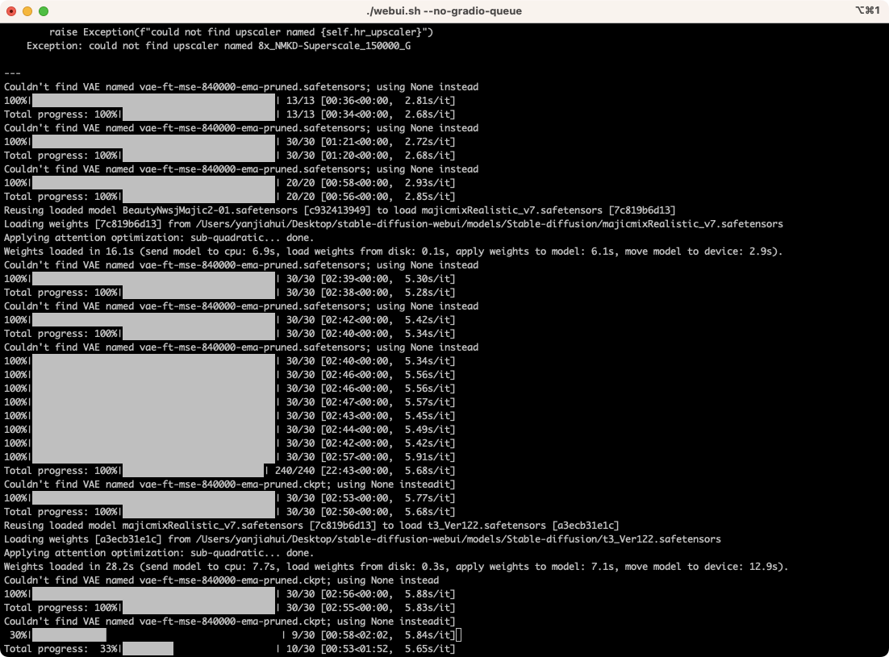
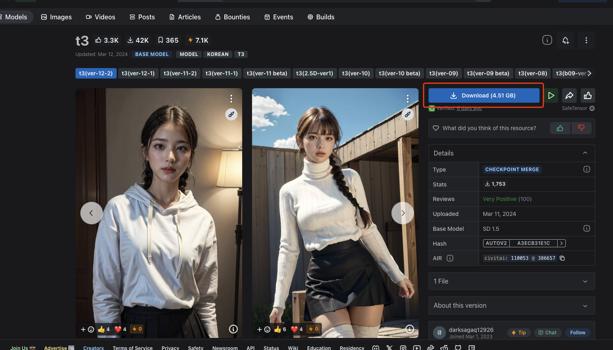
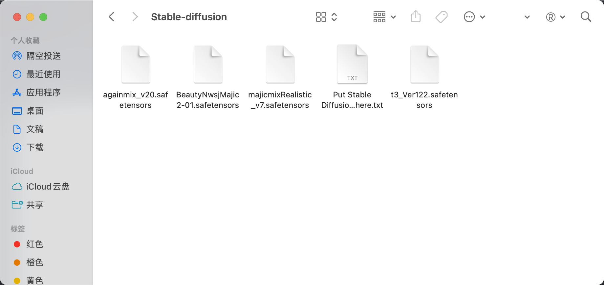
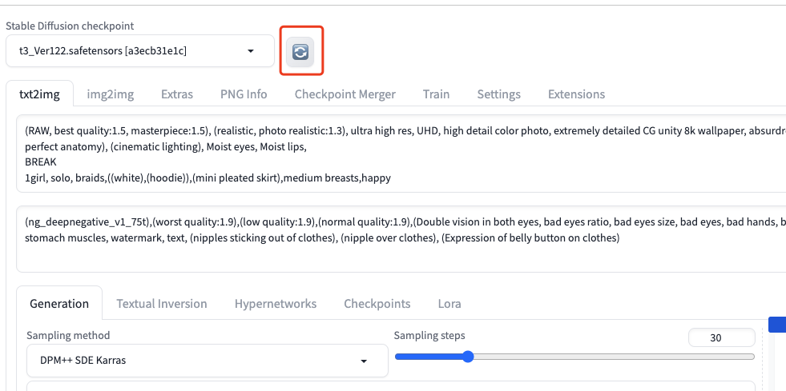
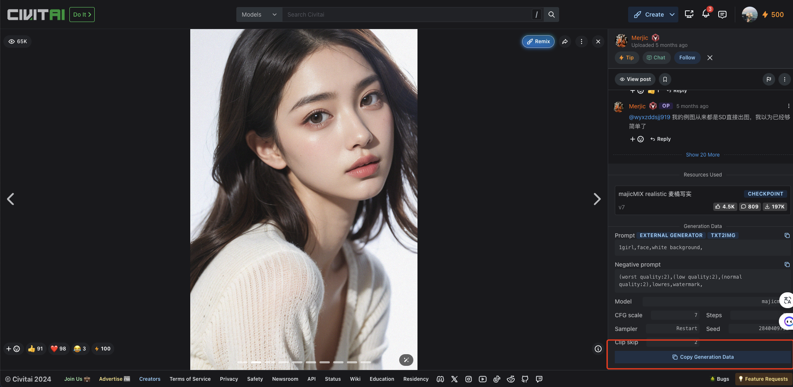
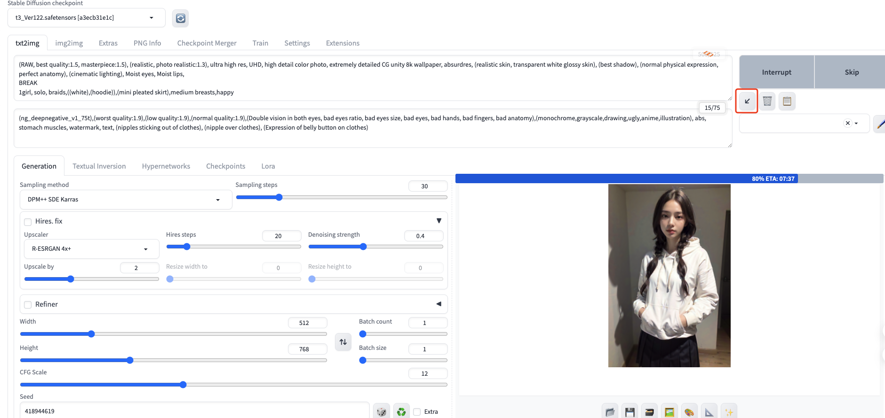
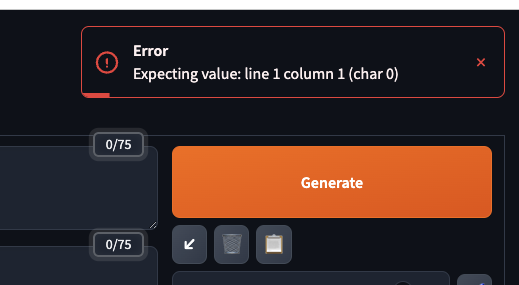
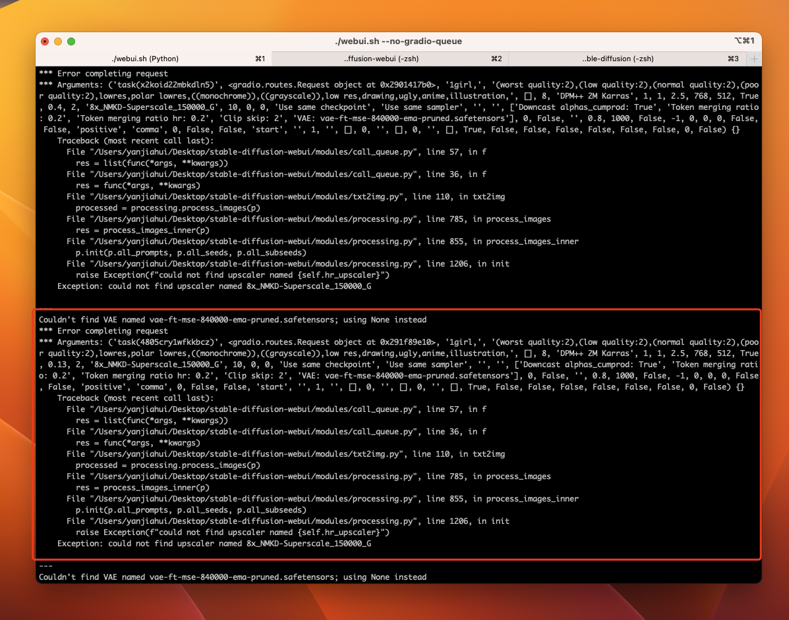
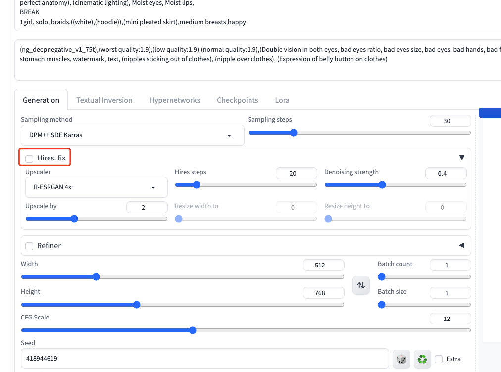

最近一直在短视频平台刷到AI生成的图片，质量也非常不错。术哥也跟我讲解了下如何安装使用。于是周末试了试。

差点变成从入门到放弃了，因此也把过程中遇到的问题记录一下。

> 目前基本上运行正常，只是内存稍微小了点，把质量调低即可。



这个下面是我生成的结果，可以先欣赏再开始。

|  |  |  |
| ------------------------------------------------------------------------------------------------------------------------------ | ---------------------------------------------------------------------------------------------------------- | ---------------------------------------------------------------------------------------------------------- |
|                      |  |  |

## 安装

> 推荐准备一个稳定的🪜，最好是 US 的，速度会快很多，也会减少问题出现的概率。

1. 先保证环境正常，安装python rust cmake 等等
   
   ```shell
   brew install cmake protobuf rust python@3.10 git wget
   ```

2. 克隆webui应用代码
   
   ```shell
   git clone https://github.com/AUTOMATIC1111/stable-diffusion-webui
   ```

3. 进入应用并启动该项目（重点）
   
   ```shell
   # 进入项目
   cd stable-diffusion-webui
   # 开始运行，这一步会比较漫长，因为会克隆几个仓库下来。
   ./webui.sh 
   ```

> 如果正常启动，会自动打开 http://127.0.0.1:7860/ 地址，这个就是本地启动的`webui`，那你可以继续下一步了。

## 下载模型&使用模型

1. 在 https://civitai.com/ 站点上，选择一个你喜欢的 `model`，下载模型（US速度更快）。



2. 下载完成之后，把这个模型复制到`stable-diffusion-webui/models/Stable-diffusion`目录下，随后刷新即可。
   
   
   
   

3. 在下载的模型上，找到喜欢的图片。然后通过一键复制。
   
   在本地启动的 `webui` 中粘贴到 Prompt 输入框中，点击填充到各项配置中。
   
   
   
   

4. 点击 Generate 就可以生成对应的图片了，参数可以自行调整。放几张图


## 注意事项（问题参考）

1. 如果出现 Error Expecting value: line 1 column 1 (char 0)
   
   [解决方案-13003](https://github.com/AUTOMATIC1111/stable-diffusion-webui/issues/13003) 由于开启代理导致的，通过下面`--no-gradio-queue`运行代码。
   
   ```shell
   ./webui.sh --no-gradio-queue
   ```
   
   

2. 如果导入的模型，在生成的时候出现，下面的错误，是因为模型的内容配置太高，电脑配置不够，从而导致内存爆了。可以先把 Hires.fix关掉，重新生成即可，只是质量没那么高。
   
   
   
   

3. 如果在启动项目的时候出现clone不下来，请换 🪜 为 US。重新运行即可。

## 写在最后
`stable-diffusion` 绝不止这么一点皮毛，还需要继续研究配置，本文也只解释了如何入门的 `TextToImage`，里面还可以配置多帧，随后做成视频。

## 参考文档

- Mac 安装方式 [Installation on Apple Silicon](https://github.com/AUTOMATIC1111/stable-diffusion-webui/wiki/Installation-on-Apple-Silicon)

- Models 地址 https://civitai.com/
