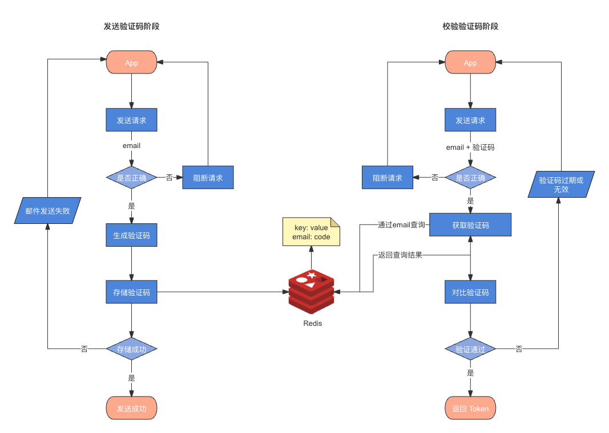
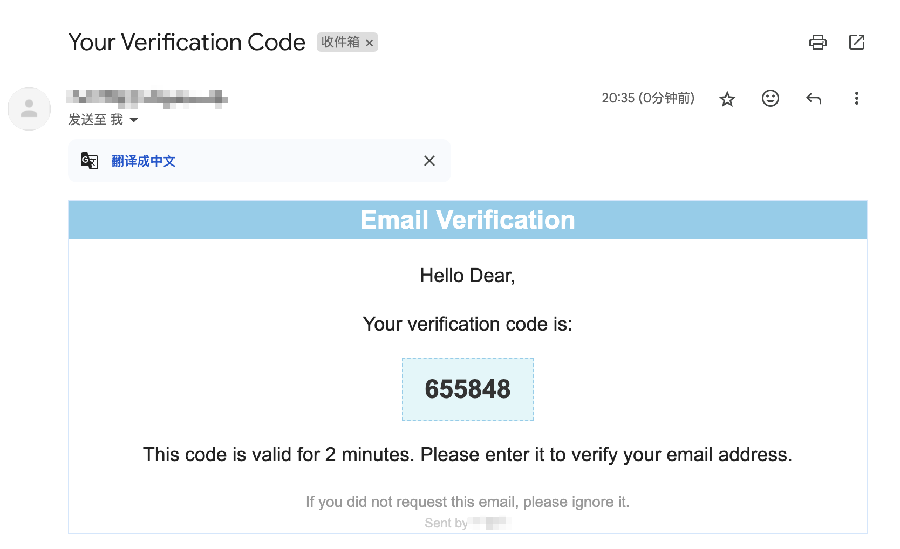
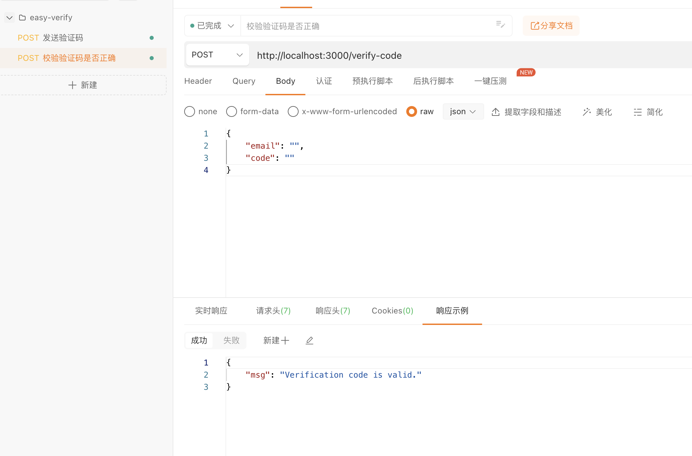
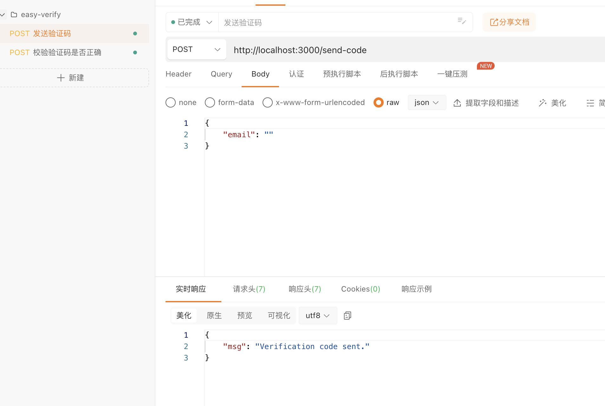

## 前言

某天，突然想到怎么去做一个验证码校验功能呢？怎么校验正确与否呢？

> 在n年前第一家公司实习时有一个手机发送验证码的需求，随后后端同学出了一个点子。在前端发送验证码请求之后，直接返回发出去的验证码，然后前端直接对比用户输入的验证码和后端返回的验证码是否一致即可。

当时我还觉得挺合理的。

## 正确的方式是怎样的呢？

以下是本人画的发送验证码及校验阶段流程图（简易版）



大致分为如下两个阶段：

**发送验证码阶段** 

1. **发送请求**：
   
   1. 用户通过 App 发送包含 `email` 参数的请求。 

2. **检查邮箱格式**： 
   
   1. 如果邮箱格式不正确，拒绝请求。

3. **生成验证码**：
   
   1. 如果邮箱格式正确，生成一个验证码。 

4. **存储验证码**：
   
   1. 将生成的验证码存储到 Redis，键为邮箱地址，值为验证码。 

5. **发送邮件**：
   
   1. 如果验证码存储成功，发送包含验证码的电子邮件。
   
   2. 如果邮件发送成功，返回发送成功信息；否则返回发送失败信息。

**校验验证码阶段**

1. **发送请求**：
   1. 用户通过 App 发送包含 `email` 和 `验证码` 参数的请求。 
2. **检查请求格式**：
   1. 如果请求格式不正确，拒绝请求。 
3. **获取验证码**：
   1. 从 Redis 中获取存储的验证码。 
4. **验证验证码**： 
   1. 如果验证码正确且未过期，返回成功信息和 Token。
   2. 如果验证码不正确或已过期，返回验证失败信息。

## 接下来实践下

**使用依赖及工具库**

- express（nodejs框架）

- nodemailer（发送邮件）

- redis（存储时效验证码）

- dotenv （读取环境变量）

- ejs（邮件模板）

**非必需（项目启动）**

- pm2

- nodemon

### 一、安装 `Redis`

[Docker 安装 Redis | 菜鸟教程](https://www.runoob.com/docker/docker-install-redis.html)

https://www.runoob.com/docker/docker-install-redis.html

### 二、提供编写两个接口

**发送验证码**

方法：POST

路径：/send-code

参数：

- email (string): 接收验证码的邮箱地址

- username (string): 用户名称（非必填）

```js
app.post('/send-code', async (req, res) => {
    const { email, username } = req.body;
    const result = await client.get(email);
    // 已存在此邮箱验证码，组织重复存入
    if(result) {
        return res.status(409).json({ msg: 'Please do not repeatedly initiate requests, they can be initiated again after two minutes.' });
    }
    // 邮箱格式不正确
    if(!validateEmail(email)) {
        return res.status(400).json({ msg: 'Invalid email format' })
    }
    // 生成验证码
    const verificationCode = Math.floor(100000 + Math.random() * 900000).toString();
    try {
        // 发送验证码邮件
        await sendVerificationEmail(email, username, verificationCode);
        // 存储验证码至 redis
        await storeVerificationCode(email, verificationCode);

        res.status(201).json({ msg: 'Verification code sent.' });
    } catch (error) {
        res.status(500).json({ msg: 'Error sending verification code.' });
    }
});
```

**校验验证码**

方法：POST

路径：/verify-code

参数：

email (string): 接收验证码的邮箱地址

code (string): 用户输入的验证码

```js
app.post('/verify-code', async (req, res) => {
    const { email, code } = req.body;
    await verifyCode(email, code, (err, isValid) => {
        if (err) {
            return res.status(500).json({ msg: 'Error verifying code.' });
        }
        if (isValid) {
            // 此处可以生成 Token 返回
            return res.status(201).json({ msg: 'Verification code is valid.' });
        }
        return res.status(400).json({ msg: 'Verification code is invalid or expired.' });
    });
});
```

### 三、连接 Redis

创建 `Redis` 连接方法

```js
const redis = require('redis');

require('dotenv').config({ path: '.env.local' });

const client = redis.createClient({
    url: `redis://${process.env.REDIS_HOST}:${process.env.REDIS_PORT}`,
});

client.on('error', (err) => {
    console.error('Redis error:', err);
});

module.exports = {
    client,
};
```

在主入口引入方法，然后通过自执行函数调用连接

```js
const { client } = require('./redis-client/index.js');

(async () => {
    await client.connect();
    console.log(`Redis startup completed`);
    console.log(`Redis enabled status: ${client.isOpen}`)
})();
```

### 四、校验验证码

通过 Redis 方法获取存储的数据，判断是否相等。

```js
const { client } = require('../redis-client/index.js');

const verifyCode = async (email, code, callback) => {
    try {
        // 获取验证码
        const result = await client.get(email);
        if(result === code) {
            // 删除验证码
            client.del(email)
            return callback(null, true);
        }
        else return callback(null, false)
    } catch (error) {
        callback(error, false);
    }
};

module.exports = verifyCode;
```

### 五、发送&存储验证码

这里我使用的是邮件发送，各位也可以使用手机验证码服务。

```js
// 创建邮件服务
const transporter = nodemailer.createTransport({
    service: process.env.EMAIL_SERVICE,
    auth: {
        user: process.env.EMAIL_USERNAME,
        pass: process.env.EMAIL_PASSWORD,
    },
});

// 发送验证码
const sendVerificationEmail = async (to, username = 'Dear', verificationCode ) => {
    const templatePath = path.join(__dirname, '../template/theme.ejs');
    const template = fs.readFileSync(templatePath, 'utf-8');
    const html = ejs.render(template, { username, verificationCode, senderName: process.env.EMAIL_SEND_NAME });
    const mailOptions = {
        from: process.env.EMAIL_USERNAME,
        to,
        subject: 'Your Verification Code',
        html,
    };

    try {
        await transporter.sendMail(mailOptions);
        console.log('Verification email sent successfully.');
    } catch (error) {
        console.error('Error sending email:', error);
        return new Error(`Error sending email: ${error}`);
    }
};

// 存储验证码
const storeVerificationCode = async (email, code) => {
    await client.set(email, code, {
        EX: process.env.CODE_EXPIRE_TIME,
        NX: true,
    }); // 设置有效期为2分钟
};
```

### 六、验证码邮件模板（ejs）

邮件模板样式我就不放了

```ejs
<div class="container">
    <div class="header">
        Email Verification
    </div>
    <div class="content">
        <p>Hello <%= username %>,</p>
        <p>Your verification code is:</p>
        <div id="verificationCode" class="verification-code" onclick="copyToClipboard()">
            <%= verificationCode %>
        </div>
        <p>This code is valid for 2 minutes. Please enter it to verify your email address.</p>
    </div>
    <div class="footer">
        If you did not request this email, please ignore it.
    </div>
    <div class="byline">
        Sent by <%= senderName %>
    </div>
</div>
```

### 七、环境变量

配置一个 `.env.local` 存储环境变量

```shell
EMAIL_SERVICE=qq
# 邮件用户
EMAIL_USERNAME=
# 邮件 SMTP 授权码
EMAIL_PASSWORD=
# 发件人
EMAIL_SEND_NAME=
REDIS_HOST=127.0.0.1
REDIS_PORT=6379
PORT=3000
CODE_EXPIRE_TIME=120
```

在对应的需要用到的js文件中通过 `dotenv` 导入文件，即可使用环境变量。

```js
require('dotenv').config({ path: '.env.local' });
```

## 看看效果

简单的验证吗邮件就完成了。



## 接口文档

[EASY_VERIFY API DOC](https://console-docs.apipost.cn/preview/a2ec4a6e79901e9d/577fbc2fe5e9d4d1) https://console-docs.apipost.cn/preview/a2ec4a6e79901e9d/577fbc2fe5e9d4d1




## 完整代码

如果你想参考完整代码，可以访问我的仓库地址，欢迎 Star、PR及Issue。

[GitHub - CrazyMrYan/easy-verify: 一个 Nodejs + Redis 的邮箱验证码+验证服务，易移植，易使用。](https://github.com/CrazyMrYan/easy-verify) 

https://github.com/CrazyMrYan/easy-verify
