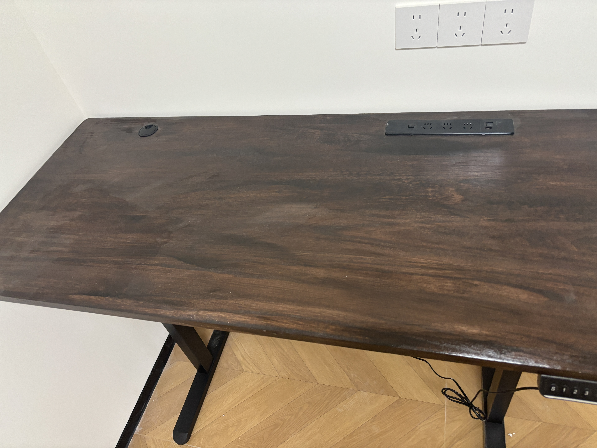
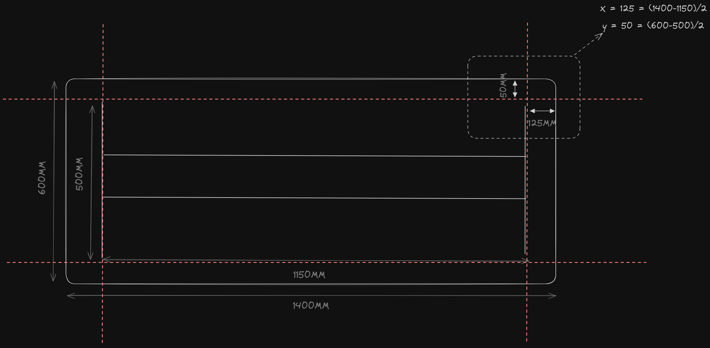
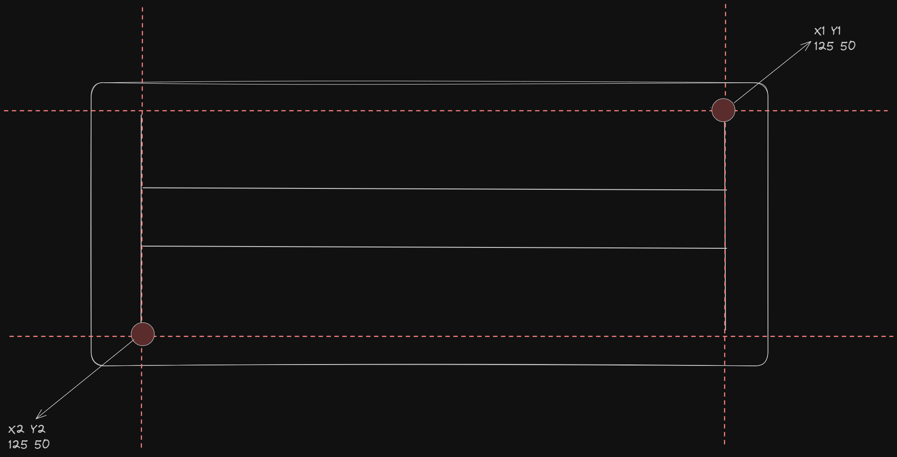
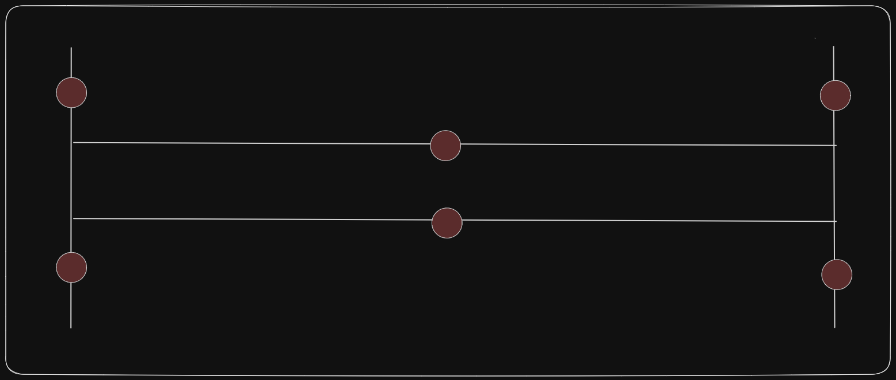
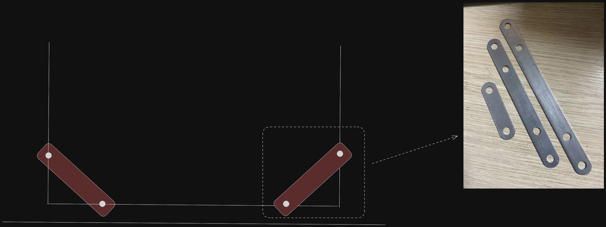
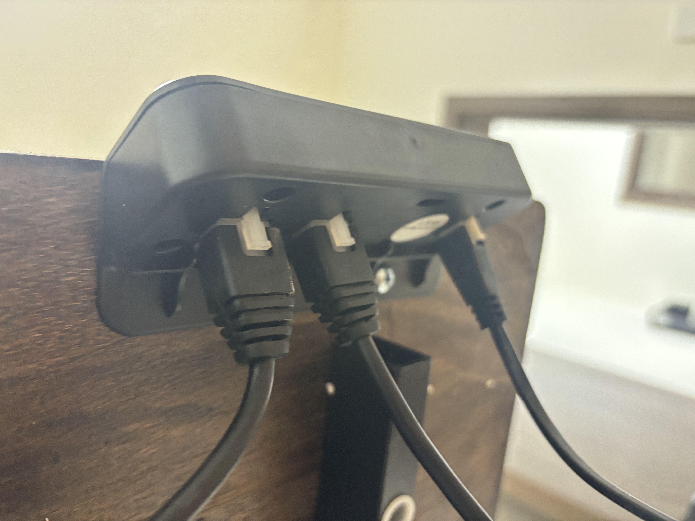
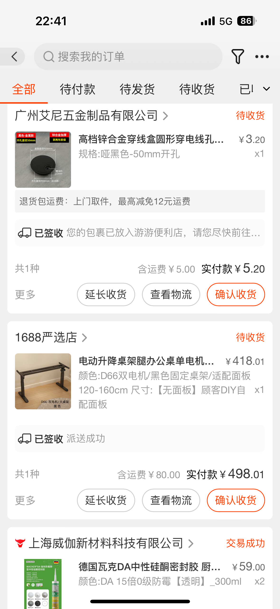

## 前言

> 在房子装修之前，就想着拥有一个书房。但是如果书房里面没有书桌，那不扯淡么？之后想着天天坐这么久，腰部颈部经常不适，所以又开始纠结买哪款人体工学椅子比较合适。
>
> 说时迟，那时快。当天偶然刷小红书得时候，发现了电动升降桌，立马掏出手机，打开购物App准备下单，发现稍微有点颜值的升降桌都接近 1.5 ～ 2k 或以上。
> 
> 所以萌生了自己组装的想法，在多个平台看了下，好像也不是很麻烦。
>
> 说干就干，于是开启了我漫长的选材之路。

## 先上效果

## 主要材料

> 以下是升降桌所有材料清单，可以自行选择。

### 实木桌面（必须）

*   规格：4cm \* 140cm \* 60cm
*   价格：￥185 + ￥5（多开了个孔）= ￥190
*   平台：闲鱼
*   备注：记得自己画好桌面初稿，标注尺寸和开孔位置即可。桌面最好4cm以上，不然容易弯曲变形。

### 升降桌腿（必须）

*   规格：双电机+两节（可调高度72-117cm）
*   价格：￥418 +￥ 80（运费）= ￥498.01
*   平台：1688
*   备注：相对tb、jd来说价格比较优惠

### 木蜡油（非必要）

*   规格：嘉宝莉胡桃色木蜡油（亮面）500g
*   价格：￥31.9
*   平台：淘宝
*   备注：由于实木桌面不是很光滑，所以买了这个木蜡油

### 嵌入式插座（非必要）

*   规格：公牛 GNQ-B1031UTH 黑色 1.8m
*   价格：￥68.12
*   平台：淘宝
*   备注：桌面插座用于给手机或者外接设备充电

### 圆孔穿线（非必要）

*   规格：锌合金-哑黑 50mm开孔
*   价格：¥5.2
*   平台：1688
*   备注：升降桌里面配了，但是是塑料的，颜色是灰色。

### 总价
190 + 498.01 + 31.9 + 68.12 + 5.2 = `793.23`

## 安装过程

> 准备工具
>
> 1.  电动钻（升降架中带了螺丝刀，我图省力用的这个）
> 2.  纸盒（垫在桌子下面）
> 3.  手套（防止粘在手上）
> 4.  羊毛刷（刷木蜡油）
> 5.  砂纸（打磨实木）

### 1. Handle 实木桌面

**打磨**：桌面买回来之后，先用粗砂纸打磨毛刺或者不光滑区域，直至不扎手为止。

**上色**：想让桌面更有质感，可以通过使用木蜡油进行涂刷（羊毛刷），如果涂不均匀，可以加入0-10%的水进行搅拌稀释。刷完之后在阴凉通风处等待2天（时间因天气而定）之后直至完全阴干，推荐桌面分正反两次涂刷。

> 正好当时俺爹在这里，请他当了下油漆工。

### 2. Install 嵌入式插座

将插座表面的盖板打开，得使点劲（但是别掰坏了）

插座两面有螺孔，使用自带的自攻螺丝拧紧，随后盖上盖板即可。

### 3. Make 升降架 + 桌面

**组装桌腿：** 先将先传动轴插在桌腿的上塑料壳上，随后套上电机，稍加转动使其两侧的螺孔对齐，使用自带较长的自供螺丝 * 2，在左右固定。左右桌腿均同理。

**固定支架：**

使用支架在桌面找出安装点位，可以根据公式找居中位置

`Y1`、`Y2` = (桌面高度 - 支架高度) / 2

`X1`、`X2` = （桌面宽度 - 支架宽度）/ 2

`XY` 为一个坐标点，`X1`+`Y1` 为右上角坐标，`X2` + `Y2`为左下角坐标。随后标记位置，使其支架右上角和左下角都对齐标记的位置。

开始固定支架，选择6颗较短的自攻螺丝。

**桌腿支架合并：**

将桌腿固定在支架上，桌腿与支架有红点一侧对齐，随后使用内六角螺丝进行固定，另一侧同理。

将固定贴条，一前一后进行安装，用于固定桌腿与支架。

此时已经大体结构已经安装完成。

**测试及固定面板：**

将两侧电机与电源排线，接入控制面板。按下`上`、`下`及挡位，观察是否正确。

如正确，则可以将直接面板安装在合适的位置，本人放在右侧，比较顺手。

## 321 上链接
不是打广告哈，大家可以多对比下，这里只是推荐下我的购买清单。

|  |  |   |
| --- | --- | -- |

